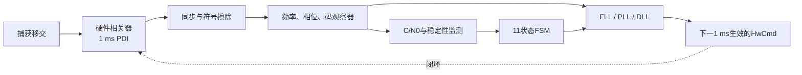

# StarTrack 跟踪算法从零到源码

> [!abstract] 这套笔记解决什么问题
> 卫星信号到达接收机后，捕获模块只给出一个“差不多”的载波频率和码相位。跟踪模块要在
> 噪声、数据位翻转、接收机钟漂、卫星运动和遮挡中，持续把本地载波与本地码对准输入信号。
> 本笔记从最基础的“相关是什么”讲起，最后落到 StarTrack 当前代码中的类、函数和状态机。

> [!important] 代码基线
> 内容以 `/home/showskills/SN770/Project/StarTrack` 的
> `codex/eight-signal-evolution` 分支当前工作树为准；整理时 HEAD 为 `98f5426`。
> 源仓库含未提交 WIP，因此这里描述“当前代码如何工作”，不把接入状态写成资格已经完成。

## 你会学到什么

读完后，你应该能回答：

1. 为什么跟踪要同时维护载波环和码环？
2. Prompt、Early、Late、Very-Early、Very-Late分别在测什么？
3. 1 ms PDI、相干积分长度和环路更新周期为什么不是一回事？
4. FLL、PLL、DLL各自控制什么，为什么不能互相替代？
5. 数据bit和导频二次码为什么必须先同步再擦除？
6. E1、B1C为什么不能只用普通Early-Late？
7. 11个状态为什么存在，每个状态到底负责什么？
8. 日志里的`ready`、`valid`、`used`分别是什么意思？
9. 八种信号在哪些地方共用代码，哪些地方必须分支？
10. 出现失锁、PDI缺口或命令迟到时，代码如何恢复？

## 一张图先看全局

## 阅读路线

| 顺序 | 文档 | 解决的问题 |
|---:|---|---|
| 1 | [[01-入门/01-跟踪到底在跟什么|跟踪到底在跟什么]] | 建立载波、码、相关器和闭环直觉 |
| 2 | [[01-入门/02-从相关峰认识五个抽头|从相关峰认识五个抽头]] | 看懂P/E/L/VE/VL和鉴别曲线 |
| 3 | [[02-软硬件边界/03-一毫秒PDI与硬件相关器|一毫秒PDI与硬件相关器]] | 明白硬件做什么、软件不能做什么 |
| 4 | [[02-软硬件边界/04-TrackEngine六阶段流水线|TrackEngine六阶段流水线]] | 看懂每条PDI怎样走完整个软件链 |
| 5 | [[03-同步与积分/05-为什么必须先同步再长积分|为什么必须先同步再长积分]] | 数据bit、二次码、覆盖码与擦除 |
| 6 | [[03-同步与积分/06-相干积分与非相干积累|相干积分与非相干积累]] | 区分相干长度、观察窗和更新节拍 |
| 7 | [[04-载波跟踪/07-频率观察器从相位差到DFT|频率观察器]] | Cross/Dot、平方FLL、DFT、FMS |
| 8 | [[04-载波跟踪/08-载波环FLL与PLL|载波环FLL与PLL]] | 看懂预测、校正、相位注入与换档 |
| 9 | [[05-码跟踪/09-BPSK码环与载波辅助DLL|BPSK码环与DLL]] | Early-Late、PI码环和载波辅助 |
| 10 | [[05-码跟踪/10-BOC与ASPeCT|BOC与ASPeCT]] | E1/B1C旁峰、双副本和有限码斜坡 |
| 11 | [[06-状态机/11-十一状态先分职责再看切换|十一状态职责]] | 不用一张乱图，逐类认识11状态 |
| 12 | [[06-状态机/12-状态判据迟滞与命令确认|状态判据与提交]] | 证据、候选、pending和硬件确认 |
| 13 | [[07-信号路径/13-八种信号逐条走一遍|八种信号路径]] | L1CA到B1C的公共主线和专属分支 |
| 14 | [[08-质量与验证/14-CN0监测日志与故障恢复|C/N0、日志与恢复]] | 质量量、物理显示、失效边界 |
| 15 | [[08-质量与验证/15-源码地图与调试方法|源码地图与调试方法]] | 从日志追到类和关键函数 |
| 16 | [[08-质量与验证/16-测试方法与学习实验|测试方法与学习实验]] | 怎样证明算法工作而不是碰巧过例 |

## 阅读约定

- `$x$`是行内公式，`$$x$$`是Obsidian可直接显示的块公式；
- 图都在Markdown内或`90-附件`中，不依赖源仓库附件；
- “PDI”默认指一条1 ms相关输出，不等于20 ms CSV日志行；
- “观察”只负责测量，“环路”只负责控制，“FSM”只负责选策略；
- “已实现”不等于“已完成全部真实IQ资格矩阵”。

---

下一篇：[[01-入门/01-跟踪到底在跟什么|跟踪到底在跟什么]]
