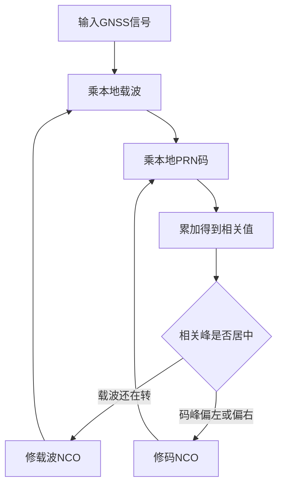
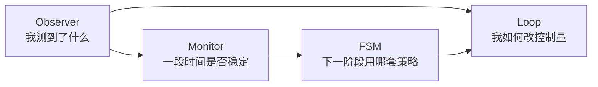

# 第1章 跟踪到底在跟什么

> [!abstract] 本章目标
> 不看代码，先建立最重要的直觉：跟踪不是“找到卫星”，而是不断修正两个会漂动的本地模型——
> 本地载波和本地伪随机码。

## 1.1 捕获只给了一个粗答案

接收机收到的基带信号可以先粗略写成：

$$
r(t)=A\,d(t)c(t-\tau)
\exp\!\left(j\left(2\pi f_dt+\phi\right)\right)+n(t).
$$

逐个解释：

| 符号 | 含义 | 跟踪要不要管 |
|---|---|---|
| $A$ | 信号幅度 | 间接通过C/N0和质量监测 |
| $d(t)$ | 数据bit或导频二次码 | 要先同步，再正确擦除 |
| $c(t-\tau)$ | 延迟了$\tau$的伪随机码 | DLL持续跟踪$\tau$ |
| $f_d$ | 多普勒与本振误差造成的频差 | FLL持续跟踪 |
| $\phi$ | 剩余载波相位 | 强信号时PLL精修 |
| $n(t)$ | 噪声和干扰 | 不能直接消除，只能用积分和门控降低影响 |

捕获会给出一个初始多普勒和一个初始码相位，但它们只是落在跟踪器可接管的范围内。卫星在动、
接收机时钟在漂，初始值会很快过期。

## 1.2 本地接收机有两把“尺子”

跟踪器内部同时生成：

1. 一把载波尺子：本地正弦/余弦，频率由载波NCO控制；
2. 一把码尺子：本地PRN码，位置和速度由码NCO控制。

载波没对准时，复相关值会在复平面旋转；码没对准时，相关幅度会下降，而且Early与Late不平衡。

## 1.3 为什么一定是闭环

一次测量不够，因为低C/N0时单次相关几乎全是噪声。跟踪器必须循环：

$$
\text{相关}\rightarrow\text{观察误差}\rightarrow\text{滤波控制}
\rightarrow\text{更新NCO}\rightarrow\text{再相关}.
$$

环路的价值不是“把误差瞬间变成0”，而是：

- 利用历史保持连续性；
- 拒绝明显不可信的单次观察；
- 在动态响应和降噪之间折中；
- 缺测时维持最近可信状态，而不是写入伪造的0误差。

## 1.4 三条环分别负责什么

| 环路 | 输入 | 输出 | 直觉 |
|---|---|---|---|
| FLL | 残余频率Hz | 载波频率控制Hz | 先让相关向量不再快速旋转 |
| PLL | 相位误差cycle | 小的载波频率修正Hz | 强信号时把相位进一步钉住 |
| DLL | 码误差chip | 剩余码率修正chip/s | 让Prompt位于相关峰中心 |

StarTrack的载波输出不是PLL单独控制，而是：

$$
f_{ctrl}=f_{FLL}+f_{PLL}.
$$

码率也不是DLL独自承担：

$$
R_{code}=R_c+R_{aid}+R_{DLL}.
$$

其中$R_{aid}$来自载波多普勒。因为载波多普勒和码多普勒来自同一径向运动，让载波承担主要
码率动态，DLL只修剩余误差，弱信号时更稳。

## 1.5 “锁定”不是一个布尔量

工程上至少有四种不同含义：

- 载波频率已经进入局部范围；
- 数据bit或导频二次码边界已经同步；
- 码误差在主峰附近稳定；
- 当前状态的C/N0、频率RMS、相位RMS等监测通过。

因此不能看到某一个`locked=true`就认为一切完成，也不能只看最终状态名称判断环路是否健康。

## 1.6 StarTrack的三层职责

这是阅读源码最重要的总原则：

- Observer不直接改NCO；
- Loop不决定切状态；
- FSM不读取原始I/Q，也不重算鉴别器；
- Logger和显示只读结果，不反馈控制。

> [!tip] 记忆方法
> Observer像传感器，Loop像方向盘，Monitor像仪表盘，FSM像驾驶策略。仪表盘不能自己抢方向盘。

## 1.7 本章小结

跟踪器持续估计并修正载波频率、载波相位和码相位。捕获只负责把初始误差送进可接管范围；
真正长期保持靠相关、观察器、环路、监测器和状态机共同工作。

---

上一篇：[[00-首页|首页]]　下一篇：[[02-从相关峰认识五个抽头|从相关峰认识五个抽头]]
