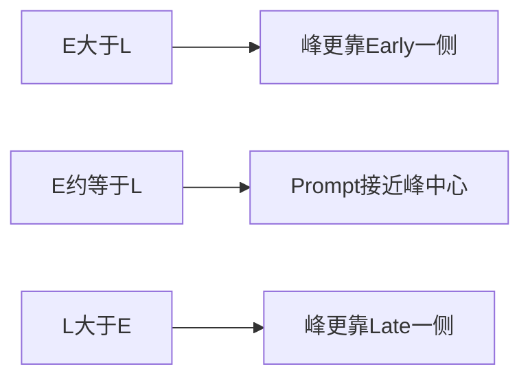

# 第2章 从相关峰认识五个抽头

> [!abstract] 本章目标
> 解释相关值、Prompt、Early、Late、Very-Early、Very-Late，以及它们怎样告诉接收机码峰偏向哪边。

## 2.1 相关就是“拿模板去对齐”

假设输入码是$s[n]$，本地码模板是$c[n-\tau]$。相关器把对应样点相乘再累加：

$$
R(\tau)=\sum_{n=0}^{N-1}s[n]c[n-\tau].
$$

当$\tau$刚好等于真实延迟时，同号相乘最多，$|R(\tau)|$最大；模板错开后，正负逐渐抵消。

![[90-附件/相关峰与五抽头.svg]]

## 2.2 五个抽头不是五套码环

StarTrack同时生成五个本地码相位：

| 抽头 | 英文 | 相对Prompt的位置 | 主要用途 |
|---|---|---:|---|
| VE | Very-Early | 更早 | 判断更宽范围的左侧能量 |
| E | Early | 较早 | DLL左侧局部斜率 |
| P | Prompt | 中心 | 载波、同步、C/N0与峰值能量 |
| L | Late | 较晚 | DLL右侧局部斜率 |
| VL | Very-Late | 更晚 | 判断更宽范围的右侧能量 |

它们共享同一个连续码NCO，只是加上不同的抽头偏移。普通状态更新步进时不会重新装载码相位。

## 2.3 Early-Late怎样产生误差

最基本的归一化鉴别量是：

$$
D_{EL}=\frac{E-L}{E+L}.
$$

这里$E$和$L$代表对应抽头的包络或功率。分母做归一化，使同样的码偏差在信号整体变强或变弱时
输出尽量一致。

> [!warning] 符号必须看实现定义
> 硬件的码地址增大方向、数组排列和“本地码相对输入码”的误差定义可能相反。StarTrack在
> `CodeObserver::observe()`统一翻转到`CodeObs.code_chips`语义。不能只看公式猜控制符号。

## 2.4 为什么还需要VE和VL

只有E/P/L时，如果移交码误差已经超过局部线性区，E和L可能都很小，或者错误副峰看起来像中心。
VE/VL提供更宽的能量轮廓：

- 在BPSK类信号中，可先选择五抽头中最靠近主峰的一组；
- 在E1/B1C中，可构造左、中、右三组宽峰证据；
- 最外抽头胜出时只向内移动有限一步，不直接把它当精确码误差。

## 2.5 复相关值为什么有I和Q

相关输出不是普通实数，而是：

$$
z=I+jQ.
$$

码对齐决定相关幅度，载波相位决定它在复平面上的方向。若载波仍有频差，Prompt会随时间旋转：

$$
P_k\approx A\exp(j\phi_k)+n_k.
$$

所以同一组相关值可以同时服务：

- Prompt相位变化：频率观察；
- Prompt瞬时角度：相位观察；
- E/P/L相对能量：码观察；
- Prompt功率统计：C/N0估计。

## 2.6 `ready`、`valid`和数值不是一回事

观察器公共语义：

| 状态 | 含义 | 能否控制 |
|---|---|---|
| `ready=false` | 窗还没积满 | 不能 |
| `ready=true, valid=false` | 窗已结束，但质量或物理条件失败 | 不能 |
| `ready=true, valid=true` | 完整且合格 | 还要经过上层门控 |

`valid=false`时即使结构体里某个数值是0，也不能把它当“误差正好是0”。缺测向环路写0会制造假居中。

## 2.7 BOC为什么更麻烦

BPSK主峰大致是单个三角峰；BOC叠加子载波后出现多个峰。普通E-L可能在副峰也形成零点。

![[90-附件/BPSK与BOC相关峰.svg]]

因此E1/B1C除了完整BOC副本，还保留一个PRN-only副本，用ASPeCT消除旁峰。详细过程见
[[../05-码跟踪/10-BOC与ASPeCT|第10章]]。

## 2.8 对应源码

| 概念 | 主要位置 |
|---|---|
| 五抽头PDI结构 | `include/model/track_data.h`中的`PdiCorr`、`PdiData` |
| 硬件五抽头相关 | `src/hardware/hw_channel.cpp` |
| 标准码观察 | `src/code_observer/code_observer.cpp` |
| 芯片鉴别器 | `src/code_observer/chip_dll_disc.cpp` |
| ASPeCT鉴别 | `src/code_observer/aspect_disc.cpp` |

## 2.9 本章小结

五抽头是在同一个码NCO周围同时量取相关峰形状。P给载波、同步和功率，E/L给局部码误差，
VE/VL给更宽范围方向证据。观察窗没成熟或质量失败时，必须保持缺测语义。

---

上一篇：[[01-跟踪到底在跟什么|跟踪到底在跟什么]]　下一篇：[[../02-软硬件边界/03-一毫秒PDI与硬件相关器|一毫秒PDI与硬件相关器]]
