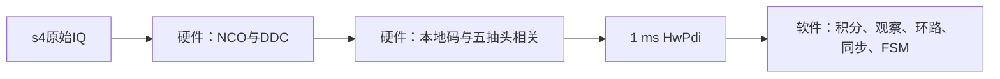
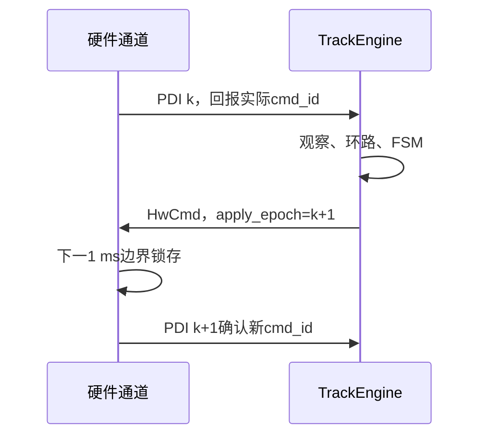

# 第3章 一毫秒PDI与硬件相关器

> [!abstract] 本章目标
> 看懂StarTrack最重要的接口边界：硬件逐样点处理原始IQ，但软件跟踪核心只能看到1 ms PDI。

## 3.1 为什么要划边界

如果每个软件观察器都直接读取原始IQ，就会重复实现混频、本地码和时间轴，还会让算法无法映射到
真实芯片。StarTrack把职责固定为：

软件不能绕过`HwPdi`重新访问原始IQ或硬件内部累加器。

## 3.2 载波NCO做什么

载波NCO是一个u32相位累加器。每来一个采样，内部相位加一个步进字$w_c$。对应物理频率：

$$
f_{NCO}=\frac{w_c}{2^{32}}f_s.
$$

当前DDC取相位高4位查16相位正余弦表，用共轭本振混频：

$$
I'=I\cos\theta+Q\sin\theta,
$$

$$
Q'=Q\cos\theta-I\sin\theta.
$$

输入是s4复样点，DDC按规定移位和饱和后输出s5。软件只得到相关后的s24累加值，不再重复量化。

## 3.3 码NCO做什么

码NCO保存“当前本地码走到哪个chip、小数chip走到哪里”。步进决定每个采样推进多少码相位。

普通控制命令只改步进，不重新装载相位。只有第一次捕获移交或明确重捕获才允许
`load_code=true`。这样状态换档不会让码突然跳到另一个位置。

E1和B1C有两个本地副本：

- replica 0：PRN乘BOC(1,1)子载波；
- replica 1：只有PRN，不乘BOC。

两者使用同一个码相位和同一个chip相位MSB，这是ASPeCT能够相减的前提。

## 3.4 一条PDI里到底有什么

`HwPdi`不是只有一个Prompt值。它记录：

| 类别 | 字段含义 |
|---|---|
| 时间 | `epoch`、`first_sample`、`sample_count` |
| 命令 | 实际`cmd_id`、本PDI实际使用的载波/码步进和首相位 |
| 主码 | `code_period`、`segment`、`segments_per_code` |
| 相关矩阵 | 最多2分量×2副本×5抽头×复数I/Q |
| 完整性 | `partial`、`gap`、`overflow`、`cmd_late` |

PDI默认约1 ms，但首个捕获码相位可能落在1 ms边界中间，因此第一条可能是`partial=true`。
这条PDI不进入观察器，但它是合法启动，不等于故障。

## 3.5 主码周期和PDI周期为什么不同

| 信号 | 主码长度 | 一主码含多少条1 ms PDI |
|---|---:|---:|
| L1CA、B1I、G1、L5、B2a、E5a | 1 ms | 1 |
| E1 | 4 ms | 4 |
| B1C | 10 ms | 10 |

E1/B1C观察器必须检查`segment`连续并从0开始。不能随便拿4条或10条相邻PDI就冒充完整主码。

## 3.6 命令什么时候生效

处理历元$k$的PDI后，软件生成目标历元为$k+1$的`HwCmd`：

所以“软件决定换状态”和“新状态硬件配置已经生效”之间隔着一次命令确认。状态机、抽头几何切换、
有限码斜坡停止都必须遵守这个事务协议。

## 3.7 `PdiDecoder`怎样进入浮点域

`PdiDecoder::decode()`完成唯一一次硬件到软件转换：

- s24相关值无损转`double`；
- s32载波字按补码转Hz；
- 首相位推进到PDI中心，形成统一`nco_phase`；
- 复制完整相关矩阵；
- partial、gap、overflow、cmd_late都会令`complete=false`。

随后`LoopPdiSelector::select()`把默认闭环分量的固定相位旋转到统一同相参考，但保留原始矩阵给
ASPeCT和只读诊断。

## 3.8 出错时为什么要清窗口

如果PDI缺了一条，跨缺口做相位差会把未知时间当作1 ms；跨命令失配做积分会混合两套NCO参考。
因此：

- gap/overflow/cmd_late/cmd_id不符：当前PDI不能进观察器；
- 未完成的主码、bit、频率和C/N0窗口清除；
- FLL时间锚重新建立；
- 最近已经确认的物理NCO保持，不注入0误差。

## 3.9 对应源码

| 模块 | 文件/关键函数 |
|---|---|
| DDC | `src/hardware/ddc.cpp`中的`mixDdc()` |
| 硬件通道 | `src/hardware/hw_channel.cpp`中的`HwChannel::process()`、`finishPdi()` |
| 寄存器 | `src/hw/hw_regs.cpp`中的`writeCmd()`、`latchCmd()`、`pushPdi()` |
| 数据合同 | `include/hw/hw_contract.h` |
| PDI解码 | `src/integrator/pdi_decoder.cpp` |
| 分量选择 | `src/integrator/loop_pdi_selector.cpp` |

## 3.10 本章小结

硬件只做确定的逐样点运算并每1 ms交付完整时间轴；软件只消费PDI。每条命令下一边界生效，
必须由后续PDI确认。理解这个边界后，长相干、状态切换和恢复逻辑才不会被误认为硬件周期。

---

上一篇：[[../01-入门/02-从相关峰认识五个抽头|从相关峰认识五个抽头]]　下一篇：[[04-TrackEngine六阶段流水线|TrackEngine六阶段流水线]]
