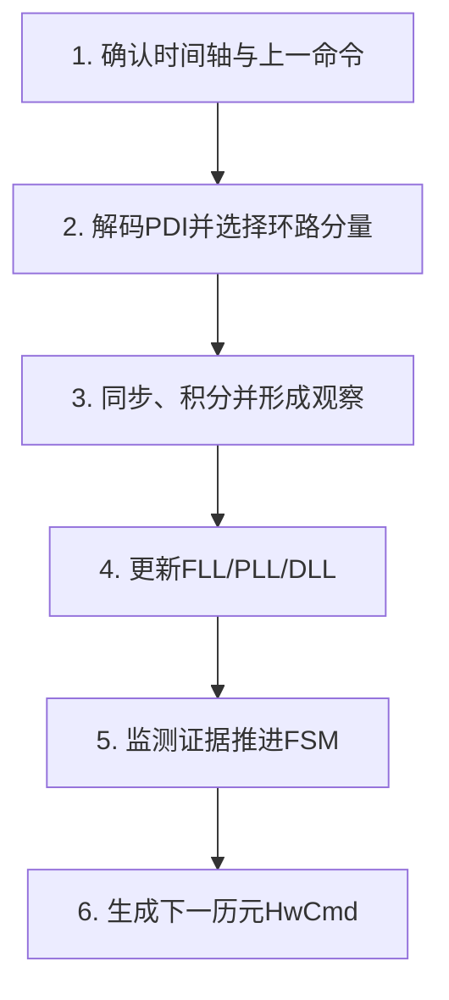
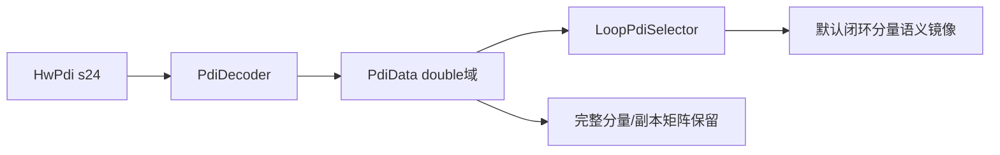
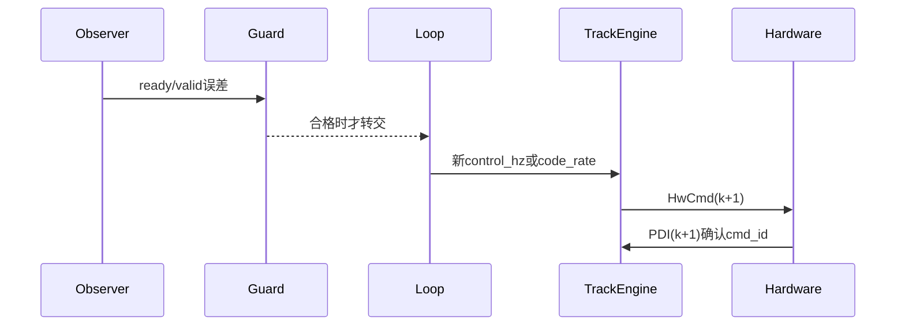

# 第4章 TrackEngine六阶段流水线

> [!abstract] 本章目标
> 沿着`TrackEngine::processPdi()`走一遍，知道一条1 ms PDI经过哪些模块，为什么顺序不能随便换。

## 4.1 总入口

当前主入口：

```cpp
TrackResult TrackEngine::processPdi(
    const HwPdi& input,
    int8_t aid_symbol,
    bool aid_valid);
```

输入是一条硬件PDI和可选的外部已知bit；输出包含本历元全部观察、监测、状态、环路结果和下一命令。

## 4.2 六阶段总览



### 阶段1：确认

主要调用：

- `confirmTransition()`：过渡命令已生效才提交pending状态；
- `confirmCodeSlew()`：有限码斜坡开始/停止命令必须被PDI确认；
- `confirmE1FineTaps()`：E1稳定抽头命令确认后才能用新几何形成细码窗。

如果命令号不符，不能假装新配置已经工作，也不能把新旧配置产生的PDI拼到一个观察窗。

### 阶段2：解码与选择



默认分量被旋转到同相参考，通用载波和码观察器不需要知道每种信号固定相位；原始矩阵仍给
E1/B1C ASPeCT、数据Prompt和数据/导频A/B诊断。

### 阶段3：形成观察

`formObservations()`内部不是一条直线，而是有依赖顺序：

1. `SignalSync::add()`推进bit或导频同步；
2. 覆盖码或二次码擦除形成`loop_pdi`；
3. `BitIntegrator`和`CodePeriodSum`形成边界对齐块；
4. `formFreqObs()`选择唯一频率观察路径；
5. `formCodeObs()`选择BPSK、ASPeCT粗/细或弱导频码路径；
6. `PhaseObserver`只在允许的边界形成相位；
7. C/N0和只读诊断更新。

同步必须在长积分前，因为不知道符号时跨边界相加会相消。

### 阶段4：更新环路

`updateLoops()`先把观察从窗口中心重定时到当前命令边界，再做门控：

- 合格频率观察进入`CarrierLoop::correct()`；
- 每PDI先用已确认趋势`advanceTo()`预测；
- 只有允许相位控制的状态才能把`PhaseObs`送进PLL；
- `CodeLoop::update()`总是带上当前载波多普勒辅助；
- 粗码观察不进入DLL PI。

观察结构里的`valid=true`仍不等于一定使用；上层`FreqGuard`、状态策略和同步条件可以使
`freq_used=false`。

### 阶段5：更新状态

`updateState()`组装`TrackEvidence`，内容包括：

- PDI/命令是否正常；
- 同步是否锁定或失败；
- C/N0是否新鲜；
- 频率批次均值、RMS和Hz/s趋势是否可信；
- 相位、DLL监测是否稳定；
- 外部bit辅助是否有效。

FSM只选择策略。它不读取相关I/Q、不重算DFT、不直接写NCO。

### 阶段6：生成命令

`makeCommand(epoch+1)`把当前状态策略和环路结果转成下一PDI命令：

- 载波步进来自捕获基值加`carrier.control_hz`；
- 码步进来自标称码率、载波辅助、DLL残差和可选有限斜坡；
- 抽头间距、分量/副本掩码来自当前或待切换策略；
- 普通命令不装载连续相位。

## 4.3 为什么同步锁定边界还要特别处理

当`result.sync.locked`首次从false变true时，旧预同步观察可能和新擦码状态不兼容。
`enterSyncAlignment()`会清除旧wide FLL、预同步积分或旧策略窗口。本历元不能同时用旧wide观察
驱动新锁定状态，下一PDI从干净窗口开始。

## 4.4 `TrackResult`是本历元快照

重要字段：

| 字段 | 说明 |
|---|---|
| `freq/phase/code` | 本历元刚形成的观察 |
| `freq_status/phase_status/dll_status` | 一段窗口形成的稳定性证据 |
| `sync/pilot_sync` | 统一同步状态与导频细节 |
| `carrier/code_loop` | 连续控制器状态 |
| `cn0/loop_cn0/display_cn0/physical_cn0` | 不同职责的质量与显示量 |
| `state/pending_state` | 已确认状态与等待命令确认的目标 |
| `pdi_ok/cmd_ok/freq_used` | 本历元关键门控结果 |
| `command` | 下一1 ms边界命令 |

`TrackResult`每PDI重新构造；Logger只能读取，不能回写。

## 4.5 一个观察如何真正影响硬件



这解释了三个常见日志概念：

- `freq_valid`：观察器认为这次频率测量成立；
- `freq_used`：它又通过上层门，并真的进入FLL；
- `cmd_ok`：由硬件回报证明对应控制命令已应用。

## 4.6 对应源码

| 处理阶段 | 主要函数 |
|---|---|
| 总编排 | `src/tracking/track_engine.cpp::processPdi()` |
| 观察 | `formObservations()`、`formFreqObs()`、`formCodeObs()` |
| 环路 | `updateLoops()` |
| 状态 | `updateState()` |
| 命令 | `makeCommand()` |
| 策略重建 | `applyPolicy()`、`enterSyncAlignment()` |

## 4.7 本章小结

`processPdi()`固定按确认、解码、观察、环路、FSM、命令六阶段运行。这个顺序把时间轴、测量、
控制和策略隔开，保证新命令只能在下一PDI边界生效，并能在异常时准确清掉受污染窗口。

---

上一篇：[[03-一毫秒PDI与硬件相关器|一毫秒PDI与硬件相关器]]　下一篇：[[../03-同步与积分/05-为什么必须先同步再长积分|为什么必须先同步再长积分]]
