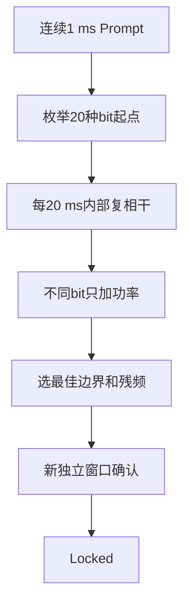
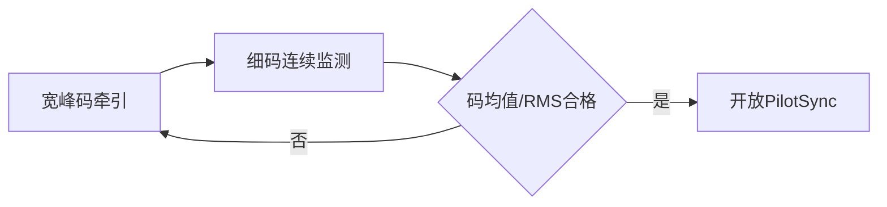

# 第5章 为什么必须先同步再长积分

> [!abstract] 本章目标
> 解释数据bit、固定覆盖码和导频二次码为什么会翻转相关符号，以及StarTrack怎样搜索边界、独立确认、
> 再统一擦除全部抽头和副本。

## 5.1 符号翻转会把相干和抵消掉

假设每1 ms Prompt都是$A$，连续20 ms相加得到$20A$。如果第11 ms数据位翻转，后10个变成
$-A$，直接相加得到0：

$$
\sum_{m=0}^{19}d[m]P[m]
=10A-10A=0.
$$

所以长相干前必须知道符号边界，或者使用对符号不敏感的平方/功率统计。

## 5.2 三类符号不要混淆

| 类型 | 例子 | 是否公开已知 | 处理方式 |
|---|---|---|---|
| 导航数据bit | L1CA、B1I、G1数据 | 内容未知 | 先找20 ms边界，不能跨未知bit相干 |
| 固定覆盖码 | B1I NH20、G1 meander | 序列已知 | 时间边界确认后按绝对历元擦除 |
| 导频二次码 | L5Q20、B2a/E5a 100、E1C25、B1C-P1800 | 序列公开 | 搜索相位并独立确认后擦除 |

“序列公开”不等于当前相位已知。接收机仍要找出二次码走到哪一chip。

## 5.3 数据型信号怎样找20 ms边界

`DataBitSync`尝试20种候选起点。对候选$h$，每个bit内部复数相干，bit之间只加功率：

$$
J(h)=\sum_b\left|\sum_{m=0}^{19}P[h+20b+m]\right|^2.
$$

第一次搜索只建立候选；第二个独立数据窗确认同一边界，才允许下游把它当锁定结果。

## 5.4 E1/B1C为什么先要码居中

BOC存在多个相关峰。码还在副峰时，Prompt可能依然很强，导频二次码搜索甚至可能给出高峰值比。
如果先锁二次码，后续擦码和长相干会在错误码峰上自洽。

所以E1/B1C有额外门：

码居中门打开的同一PDI仍不能进入旧同步窗口；下一条满足完整主码边界的PDI才开始新搜索。

## 5.5 导频同步先按完整主码聚合

E1主码4 ms，B1C主码10 ms。`CodePeriodSum`先形成：

$$
Z_k=\sum_{m=0}^{M-1}P_{k,m},
$$

其中E1的$M=4$，B1C的$M=10$。聚合必须满足：

- 从`segment=0`开始；
- segment严格连续；
- `code_period`正确递增；
- PDI完整；
- 普通NCO命令换字不视为缺口。

## 5.6 不同导频的同步时标

| 信号 | 二次码周期 | 当前关键时标 |
|---|---:|---|
| L5Q | 20 ms | 短二次码搜索与独立确认 |
| B2a-P | 100 ms | 公开100 chip序列 |
| E5a-Q | 100 ms | 公开100 chip序列 |
| E1C | 100 ms | 500 ms搜索+500 ms独立确认 |
| B1C-P | 18 s | 18 s搜索+18 s独立确认 |

B1C不是“相干18秒”。它把1800个10 ms主码按500 ms分段相干，再跨分段加功率，降低残频敏感性。
确认阶段重新使用独立数据和二维频率×相位搜索。

## 5.7 `PilotWiper`必须一次擦全

锁定后，公开二次码符号$d_s[k]\in\{-1,+1\}$必须同时作用于默认导频分量的：

- BOC和PRN-only两个副本；
- P/E/L/VE/VL全部抽头；
- 语义镜像和完整相关矩阵。

$$
z'_{c,r,t}=d_s[k]z_{c,r,t}.
$$

只擦Prompt会让载波环看到连续相位，而码环的E/L仍翻转；只擦BOC副本会破坏ASPeCT两路的相对符号。

## 5.8 同步失败与重建

以下事件会清同步候选或锁定状态：

- PDI缺口、overflow、命令迟到或命令号错误；
- 主码segment/period不连续；
- BOC重新确认外峰；
- 状态/配置重建导致观察模型改变；
- 明确同步失败达到返回快速恢复条件。

单个`ready-invalid`只代表本窗证据不足，是否清锁定必须按对应同步器合同处理，不能统一粗暴解锁。

## 5.9 对应源码

| 功能 | 文件/类 |
|---|---|
| 数据bit同步 | `src/sync/data_bit_sync.cpp::DataBitSync` |
| 导频同步 | `src/sync/pilot_sync.cpp::PilotSync` |
| 统一编排 | `src/sync/signal_sync.cpp::SignalSync` |
| 主码聚合 | `src/integrator/code_period_sum.cpp::CodePeriodSum` |
| 覆盖码擦除 | `src/integrator/data_cover_wiper.cpp` |
| 导频擦除 | `src/integrator/pilot_wiper.cpp` |

## 5.10 本章小结

长相干的前提是符号模型正确。数据型信号找bit边界，导频信号找二次码相位，E1/B1C还要先证明
码峰居中。搜索和确认必须用独立窗口，锁定后必须统一擦除全部控制相关量。

---

上一篇：[[../02-软硬件边界/04-TrackEngine六阶段流水线|TrackEngine六阶段流水线]]　下一篇：[[06-相干积分与非相干积累|相干积分与非相干积累]]
