# 第6章 相干积分与非相干积累

> [!abstract] 本章目标
> 彻底区分1 ms PDI、相干块、观察窗、更新周期和状态监督周期。很多跟踪设计误解都来自把它们
> 混成一个“环路周期”。

## 6.1 两种累加的根本区别

### 复数相干积分

$$
Z=\sum_{n=0}^{N-1}z_n.
$$

相位对齐时，信号幅度按$N$增长，功率按$N^2$增长；随机噪声功率只按$N$增长，处理增益高。
但只要符号翻转或相位明显旋转，信号也会相消。

### 功率非相干积累

$$
J=\sum_{k=0}^{K-1}|Z_k|^2.
$$

每块先相干，再加功率。它不怕块间正负号翻转，但丢失了块间相位，处理增益低于全相干。

## 6.2 五个时间量

| 名称 | 例子 | 决定什么 |
|---|---:|---|
| 硬件PDI | 1 ms | 命令和相关器的最小交互边界 |
| `coherent_ms` | 1、20、100、120 ms | 单个复数块多长 |
| `carrier_obs_ms` | 20、160、320、600 ms | 频率观察用了多长数据 |
| `carrier_update_ms` | 20、160、320、600 ms | 多久允许一次新频率校正 |
| `code_obs_ms/update_ms` | 最长5 s历史/最多600 ms更新 | 码能量降噪与DLL响应 |

长观察不等于每1 ms停止出命令。没有新观察时，环路仍可用已经确认的频率趋势和码率状态连续产生
下一条NCO命令。

## 6.3 `BitIntegrator`怎样工作

同步后，`BitIntegrator`按已确认边界累加P/E/L/VE/VL：

$$
Z_X=\sum_{n=0}^{N-1}d[n]X[n].
$$

无辅助数据型信号不能跨未知数据bit；已知bit辅助或已擦导频可以跨更长时间。输出`CohResult`还保存：

- `first_epoch/last_epoch`；
- 实际`span_s`；
- 窗口中心NCO频率与相位；
- `known_symbols`、`ready`、`valid`。

这些时间字段用于观察重定时，不能只拿窗口末端当作测量时刻。

## 6.4 长历史和短更新可以并存

码观察器可以保留最长5 s基础块，但每320 ms发布一次新的DLL误差。做法是每次从连续历史取一个后缀
重新统计，而不是5 s才控制一次。

```mermaid
gantt
    title 5秒码能量历史与320毫秒更新示意
    dateFormat  X
    axisFormat %L
    section 历史
    连续保留基础块 :0, 5000
    section DLL更新
    更新1 :0, 320
    更新2 :320, 640
    更新3 :640, 960
    更新4 :960, 1280
```

项目硬约束是`code_update_ms<=600`，更长降噪只能来自重叠历史，不能把控制反应拖成数秒。

## 6.5 NCO换字为什么不一定清窗

普通NCO命令每PDI都可能变化。如果每次换字都清积分，闭环永远积不满。StarTrack为每条PDI保存真实
`nco_hz/nco_phase`，观察器把各块旋转或重定时到共同参考。

真正需要清窗的是：

- 时间轴不连续；
- 载波或码相位被显式重新装载；
- 观察模式、频点网格、符号边界或抽头几何不兼容；
- 有限码斜坡开始/停止使码率模型跨边界改变。

## 6.6 观察输出时刻

一条长窗口频率观察描述的是窗口中心$t_{obs}$附近的残差，不是当前$t_{now}$。若已有可信Hz/s趋势$r_f$：

$$
\Delta f_{now}=\Delta f_{obs}+r_f(t_{now}-t_{obs}).
$$

只有被独立频率监测确认的趋势才可这样传播；噪声拟合出来的斜率不能进入控制。

## 6.7 一个具体例子：LongFast

`LongFast`参数为：

- 每个相干块20 ms；
- 8个块形成160 ms载波观察；
- 载波每160 ms接受一次新观察；
- 码观察和DLL更新也是160 ms；
- 但每1 ms仍产生一条HwCmd。

这不等于“硬件160 ms才更新一次”。正确理解是160 ms才有一次新的测量校正，预测和命令连续运行。

## 6.8 无效窗口的处理

- `ready=false`：继续积累或等待下一发布节拍；
- `ready=true, valid=false`：这个完整窗口作废，环路保持上一可信状态；
- gap：窗口清空，从合法边界重建；
- 模式变化：只有数据组织和几何兼容时才允许复用预热历史。

## 6.9 对应源码

| 功能 | 位置 |
|---|---|
| 20 ms及更长相干 | `src/integrator/bit_integrator.cpp` |
| E1/B1C完整主码 | `src/integrator/code_period_sum.cpp` |
| 载波频点积累 | `src/carrier_observer/freq_bin_observer.cpp` |
| 码能量历史 | `src/code_observer/code_observer.cpp` |
| 策略周期表 | `src/tracking/track_fsm.cpp::kTrackPolicies` |

## 6.10 本章小结

相干积分保留相位、增益高但怕符号和残频；非相干积累稳健但损失相位信息。StarTrack把数据跨度、
发布周期和1 ms控制边界分开，既能用长观察降噪，又不让硬件控制停顿。

---

上一篇：[[05-为什么必须先同步再长积分|为什么必须先同步再长积分]]　下一篇：[[../04-载波跟踪/07-频率观察器从相位差到DFT|频率观察器从相位差到DFT]]
