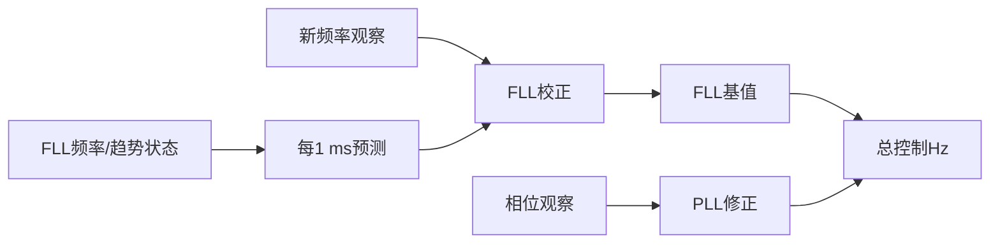
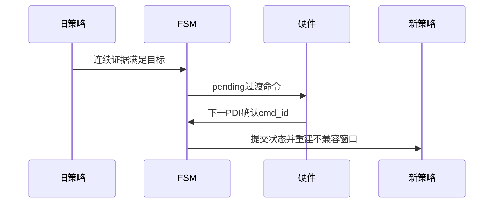

# 第8章 载波环：FLL预测、校正与PLL精修

> [!abstract] 本章目标
> 解释频率观察进入控制器后怎样变成连续NCO，为什么弱状态只允许FLL，以及状态换档怎样避免频率跳变。

## 8.1 观察不是控制

频率观察告诉环路“当前NCO大约还差多少Hz”。它可能每20、160、320或600 ms才出现一次，但硬件
每1 ms都需要新命令。载波环因此分成：

1. `advanceTo()`：没有新观察也按已确认趋势推进；
2. `correct()`：有合格观察时校正频率和趋势；
3. 可选PLL：用相位误差做小修正。

## 8.2 FLL保存哪些状态

内部至少保存：

- 当前连续频率$f$；
- 与更新周期对应的趋势步进$d_2$；
- 物理变化率$r_f=d_2/T_u$；
- 最近时间锚。

到当前时刻的预测：

$$
f_k^{-}=f_{k-1}+r_f\Delta t.
$$

如果PDI时间轴断了，`rebaseTime()`重新锚定，不能把趋势跨未知缺口外推。

## 8.3 FLL怎样校正

对合格频率误差$e_f$：

$$
d_{2,k}=d_{2,ref}+\lambda(d_{2,k-1}-d_{2,ref})+K_2e_f,
$$

$$
f_k=f_k^{-}+(d_{2,k}-d_{2,k-1})+K_1e_f.
$$

直觉上：

- $K_1$马上纠正当前频率；
- $K_2$学习持续变化趋势；
- $\lambda$在极弱状态抑制旧趋势随机游走；
- 不是所有`valid`观察都能推进高阶趋势，必须具有物理Hz解释或明确授权。

状态策略表中给出芯片系数还原后的$K_1/K_2$。若无显式系数，可由等效带宽和更新时间推导：

$$
\omega_n=\frac{B_n}{0.53},\qquad
K_1=1.414\omega_nT_u,\qquad K_2=(\omega_nT_u)^2.
$$

## 8.4 PLL为什么只在强信号状态开放

相位比频率更敏感。弱信号下Prompt相位容易被噪声随机拉动，PLL可能把随机相位当真实频率修正。

StarTrack只有`ShortSlow`允许`CarrierLoopMode::kFllPll`，并有两层保护：

1. 状态策略`phase_control=true`；
2. `CarrierLoop`模式也必须允许PLL注入。

Sensitivity、BitAiding、OutdoorBitAiding和动态状态都保持FLL-only；即使日志形成相位诊断，也不进入NCO。

## 8.5 相位观察

已知符号时使用四象限：

$$
\widehat\phi=\frac{1}{2\pi}\operatorname{atan2}(Q_P,I_P),
\qquad \text{period}=1\ \text{cycle}.
$$

未知数据bit时使用Costas形式：

$$
\widehat\phi=\frac{1}{2\pi}\arctan\left(\frac{Q_P}{I_P}\right),
\qquad \text{period}=0.5\ \text{cycle}.
$$

`PhaseMonitor`还要求一段窗口内有效比例和RMS同时通过，不能靠一次漂亮相位就宣布锁定。

## 8.6 PLL控制公式

设相位误差$\phi_k$以cycle输入，$\omega_p=B_{PLL}/0.7845$：

$$
r_{p,k}=r_{p,k-1}+0.25T_u\omega_p^3\phi_k,
$$

$$
i_{p,k}=i_{p,k-1}+T_u\left(r_{p,k}+0.55\omega_p^2\phi_k\right),
$$

$$
f_{PLL,k}=i_{p,k}+2.4\omega_p\phi_k.
$$

总控制：

$$
f_{ctrl}=f_{FLL}+f_{PLL}.
$$

PLL带宽按新鲜C/N0分四档：

| C/N0 | 带宽 |
|---:|---:|
| 小于36 dB-Hz | 2.4 Hz |
| 36到38 dB-Hz | 4.8 Hz |
| 38到42 dB-Hz | 7.2 Hz |
| 不小于42 dB-Hz | 9.6 Hz |

## 8.7 相位失效时怎样避免旧PLL拖累

若相位观察完整但无效，同时本次有有效FLL观察，当前总NCO先吸收到FLL基值，再清PLL状态。这样不会因
清PLL而让总频率突然跳变，也不会让旧PLL修正长期抵消新FLL校正。

单纯`phase.ready=false`表示没有新相位，最近PLL状态保持，不等于立即清零。

## 8.8 状态换档的连续性

换档时：

- 保留当前总NCO频率；
- 只交接可信的Hz/s趋势；
- 清PLL即时积分和不兼容观察窗；
- 不装载载波相位；
- 命令确认后新策略才接管。

## 8.9 为什么高动态状态仍是320 ms

高动态不是靠“每次都加宽搜索”实现，而是依靠：

- 频率监测器从独立批次确认Hz/s趋势；
- FLL每1 ms按趋势预测；
- 320 ms观察提供新的误差校正；
- HighDynamic使用更高FLL带宽和趋势增益。

若趋势不可信，长窗口之间盲目外推会比不预测更危险。

## 8.10 对应源码

| 功能 | 文件/函数 |
|---|---|
| FLL状态 | `src/carrier_loop/third_order_fll.cpp` |
| 载波环编排 | `src/carrier_loop/carrier_loop.cpp::advanceTo()`、`correct()` |
| 相位观察 | `src/carrier_observer/phase_observer.cpp` |
| 相位监测 | `src/monitor/phase_monitor.cpp` |
| 带宽与状态策略 | `src/tracking/track_fsm.cpp` |

## 8.11 本章小结

FLL负责连续频率和趋势，PLL只在强信号ShortSlow中精修相位。新观察间隔可以很长，但预测和命令仍按
1 ms运行。换档保留总NCO并等待硬件确认，避免软件状态名变化造成物理频率跳变。

---

上一篇：[[07-频率观察器从相位差到DFT|频率观察器从相位差到DFT]]　下一篇：[[../05-码跟踪/09-BPSK码环与载波辅助DLL|BPSK码环与载波辅助DLL]]
