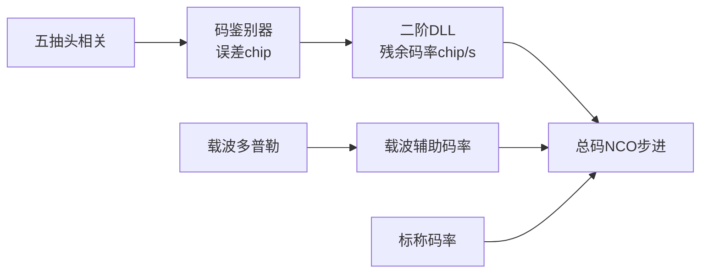

# 第9章 BPSK码环与载波辅助DLL

> [!abstract] 本章目标
> 从Early-Late鉴别量走到最终码NCO，解释为什么DLL只修剩余码误差、载波多普勒必须承担主要码率动态。

## 9.1 码环的输入和输出

DLL输入是码相位误差$\epsilon_c$，单位chip；输出不是“码相位”，而是剩余码率修正，单位chip/s。

## 9.2 Early-Late鉴别量

基础归一化量：

$$
D_{EL}=\frac{E-L}{E+L}.
$$

如果Prompt是局部主峰且启用双差：

$$
D_{DD}=\frac{2(E-L)-(VE-VL)}{E+L}.
$$

双差利用外抽头抵消部分幅度斜率，但只能在已知局部主峰附近使用。输出还需乘几何标定系数并加上
选中峰相对Prompt的抽头偏移。

## 9.3 峰值策略

标准`CodeObserver`支持：

| 策略 | 观察范围 | 适用阶段 |
|---|---|---|
| 固定Prompt | 只相信P附近 | 已经稳定跟踪 |
| E/P/L局部选峰 | 三抽头 | 普通局部恢复 |
| VE/E/P/L/VL宽选峰 | 五抽头 | 捕获后或更宽局部恢复 |

最外抽头胜出时不会直接把外抽头当精确误差，而是先向内移动一格，让后续E/L两侧都有信息。

## 9.4 为什么载波可以辅助码率

卫星与接收机径向运动同时改变载波频率和码片到达速度。近似关系：

$$
R_{aid}=f_d\frac{R_c}{f_L}.
$$

其中：

- $f_d$是物理载波多普勒；
- $R_c$是标称码率；
- $f_L$是实际载频；
- G1使用对应FDMA频道载频。

例如载波多普勒数千Hz时，若完全不给码率辅助，长同步窗内会累积明显码漂。StarTrack从初始捕获命令起
就建立辅助，不等第一条DLL观察成熟。

## 9.5 总码率

$$
R_{code}=R_c+R_{aid}+R_{DLL}+R_{slew}.
$$

$R_{slew}$只在E1/B1C有限码斜坡事务期间存在；普通BPSK跟踪为0。

## 9.6 二阶DLL

只有`CodeObsKind::kFine`且`ready&&valid`时推进PI：

$$
I_k=\lambda_c I_{k-1}+K_i\epsilon_{c,k},
$$

$$
R_{DLL,k}=I_k+K_p\epsilon_{c,k}.
$$

各项直觉：

- 比例项快速修正当前码偏；
- 积分项消除持续小偏差；
- $\lambda_c$可在极弱状态抑制旧积分噪声；
- 载波辅助每PDI更新，DLL只负责剩余误差。

## 9.7 缺测时为什么保持而不是归零

若本次没有新码观察，真实码率并不会自动回到标称值。StarTrack保持最近DLL输出并继续叠加载波辅助。
把缺测当0误差并不等于保持：如果实现顺便衰减积分，会让已经学到的接收机钟差补偿丢失。

明确时间轴中断、粗牵引或不兼容状态切换才重置PI。

## 9.8 粗观察为什么绝不能进入DLL

粗观察只说“应该向Early或Late方向移动一次”，不代表存在持续的chip/s偏差。如果进入积分器：

1. 一次方向事件被积成长期码率；
2. 后面缺测时继续保持；
3. 码相位越走越远。

所以数据类型显式区分：

- `CodeObsKind::kCoarse`：只给TrackEngine有限斜坡事务；
- `CodeObsKind::kFine`：才允许送`CodeLoop`。

## 9.9 DLL监测器不是DLL本身

`DllMonitor`在独立窗口统计：

$$
\bar\epsilon_c=\frac{1}{N_v}\sum\epsilon_{c,i},
$$

$$
\epsilon_{rms}=\sqrt{\frac{1}{N_v}\sum\epsilon_{c,i}^2}.
$$

控制器用本次误差更新码率；FSM和BOC FineCheck用均值、RMS、有效率判断是否稳定。不能用监测均值替代本次
控制，也不能用当前DLL输出大小判断是否居中。

## 9.10 极弱导频码观察

导频进入Sensitivity后可以用更长能量历史降低E/L随机噪声，但仍保持不超过600 ms的更新。当前导频
Sensitivity可使用5 s能量观察历史、320 ms发布节拍，并把DLL带宽改为更窄的专属值。

“观察用5 s”不等于“5 s才更新码NCO”，详见[[../03-同步与积分/06-相干积分与非相干积累|第6章]]。

## 9.11 状态变化时保留什么

兼容换档保留：

- 连续码相位；
- 标称码率；
- 实时载波辅助；
- 物理兼容的DLL状态。

必须清除：

- 使用不同抽头几何的未完成码窗；
- 粗牵引期间的PI；
- 有限斜坡事务；
- 跨PDI缺口的监测历史。

## 9.12 对应源码

| 功能 | 文件/函数 |
|---|---|
| 标准码观察 | `src/code_observer/code_observer.cpp` |
| 芯片鉴别器 | `src/code_observer/chip_dll_disc.cpp` |
| 码环 | `src/code_loop/code_loop.cpp::CodeLoop::update()` |
| DLL监测 | `src/monitor/dll_monitor.cpp` |
| 配置选择 | `src/tracking/track_engine.cpp::codeConfig()` |
| 命令合成 | `src/tracking/track_engine.cpp::makeCommand()` |

## 9.13 本章小结

DLL不是独自追踪全部码动态。载波多普勒先给主要码率辅助，DLL只修局部码相位残差。粗方向和细误差
在类型与状态机中严格隔离，避免一次宽峰判断变成无限期码率偏置。

---

上一篇：[[../04-载波跟踪/08-载波环FLL与PLL|载波环FLL与PLL]]　下一篇：[[10-BOC与ASPeCT|BOC与ASPeCT]]
