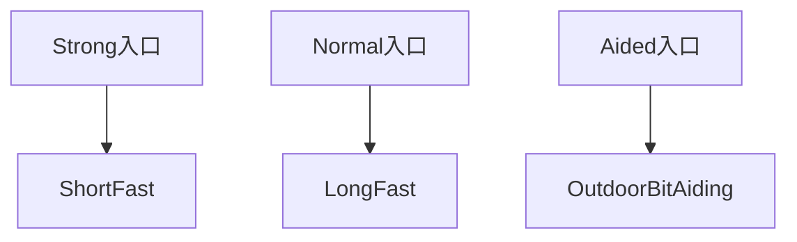
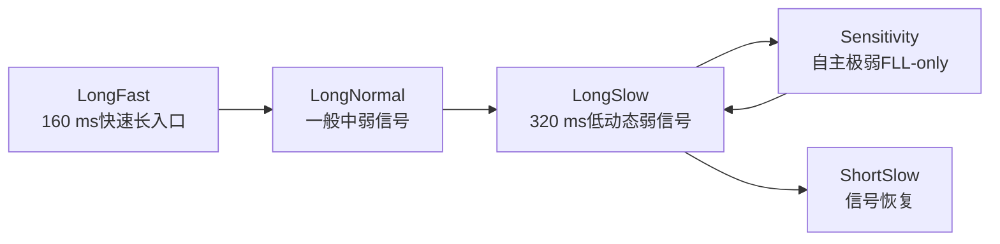
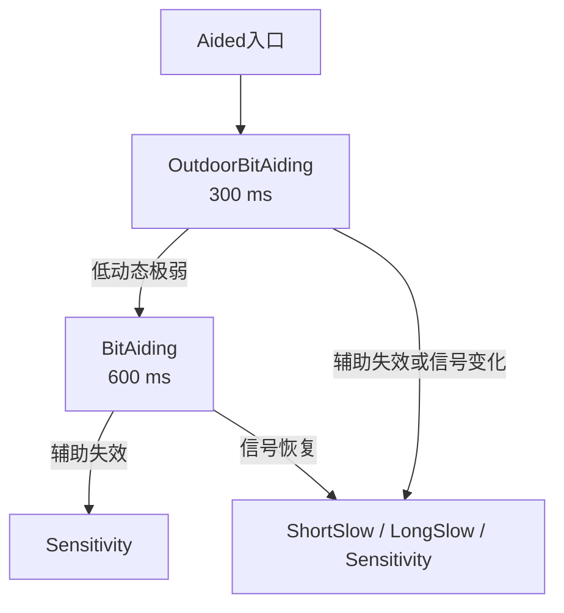

# 第11章 十一状态：先分职责，再看切换

> [!abstract] 本章目标
> 不画一张纠缠的蜘蛛网。先把11个状态按“入口、强弱、动态、辅助”分组，再分别看局部转换。

## 11.1 状态到底改变什么

状态不是“锁定等级标签”，它选择一套完整策略：

- PDI组织模式；
- 相干长度与非相干块数；
- 频率鉴别器、频点数和间隔；
- 载波观察/更新周期；
- FLL带宽和系数；
- 码观察/更新周期与DLL系数；
- 是否允许PLL；
- 是否要求外部bit辅助。

## 11.2 先记四组职责

| 组别 | 状态 | 一句话职责 |
|---|---|---|
| 短周期强信号 | ShortFast、ShortNormal、ShortSlow | 快速接管、同步、强信号精跟踪 |
| 长周期中弱信号 | LongFast、LongNormal、LongSlow、Sensitivity | 普通入口、降噪、极弱自主保持 |
| 辅助 | OutdoorBitAiding、BitAiding | 使用可信外部bit扩大相干 |
| 动态 | MidDynamic、HighDynamic | 在中高Hz/s下提高FLL动态能力 |

## 11.3 三种入口

入口只决定初始工作区，不永久限制后续状态。捕获结果不应直接把冷态引擎强塞进任意后续状态；测试若要
固定状态，必须从活跃引擎`captureEntry()`取得合法连续快照。

## 11.4 短周期强信号链

### ShortFast

- 1 ms基础相关、20 ms观察/更新；
- Cross/Dot FLL，3 Hz；
- DLL 2 Hz；
- FLL-only；
- 职责是捕获后快速把载波和码拉入局部范围。

### ShortNormal

- 20 ms相干，11个10 Hz频点；
- 20 ms观察/更新；
- FLL 2 Hz、DLL 0.8 Hz；
- 等待bit或导频同步建立。

### ShortSlow

- 仍是20 ms更新，但FLL降到1 Hz、DLL降到0.1 Hz；
- 唯一允许FLL+PLL的状态；
- 负责强信号低残差精跟踪。

> [!important] ShortNormal不是“没用的过渡态”
> 它的职责是让快速牵引结果在20 ms边界和多频点观察下建立同步与局部稳定证据。ShortFast直接跳
> ShortSlow会把“刚接管”误当成“相位已经可信”。

## 11.5 长周期中弱信号链

### LongFast

- 20 ms相干×8，160 ms观察/更新；
- FLL 1.6 Hz、DLL 1.0 Hz；
- Normal移交入口和长统计快速恢复。

### LongNormal

- 同样160 ms，但FLL 0.8 Hz、DLL 0.5 Hz；
- 负责一般动态和中弱信号。

### LongSlow

- 20 ms×16，320 ms观察/更新；
- FLL 0.35 Hz、DLL 0.1 Hz；
- 低动态弱信号的稳定过渡层。

### Sensitivity

- 320 ms载波更新，FMS局部鉴频；
- FLL 0.2 Hz；
- 码观察可600 ms，更新仍320 ms；
- FLL-only，不允许相位控制；
- 负责自主极弱保持，不等于已知bit辅助。

## 11.6 动态状态单独看

进入动态状态依赖：

- 同步锁定；
- C/N0可靠；
- 独立频率批次均值和RMS；
- $|mean|/RMS$关系；
- Hz/s趋势至少达到拟合标准差的可信范围。

HighDynamic不是简单把所有频差门放宽。它用0.7 Hz FLL带宽和已确认趋势预测承担最高动态；
MidDynamic用0.5 Hz作为恢复中间层。

## 11.7 辅助状态单独看

### OutdoorBitAiding

- 100 ms相干×3，300 ms更新；
- BinPower 5 Hz频点；
- FLL 0.4 Hz、DLL 0.1 Hz；
- 要求每PDI可信bit及其时间映射。

### BitAiding

- 120 ms相干×5，600 ms更新；
- 3点FMS，FLL 0.05 Hz；
- DLL 0.025 Hz；
- 用于室内低动态、严格已知bit极弱保持。

辅助不是“信号越弱就自动猜bit”。`aid_valid`必须由外部A-GNSS时间映射证明。

## 11.8 参数总表

| 状态 | 相干×块 | 载波观察/更新 | FLL Hz | 码观察/更新 | DLL Hz | 载波模式 |
|---|---:|---:|---:|---:|---:|---|
| ShortFast | 1×20 ms | 20/20 | 3.0 | 20/20 | 2.0 | FLL |
| ShortNormal | 20×1 ms | 20/20 | 2.0 | 20/20 | 0.8 | FLL |
| ShortSlow | 20×1 ms | 20/20 | 1.0 | 20/20 | 0.1 | FLL+PLL |
| LongFast | 20×8 ms | 160/160 | 1.6 | 160/160 | 1.0 | FLL |
| LongNormal | 20×8 ms | 160/160 | 0.8 | 160/160 | 0.5 | FLL |
| LongSlow | 20×16 ms | 320/320 | 0.35 | 320/320 | 0.1 | FLL |
| Sensitivity | 20×16 ms | 320/320 | 0.2 | 600/320 | 0.15 | FLL |
| BitAiding | 120×5 ms | 600/600 | 0.05 | 600/600 | 0.025 | FLL |
| OutdoorBitAiding | 100×3 ms | 300/300 | 0.4 | 300/300 | 0.1 | FLL |
| MidDynamic | 20×16 ms | 320/320 | 0.5 | 320/320 | 0.1 | FLL |
| HighDynamic | 20×16 ms | 320/320 | 0.7 | 320/320 | 0.1 | FLL |

## 11.9 为什么没有一张完整状态蜘蛛网

完整直接邻接关系在下一章用表列出。学习时把入口、强弱、动态、辅助分开，能看清每条边的物理职责；
把所有箭头画到一张图会掩盖“进入”和“退出”使用不同证据、不同迟滞这一事实。

## 11.10 对应源码

- 枚举：`include/model/track_data.h::TrackState`；
- 参数表：`src/tracking/track_fsm.cpp::kTrackPolicies`；
- 策略结构：`include/tracking/track_fsm.h::TrackPolicy`；
- 状态名称：`src/model/track_data.cpp::trackStateName()`。

## 11.11 本章小结

11状态不是11种互相竞争的算法，而是四组职责：快速接管、强信号精跟踪、中弱/极弱保持、辅助和动态。
先理解每个状态为什么存在，再看切换判据，状态机就不再是一团箭头。

---

上一篇：[[../05-码跟踪/10-BOC与ASPeCT|BOC与ASPeCT]]　下一篇：[[12-状态判据迟滞与命令确认|状态判据迟滞与命令确认]]
