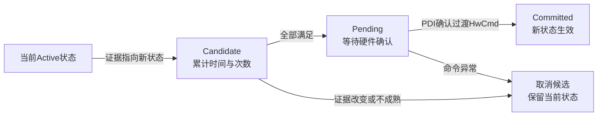
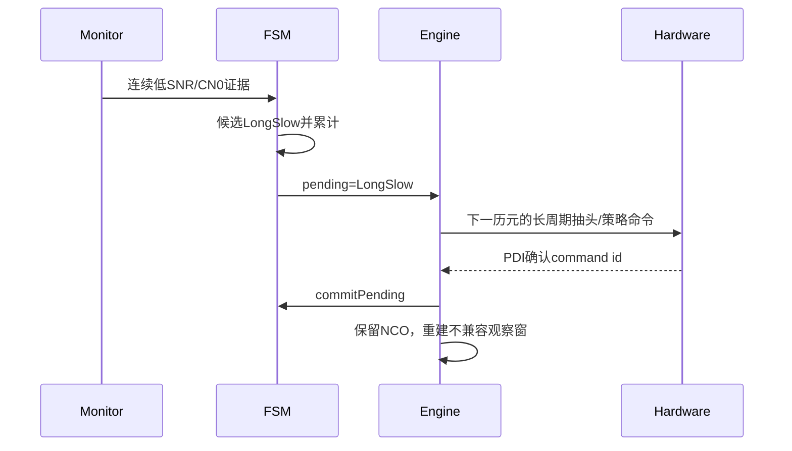

# 第12章 状态判据、迟滞与命令确认

> [!abstract] 本章目标
> 解释FSM到底读取哪些证据、怎样防止来回抖动，以及为什么满足判据后还不能马上宣布状态切换完成。

## 12.1 FSM只看压缩后的证据

`TrackEvidence`包含：

| 类别 | 关键字段 |
|---|---|
| 完整性 | `pdi_ok`、`cmd_ok` |
| 同步 | `sync_locked`、`sync_failed` |
| 强弱 | `cn0_db_hz`、`loop_snr`及有效性 |
| 频率稳定 | 最近误差、批次均值、RMS、有效率 |
| 动态 | `carrier_rate_hz_s`、`rate_sigma_hz_s` |
| 码稳定 | `code_error_chips`、`code_rms_chips` |
| 相位 | `phase_valid`与监测结果 |
| 辅助 | `aid_valid` |

FSM不读取原始P/E/L、DFT频点功率或FLL积分器内部量。

## 12.2 完整状态转换表

任意状态可以保持原状态；任意非ShortFast状态遇到全局故障可请求ShortFast。普通非故障邻接：

| 源状态 | 允许直接目标 |
|---|---|
| ShortFast | ShortNormal |
| ShortNormal | ShortSlow |
| ShortSlow | LongSlow、HighDynamic |
| LongFast | LongNormal |
| LongNormal | LongSlow |
| LongSlow | ShortSlow、Sensitivity、HighDynamic |
| Sensitivity | ShortSlow、LongSlow、BitAiding |
| BitAiding | ShortSlow、LongSlow、Sensitivity |
| OutdoorBitAiding | ShortSlow、LongSlow、Sensitivity、BitAiding、HighDynamic |
| MidDynamic | ShortSlow、LongSlow、Sensitivity、HighDynamic |
| HighDynamic | ShortSlow、Sensitivity、MidDynamic |

这个表是源码`trackTransitionAllowed()`的最终边界；报告里画出的路径不能创造表外直达边。

## 12.3 全局故障优先级最高

以下任一发生，`desired()`首先请求ShortFast：

- `pdi_ok=false`；
- `cmd_ok=false`；
- 同步器明确`sync_failed=true`；
- 已要求同步的状态失去锁定。

但即使是安全回退，也仍要生成过渡命令并等待PDI确认；“请求回退”不等于硬件配置已经换完。

## 12.4 为什么要迟滞

C/N0、频率RMS和动态估计都有噪声。如果一次越门就换状态，会出现：

$$
\text{LongSlow}\leftrightarrow\text{Sensitivity}
$$

每个更新点来回跳，观察窗不停重建，反而失锁。

默认迟滞：

- 同一候选累计至少400 ms；
- 至少2次监督确认；
- 当前状态通常至少驻留1000 ms；
- 动态候选至少4次确认；
- 自动入口链有专属较短驻留和确认规则。

## 12.5 四阶段状态提交

### Active

当前状态已经由硬件确认，`fsm_.state()`返回它。

### Candidate

只是软件看到连续证据；如果中间缺一轮或目标改变，累计清零。

### Pending

判据满足，但还在等待含新策略配置的命令被下一PDI确认。

### Committed

`confirmTransition()`确认命令号后才调用`commitPending()`，然后`applyPolicy()`重建不兼容观察窗。

## 12.6 专用C/N0计数边

部分强弱边复刻芯片行为，不只使用通用400 ms迟滞：

- ShortSlow低线性SNR连续4次后进入LongSlow；
- LongSlow和动态档低C/N0连续6次进入Sensitivity；
- Sensitivity高C/N0连续26次恢复LongSlow；
- Sensitivity极弱且辅助有效连续16次进入BitAiding；
- 慢状态达到32 dB-Hz并连续恢复可回ShortSlow。

这些计数只在新的独立C/N0更新时推进，不能把同一个1 s结果在每20 ms日志行重复算50次。

## 12.7 动态判据

仅在同步和C/N0可靠时分类动态。典型量：

$$
R_d=\frac{|\bar f|}{f_{rms}}.
$$

还要求Hz/s变化率相对拟合不确定度足够可信，例如真实趋势至少达到若干倍$\sigma_r$。这样随机频率噪声不会
被误认成持续加速度。

`FreqMonitor`的变化率是独立监测结果，不是FLL内部趋势本身。FSM用前者选策略，环路只在被认可时交接后者。

## 12.8 状态切换时清什么

### 保留

- 载波总NCO；
- 连续载波/码相位；
- 物理兼容的同步边界；
- 可信Hz/s趋势；
- 同一物理统计的部分监测状态。

### 清除

- 不同相干长度或频点网格的未完成窗；
- 不兼容PLL/DLL积分；
- 不同抽头几何的码窗；
- 旧NCO/旧码中心形成的同步候选；
- 未完成有限码斜坡。

## 12.9 为什么测试不能冷启动强制任意状态

后续状态假设已经存在同步边界、连续NCO、C/N0和监测历史。从冷态直接`forceState(LongSlow)`会制造生产中
不存在的初始条件。

当前接口只允许：

1. 冷态测试强制回ShortFast；
2. 活跃引擎用`captureEntry(target)`导出版本化快照；
3. 同一引擎校验快照后`forceState(entry)`。

这就是状态探针也必须先经过牵引和同步的原因。

## 12.10 一个完整例子

信号从强变弱：

状态日志里的`state_pending=true`说明流程还在中间，不能把`pending_state`当已生效状态。

## 12.11 对应源码

| 功能 | 函数 |
|---|---|
| 选择目标 | `TrackFsm::desired()`、`selectTarget()` |
| 邻接检查 | `trackTransitionAllowed()` |
| 候选迟滞 | `updateCandidate()` |
| 专用C/N0边 | `updateChipCn0()` |
| pending提交 | `commitPending()`、`cancelPending()` |
| 命令确认 | `TrackEngine::confirmTransition()` |
| 策略应用 | `TrackEngine::applyPolicy()` |

## 12.12 本章小结

FSM不直接控制NCO，它把监测证据变成候选策略。候选必须经过物理时间迟滞、监督次数、最小驻留和硬件
命令确认，才成为活跃状态。这四层是防止噪声抖动和软硬件时序错位的关键。

---

上一篇：[[11-十一状态先分职责再看切换|十一状态先分职责再看切换]]　下一篇：[[../07-信号路径/13-八种信号逐条走一遍|八种信号逐条走一遍]]
