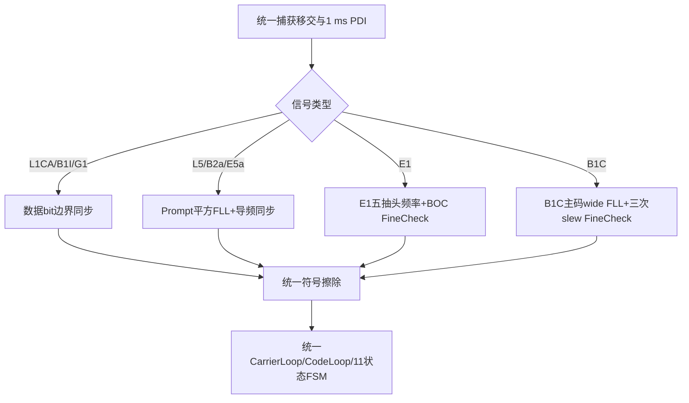

# 第13章 八种信号逐条走一遍

> [!abstract] 本章目标
> 把公共引擎和信号专属分支重新组合起来。每种信号都从捕获移交开始，说明同步、载波、码和数据分量
> 分别走哪条路径。

## 13.1 先看物理目录

`trackSignalSpec()`集中提供不可由Profile随意覆盖的物理常量。

| 信号 | 采样率 | 主码 | 分量/副本 | 默认闭环 | 覆盖码/二次码 |
|---|---:|---:|---:|---|---|
| GPS L1CA | 7.68 MHz | 1023 chip/1 ms | 1/1 | 数据 | 20 ms导航bit |
| BDS B1I D1 | 7.68 MHz | 2046/1 ms | 1/1 | 数据 | NH20 |
| GLONASS G1 | 10.24 MHz | 511/1 ms | 1/1 | 数据 | 20 ms meander |
| GPS L5 | 30.72 MHz | 10230/1 ms | 2/1 | L5Q导频 | L5Q20 |
| BDS B2a | 30.72 MHz | 10230/1 ms | 2/1 | B2a-P | 100 chip |
| Galileo E5a | 30.72 MHz | 10230/1 ms | 2/1 | E5a-Q | 100 chip |
| Galileo E1 | 7.68 MHz | 4092/4 ms | 2/2 | E1C | 25 chip/100 ms |
| BDS B1C | 7.68 MHz | 10230/10 ms | 2/2 | B1C-P | 1800 chip/18 s |

## 13.2 总分支图

分支发生在物理目录、同步和BOC牵引；完成符号处理后进入同一套环路和状态框架。

## 13.3 GPS L1 C/A

### Strong入口

1. 装载捕获多普勒和码相位；
2. ShortFast用相邻1 ms Prompt Cross/Dot快速牵引；
3. ShortNormal搜索20 ms数据bit边界；
4. 独立确认后进入20 ms边界对齐相干；
5. ShortSlow允许FLL+PLL精跟踪；
6. 信号减弱后经LongSlow进入Sensitivity，仍是无辅助FLL-only。

### Aided入口

只有外部bit符号和边界都可信，才从OutdoorBitAiding使用300 ms相干；更弱低动态可进入600 ms
BitAiding。公开资格中的“已知bit辅助”不能拿来替代无辅助能力。

## 13.4 BDS B1I D1

B1I与L1CA共享数据型主链，但1 ms Prompt还乘NH20：

- 未对齐时，普通相邻Prompt符号会按NH翻转；
- `DataBitSync`使用B1I专属频率网格找边界；
- `DataCoverWiper`按绝对历元擦NH20；
- 擦除后才进入统一20 ms积分和11状态；
- 当前只声明D1路径，不应写成D2已支持。

## 13.5 GLONASS G1

G1主码511 chip/1 ms，带20 ms meander覆盖码。它还是FDMA信号，载频随频道$k$变化：

$$
f_L=1602\ \mathrm{MHz}+k\cdot0.5625\ \mathrm{MHz},
\qquad k\in[-7,6].
$$

载波辅助DLL必须用对应频道实际载频，不能把所有G1都当1602 MHz。meander擦除后，其余数据型路径与
L1CA一致。

## 13.6 L5、B2a和E5a

三种现代导频共用主线：

默认闭环分别是L5Q、B2a-P、E5a-Q。数据分量只进入：

- `PilotDataAb`只读A/B诊断；
- `DataPromptDiag`数据Prompt诊断；
- 后续解调。

没有独立实验前，数据分量不能和导频联合更新FLL、PLL、DLL或FSM。

## 13.7 Galileo E1

E1C单导频闭环，E1B只读：

1. BPSK-like捕获给物理频率和Q16码相位，不加半chip补偿；
2. E1C BOC五抽头联合频率牵引；
3. 宽峰独立decision确认Early/Center/Late；
4. 外峰触发一次$\pm0.25$ chip有限slew；
5. 命令确认后切0.1/0.2 chip抽头做FineCheck；
6. 细码均值/RMS不超过0.20 chip；
7. 冻结预同步载波趋势；
8. 500 ms搜索+500 ms独立确认E1C二次码；
9. 擦码后用式(14)细码DLL和统一11状态。

E1正式移交域与$\pm62.5$ Hz压力场景不是一回事；算法文档不能把压力通过写成正式捕获接口要求。

## 13.8 BDS B1C

B1C-P单导频闭环，B1C-D只读：

1. 10 ms主码五抽头平方FLL，11块形成110 ms wide观察；
2. 一次完整物理有效wide观察锁存频率资格；
3. 式(13)三方向粗峰，两次160 ms同向decision；
4. 每次$\pm0.1$ chip有限slew；
5. 三次同向slew或可靠Center后启动式(14)FineCheck；
6. FineCheck均值/RMS不超过0.10 chip；
7. 18 s搜索+18 s独立确认1800 chip二次码；
8. 锁定前一直用wide FLL，码center不会切短Prompt；
9. 锁定边界清wide历史；
10. 擦码后进入统一状态观察、ASPeCT细DLL和独立物理C/N0显示。

B1C-P窄带可用功率：

$$
\frac{3}{4}\times\frac{29}{33}=\frac{29}{44}.
$$

这个比例用于真值与测量口径，不是环路里再乘一次的“补偿增益”。

## 13.9 捕获移交的统一边界

八种信号的跟踪入口只消费：

- 信号与PRN/频道；
- 绝对`start_sample`；
- 物理`doppler_hz`；
- 一个主码周期内的绝对`code_phase_q16`；
- Strong/Normal/Aided入口。

E1/B1C的BPSK-like捕获不允许跟踪端再扣边带、加半chip、读取捕获真值或内部阶段码相位。

## 13.10 公共主线与专属分支

| 模块 | 是否共用 | 专属点 |
|---|---|---|
| HardwareChannel/PDI | 共用 | 采样率、主码、分量和副本目录不同 |
| TrackEngine六阶段 | 共用 | `formFreqObs/formCodeObs`按信号路由 |
| CarrierLoop/CodeLoop | 共用 | 状态策略统一 |
| 数据同步 | 数据型共用 | NH/meander擦除不同 |
| PilotSync | 导频共用框架 | 二次码长度与E1/B1C时标不同 |
| ASPeCT | E1/B1C共用公式 | 预同步几何与流程不同 |
| B1C物理C/N0 | 专属 | 只读显示，不反馈闭环 |

## 13.11 本章小结

八种信号不是八套完全独立跟踪器。它们共享1 ms PDI、环路和状态机，只在物理目录、符号同步、BOC
预同步牵引和少量显示测量上分支。阅读源码时应先找公共主线，再进入信号专属条件。

---

上一篇：[[../06-状态机/12-状态判据迟滞与命令确认|状态判据迟滞与命令确认]]　下一篇：[[../08-质量与验证/14-CN0监测日志与故障恢复|C/N0、监测、日志与故障恢复]]
