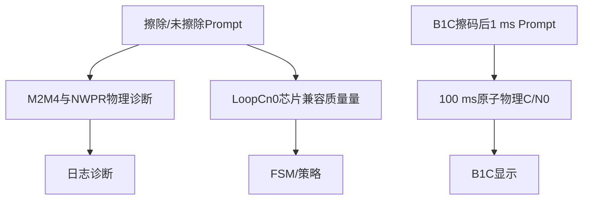

# 第14章 C/N0、监测、日志与故障恢复

> [!abstract] 本章目标
> 区分控制质量、物理C/N0和显示值；理解监测器、Logger及异常恢复怎样保持“只读证据”和“闭环控制”隔离。

## 14.1 C/N0是什么

$C/N_0$是载波功率与噪声功率谱密度之比，单位dB-Hz。它不是普通信噪比；若1 ms参考SNR为$\gamma$：

$$
C/N_0=10\log_{10}\left(\frac{\gamma}{0.001}\right).
$$

同一个跟踪器可能同时保留多个用途不同的C/N0量，不能看到单位相同就认为可以互换。

## 14.2 三条C/N0职责链

### 通用`Cn0Estimator`

同步前M2M4，同步后NWPR成熟可选。它是浮点物理诊断。

### `LoopCn0Estimator`

复刻芯片Q10比值、200 ms/1 s/5 s选择和0.1 dB量化。它保留异常10 dB和最低8 dB有效哨兵，
用于控制兼容性，是“环路质量量”，不是无偏物理显示。

### `B1cPhysicalCn0`

独立消费擦除二次码后的B1C-P 1 ms Prompt，形成100 ms相干原子和1/5/10 s pooled NWPR，只写物理与显示字段。

## 14.3 M2M4

对1 ms Prompt功率$p_i=|P_i|^2$：

$$
M_2=\frac{1}{N}\sum p_i,
\qquad M_4=\frac{1}{N}\sum p_i^2.
$$

估计：

$$
S=\sqrt{2M_2^2-M_4},\qquad N=M_2-S.
$$

$$
C/N_0=10\log_{10}\left(\frac{S}{N}\right)+30.
$$

根式或噪声功率不满足物理条件时必须invalid，不能用floor把结果抬高。

## 14.4 NWPR

对20 ms边界：

$$
P_n=\left|\sum_{m=0}^{19}P_m\right|^2,
\qquad P_w=\sum_{m=0}^{19}|P_m|^2.
$$

池化后1 ms参考SNR：

$$
\gamma_{1ms}=rac{\sum P_n-\sum P_w}
{20\sum P_w-\sum P_n}.
$$

同步失锁、边界改变或PDI缺口会清窗。一次非物理解不能静默保留旧显示而不标age或invalid。

## 14.5 B1C物理C/N0

锁定边界PDI不进入统计，等待下一合法`segment=0`。每100条擦码后PDI形成一个100 ms原子：

$$
Z_j=\sum_{i=1}^{100}z_{j,i},\qquad
W_j=\sum_{i=1}^{100}|z_{j,i}|^2.
$$

1/5/10 s分别池化$K=10/50/100$个原子，$M=100$：

$$
A=\sum|Z_j|^2,\qquad B=\sum W_j,
$$

$$
\widehat S=\frac{A-B}{KM(M-1)},
\qquad
\widehat N=\frac{MB-A}{KM(M-1)}.
$$

$$
C/N_0=10\log_{10}\left(\frac{\widehat S/\widehat N}{0.001}\right).
$$

10 s raw值直接进入当前B1C显示，不再叠15点中值。它不使用真值、FLL残差、状态补偿、offset或8 dB floor。

## 14.6 监测器分别在监什么

| 监测器 | 输出证据 | 主要消费者 |
|---|---|---|
| `FreqMonitor` | 有效率、均值、RMS、Hz/s、斜率不确定度 | FSM与趋势交接 |
| `PhaseMonitor` | 相位有效率、RMS、锁定 | PLL门与FSM |
| `DllMonitor` | 码均值、RMS、有效率 | FSM、E1/B1C FineCheck |
| `ChipDynMonitor` | 芯片alpha=1/8动态统计 | 动态诊断 |
| `FreqGuard` | 单观察物理范围和NCO一致性 | 是否`freq_used` |

监测器压缩一段历史，不能替代控制器本次误差；控制器也不能把内部积分器量冒充独立稳定证据。

## 14.7 日志字段怎样读

建议按这个顺序排查：

1. `pdi_ok/cmd_ok`：软硬件时间轴正常吗？
2. `sync.locked/pilot_wiped`：符号模型已经建立吗？
3. `freq.ready/valid/physical_valid`：观察器形成了什么？
4. `freq_used`：是否真正进入FLL？
5. `carrier.control_hz/rate_hz_s`：控制器在做什么？
6. `code.ready/valid/kind`与`dll_status`：码是粗方向还是细误差？
7. `state/pending/state_changed`：策略是否正在切换？
8. C/N0链分别是什么用途？

只看最终Doppler误差可能掩盖中途观察器频繁失效；只看`freq_valid`又可能忽略全部被Guard拒绝。

## 14.8 B1C安全诊断为什么是只读

`B1cSafetyDiag`记录wide ready、wide资格、coarse方向、slew起止、center、fine、PilotSync和lock边沿。
这些字段由真实控制提交点捕获，但仅供Logger/tests读取，不参与任何判断。

诊断记录“发生了什么”，不能反过来决定“接下来该做什么”。

## 14.9 异常恢复表

| 异常 | 处理 |
|---|---|
| epoch不连续 | `pdi_ok=false`，清跨历元窗，FLL重锚 |
| gap/overflow | 当前PDI不进入观察器，清同步/积分窗口 |
| cmd_late/cmd_id不符 | 取消待提交事务，不假定命令已应用 |
| 首PDI partial | 合法但不积分，等待完整边界 |
| freq invalid | 保持NCO，不写0；持续故障可触发FSM恢复 |
| phase invalid | 有FLL时吸收总频率后清PLL |
| code invalid | 保持辅助和DLL；FineCheck按合同重建 |
| 同步失锁 | 清擦码、长相干、C/N0，FSM请求快速恢复 |
| BOC外峰重现 | 撤销码center和PilotSync候选，回有限slew |

## 14.10 当前恢复能力边界

当前具备：

- 缺测保持；
- 五抽头局部峰恢复；
- E1/B1C专属宽峰与有限slew；
- 状态回ShortFast/LongFast。

没有通用软件大范围码搜索或运行时返回捕获模块的完整协议。因此遮挡后能否恢复必须按已验证误差范围
描述，不能写成任意失锁都能重捕获。

## 14.11 对应源码

| 功能 | 位置 |
|---|---|
| M2M4/NWPR | `src/monitor/cn0_estimator.cpp` |
| LoopCn0 | `src/monitor/loop_cn0.cpp` |
| B1C物理C/N0 | `src/monitor/b1c_physical_cn0.cpp` |
| 显示 | `src/monitor/display_cn0.cpp`、`pilot_display_cn0.cpp` |
| Logger | `src/logger/tracking_logger.cpp` |
| 异常编排 | `TrackEngine::processPdi()`、`applyPolicy()` |

## 14.12 本章小结

C/N0有物理诊断、控制质量和显示三种职责。监测器把连续历史变成FSM证据，Logger只读所有结果。异常时
保持最近可信控制、清受污染窗口并走命令确认协议，不能用floor、0误差或陈旧值掩盖失效。

---

上一篇：[[../07-信号路径/13-八种信号逐条走一遍|八种信号逐条走一遍]]　下一篇：[[15-源码地图与调试方法|源码地图与调试方法]]
