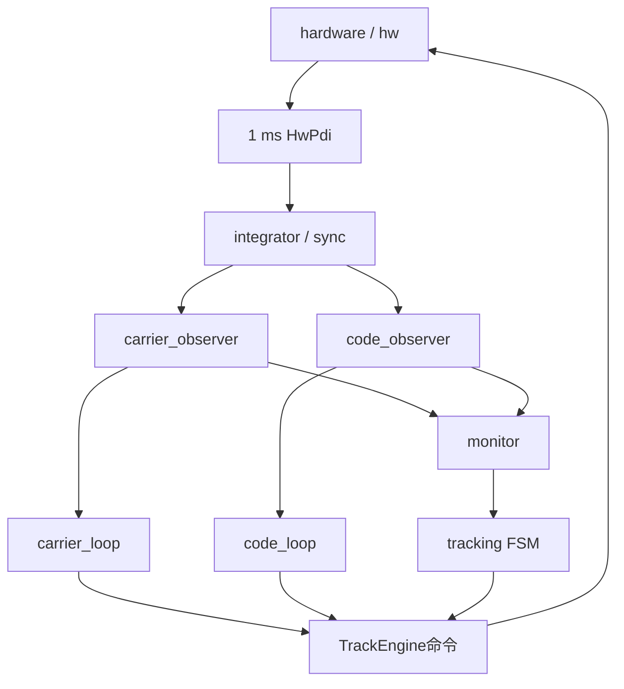

# 第15章 源码地图与调试方法

> [!abstract] 本章目标
> 给出从模块到文件、从日志到函数的索引。遇到失败时按物理链逐层定位，而不是直接调FSM阈值。

## 15.1 目录地图

## 15.2 关键文件索引

| 模块 | 主要文件 | 入口 |
|---|---|---|
| 信号目录 | `src/signal/track_signal_spec.cpp` | `trackSignalSpec()` |
| 硬件通道 | `src/hardware/hw_channel.cpp` | `process()`、`finishPdi()` |
| PDI合同 | `include/hw/hw_contract.h` | `TrackHandoff`、`HwCmd`、`HwPdi` |
| PDI解码 | `src/integrator/pdi_decoder.cpp` | `decode()` |
| 环路分量 | `src/integrator/loop_pdi_selector.cpp` | `select()` |
| 相干积分 | `src/integrator/bit_integrator.cpp` | `add()` |
| 完整主码 | `src/integrator/code_period_sum.cpp` | `add()` |
| 统一同步 | `src/sync/signal_sync.cpp` | `SignalSync::add()` |
| 数据同步 | `src/sync/data_bit_sync.cpp` | `DataBitSync::add()` |
| 导频同步 | `src/sync/pilot_sync.cpp` | `PilotSync::add()` |
| 频率观察 | `src/carrier_observer/` | 各`add()/observe()` |
| 相位观察 | `phase_observer.cpp` | `PhaseObserver::observe()` |
| 载波环 | `src/carrier_loop/` | `advanceTo()`、`correct()` |
| 标准码观察 | `code_observer.cpp` | `CodeObserver::add()` |
| ASPeCT | `aspect_disc.cpp` | 式(13)/(14) |
| ASPeCT宽峰 | `aspect_pull_obs.cpp` | `formWindow()`、粗方向 |
| 码环 | `src/code_loop/code_loop.cpp` | `CodeLoop::update()` |
| 监测器 | `src/monitor/` | C/N0、Freq、DLL、Phase |
| 状态机 | `src/tracking/track_fsm.cpp` | `trackPolicy()`、`update()` |
| 总编排 | `src/tracking/track_engine.cpp` | `processPdi()` |
| 运行入口 | `src/runtime/track_runner.cpp` | IQ到PDI闭环 |
| 日志 | `src/logger/tracking_logger.cpp` | CSV输出 |

## 15.3 从一条异常日志反查

### 情况A：`freq_valid`很低

按顺序查：

1. `freq.ready`是否按预期周期出现；不出现先查积分/边界；
2. `mode/source_tap`是否走了正确信号路径；
3. `confidence/norm_power/ambiguity_hz`哪一门失败；
4. PDI是否complete，主码segment是否连续；
5. 同步前后是否错误切了观察器；
6. 只有观察器合理后才看门限是否有物理标定。

### 情况B：`freq_valid=true`但`freq_used=false`

查`FreqGuard`：

- 物理频率是否超当前状态无模糊范围；
- 观察的`nco_hz+physical_hz`与当前控制参考是否一致；
- 观察是否太陈旧；
- 当前状态是否允许这个来源推进趋势。

### 情况C：码误差发散

查：

1. `code.kind`是coarse还是fine；
2. coarse是否误进`CodeLoop`；
3. `code_chips`符号与真实本地减信号码误差一致吗；
4. 载波辅助码率是否使用正确载频；
5. slew起止历元和停止命令是否确认；
6. BOC是否仍在旁峰却误开FineCheck。

### 情况D：状态不切或乱切

查：

- `TrackEvidence`是否成熟，而不是只看原始观察；
- 候选是否被中间无效证据清零；
- `min_dwell_ms/confirm_ms/min_confirms`是否满足；
- 是否已经pending但命令未确认；
- C/N0专用计数是否只在独立更新上推进；
- 目标是否在`trackTransitionAllowed()`邻接表中。

## 15.4 三个容易混淆的频率量

| 字段 | 意义 |
|---|---|
| `freq.freq_hz` | FLL控制鉴别量，FMS时不保证无偏物理Hz |
| `freq.physical_hz` | 相对观察参考NCO的物理残频 |
| `carrier.control_hz` | 环路相对捕获基值的连续控制修正 |

绝对输入频率的接收机估计通常由观察参考`nco_hz+physical_hz`恢复。不能把`control_hz`直接当残余频差。

## 15.5 三个容易混淆的码量

| 量 | 单位 | 含义 |
|---|---|---|
| `CodeObs.code_chips` | chip | 本次码相位误差或粗方向 |
| `CodeLoop.rate_chips_s` | chip/s | DLL剩余码率修正 |
| HwCmd `code_step` | 定点步进字 | 标称码率+载波辅助+DLL+slew的总命令 |

把chip误差直接和chip/s输出比较没有意义，必须乘观察/控制时间看相位变化。

## 15.6 调试原则

> [!important] 先找首个错误历元
> 最终P95差可能是几秒前一个错误窗口造成的。应找到第一条`pdi_ok/cmd_ok`异常、第一条错误观察、
> 第一条错误控制命令或第一条不合理状态边，而不是只调最终统计。

推荐流程：

1. 固定信号、PRN、seed、起始样点和全部二进制SHA；
2. 重建场景的绝对时间和真值；
3. 找第一条物理量开始偏离的PDI；
4. 检查当时的观察窗口输入和NCO参考；
5. 检查是否通过Guard并进入Loop；
6. 检查下一PDI命令是否被确认；
7. 最后才看FSM是否应该改变策略。

## 15.7 源码中的长期不变量

1. 硬件PDI固定1 ms；
2. 普通命令下一边界生效；
3. 状态切换等待命令确认；
4. 普通换档不装载载波/码相位；
5. `code_update_ms<=600`；
6. 未知符号不提前擦除；
7. P/E/L/VE/VL统一符号；
8. BOC双副本共享码相位；
9. 粗码观察不进DLL；
10. 弱状态双重阻断PLL；
11. C/N0不替代同步和环路稳定；
12. 控制不读取仿真真值。

## 15.8 当前工作树边界

本笔记整理时，源仓库HEAD为`98f5426`且存在大量未提交WIP。技术结论以具体文件和函数为定位依据；
若后续工作树变化，应优先对照：

- `include/model/track_data.h`；
- `src/tracking/track_fsm.cpp::kTrackPolicies`；
- `TrackEngine::processPdi()`及E1/B1C分支；
- `trackSignalSpec()`；
- Release测试与对应机器摘要。

## 15.9 本章小结

调试跟踪器要沿PDI时间轴逐层追：同步/积分是否正确、观察是否物理、门控是否使用、环路命令是否生效、
FSM是否只读成熟证据。直接从最终状态或P95倒推参数，通常会掩盖真正的首错位置。

---

上一篇：[[14-CN0监测日志与故障恢复|C/N0、监测、日志与故障恢复]]　下一篇：[[16-测试方法与学习实验|测试方法与学习实验]]
