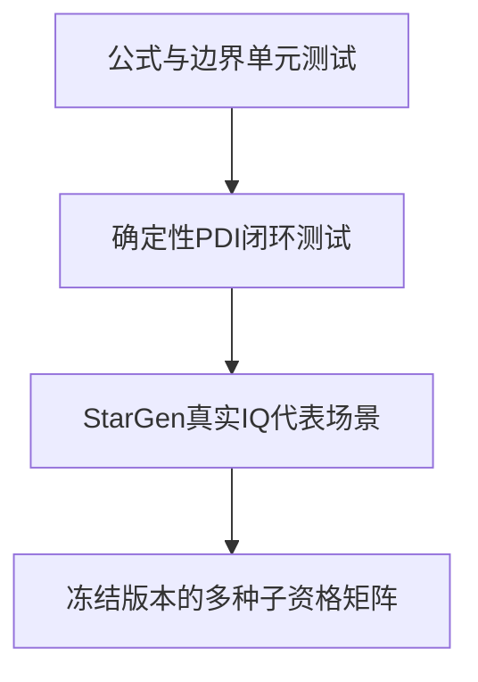

# 第16章 测试方法与学习实验

> [!abstract] 本章目标
> 学会区分单元公式测试、确定性闭环、真实IQ场景和资格矩阵，并给出适合初学者逐步验证理解的实验。

## 16.1 四层验证



| 层次 | 能证明什么 | 不能证明什么 |
|---|---|---|
| 单元测试 | 公式、符号、时标、reset边界 | 真实噪声和前端联合行为 |
| 合成PDI闭环 | 命令、状态、观察与环路时序 | 真实抽头协方差和量化输入 |
| 真实IQ | 全硬件相关链在代表场景可工作 | 未覆盖角点和尾概率 |
| 资格矩阵 | 冻结范围、版本和种子的完成度 | 矩阵外能力 |

## 16.2 必须分开的通过指标

### 闭环跟踪门

典型要求：

- 同步、频率观察有效率、频率观察使用率不低于0.95；
- Doppler RMS/P95不高于5/10 Hz；
- 码误差P95不高于0.2 chip；
- 无锁后重入PullIn、无同步丢失；
- 无PDI、overflow和命令错误；
- 300 s目标段Sensitivity驻留不少于270 s。

### 显示C/N0门

显示偏差和P95是独立测量要求。显示失败可以保留`tracking_passed=true`，但runner整体不能谎称通过，
也不能把显示量调成跟踪控制量来“相互修复”。

### 算法预期门

例如：

- ShortFast是否按职责进入ShortNormal；
- B1C锁定前是否一直`source_tap=3`；
- coarse是否只产生有限slew；
- 弱状态是否从未注入PLL；
- 状态pending是否等待命令确认。

只看最终没失锁，可能漏掉算法走了错误路径但碰巧活下来。

## 16.3 频率观察有效率和使用率

若计分窗有$N$个日志点：

$$
r_{valid}=\frac{N_{freq\ valid}}{N},
\qquad
r_{used}=\frac{N_{freq\ used}}{N}.
$$

`valid`是观察器质量；`used`还经过FreqGuard、状态、同步和新鲜度门。两者差距大时，先找为什么观察被拒绝，
不能简单降低使用率门限。

## 16.4 场景怎样从真实入口开始

所有状态和动态探针都应该：

1. 从Strong、Normal或Aided捕获移交进入；
2. 完成同步和必要牵引；
3. 由真实证据切到目标状态，或从活跃引擎导出合法`TrackEntry`；
4. 再施加目标弱信号、动态或遮挡；
5. 观察进入、驻留、退出和恢复全过程。

冷态直接强制LongSlow/HighDynamic不能代表生产状态切换。

## 16.5 建议的学习实验

### 实验1：只看相关峰

固定无噪声输入，扫码误差$-1$到$+1$ chip，画P/E/L/VE/VL功率和E-L鉴别曲线。先做L1CA，再做E1
BOC与PRN-only，亲眼看到旁峰。

### 实验2：Cross/Dot频率符号

构造$\Delta f=-20,0,+20$ Hz的复正弦PDI，验证：

$$
\arg(Z_{k-1}^{*}Z_k)
$$

与频差符号一致；再加入$\pm1$符号翻转，比较普通和平方FLL。

### 实验3：命令下一PDI生效

记录三个连续历元的`command.id/apply_epoch`和下一条PDI的`cmd_id`，验证状态pending与提交相隔一个确认边界。

### 实验4：载波辅助DLL

给定恒定载波多普勒，分别关闭和开启$R_{aid}$，比较长时间码误差；不要改变DLL系数。

### 实验5：状态职责

从Strong入口逐步降低C/N0，记录：

$$
\text{ShortFast}\rightarrow\text{ShortNormal}\rightarrow
\text{ShortSlow}\rightarrow\text{LongSlow}\rightarrow\text{Sensitivity}.
$$

再恢复强信号，检查回程迟滞而不是要求路径逐箭头完全反向。

### 实验6：B1C预同步时标

记录首wide、wide资格、每次coarse、slew start/stop、FineCheck、center、PilotSync search/confirm和lock历元，
逐个与第10章合同比对。

## 16.6 受影响修改的最小测试

| 修改区域 | 至少需要 |
|---|---|
| 频率观察器 | 正负频差、模糊边界、NCO换字、gap、噪声门、真实IQ代表角 |
| 载波环 | 阶跃/斜率、缺测、换档连续性、PLL阻断 |
| 码观察/DLL | 正负码差、符号、载波辅助、更新周期、缺口 |
| E1/B1C | 双副本、主码segment、粗/细隔离、slew、PilotSync全过程 |
| FSM | 每条合法边、非法直达、迟滞、pending与cmd确认 |
| C/N0 | 公式、非物理解、时间戳、gap、显示/控制隔离 |
| runner/analyzer | schema、时标、真值窗、resume哈希、门限分层 |

## 16.7 当前源仓库常用验证命令

在正确源码仓库运行：

```bash
cd /home/showskills/SN770/Project/StarTrack
python3 skills/startrack-cpp-style/scripts/check_startrack_style.py .
python3 tests/tools/test_l1ca_campaign_runner.py .
python3 tests/tools/test_data_signal_campaign.py .
python3 tests/tools/test_pilot_signal_campaign.py .
python3 tests/tools/test_eight_signal_status.py .
git diff --check
```

完整Release门：

```bash
cmake -S . -B build-release -G Ninja -DCMAKE_BUILD_TYPE=Release
cmake --build build-release --parallel 1
ctest --test-dir build-release --output-on-failure -j 1
```

长真实IQ运行必须记录StarTrack、StarGen的commit/tree/content/binary SHA，场景和原始CSV SHA，并用严格
resume校验。不同版本结果不能拼成一个“当前资格”。

## 16.8 怎样写结论才不越界

### 可以写

“在冻结版本、信号、PRN、频差、码差、动态和三个种子的矩阵内，闭环跟踪门全部通过。”

### 不可以写

- 一个seed通过，因此全部PRN都通过；
- 静态通过，因此高动态通过；
- 跟踪保持通过，因此捕获移交通过；
- 显示C/N0接近真值，因此环路稳定；
- 单元噪声无误触发，因此已证明误锁概率；
- 历史binary通过，因此当前脏工作树通过。

## 16.9 已明确废弃的思路

| 方案 | 禁止重新采用的原因 |
|---|---|
| 继续扩展旧Kalman闭环 | 不是当前架构依据，内部健康量侵入FSM |
| 缺测向环路写0 | 把“没测到”伪装成“已经居中” |
| 粗方向进DLL PI | 一次方向证据变成长期码率 |
| BOC只用Prompt局部DLL | 副峰或零点可能自洽 |
| 式(13)取绝对值 | 把负旁峰翻成正峰 |
| B1C center后切短Prompt FLL | 未擦二次码时产生粗差 |
| PilotSync频差再次写B1C NCO | 与连续wide FLL双重校频 |
| 用FLL残差/真值修物理C/N0 | 控制量冒充测量并形成旁路 |
| 为单seed设隐藏参数 | 不能泛化，破坏唯一正式Profile |
| 把64条队列当64 ms周期 | 队列深度只是调度弹性 |

## 16.10 全书总结

StarTrack的核心不是某一个鉴别器，而是一套严格时序和职责分层：

1. 硬件只把原始IQ变成1 ms五抽头PDI；
2. 同步和积分保证符号、时间和NCO参考正确；
3. Observer只测量，Loop只控制，Monitor只压缩证据，FSM只选策略；
4. 每条普通命令下一1 ms生效并由PDI确认；
5. FLL承担连续载波，PLL只在强信号精修；
6. 载波辅助承担主要码率，DLL修剩余码误差；
7. E1/B1C用双副本ASPeCT、有限slew和FineCheck避开BOC旁峰；
8. 日志、显示和仿真真值永远不能反馈闭环。

掌握这八点，再读源码就不再是在4864行`track_engine.cpp`里迷路，而是在一条明确的物理链上逐层定位。

---

上一篇：[[15-源码地图与调试方法|源码地图与调试方法]]　返回：[[../00-首页|首页]]
