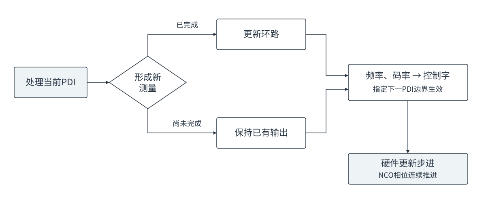

# GNSS信号跟踪设计方案

## 术语与缩略语

| 名称 | 含义 |
|---|---|
| I/Q | 同相与正交分量，用于表示复相关结果 |
| PDI | 预检测积分；本文也指硬件每1 ms输出的一组相关记录 |
| Prompt | 与当前本地码位置对应的相关抽头，简称P抽头 |
| NCO | 数控振荡器，用于生成本地载波和推进本地码 |
| FCW | 频率控制字，决定载波NCO的相位推进速度 |
| FLL／PLL／DLL | 频率锁定环／相位锁定环／延迟锁定环；DLL也称码环 |
| C/N0 | 载噪密度比，单位dB-Hz，文中简称载噪比 |
| BOC | 二进制偏移载波调制，其码相关函数具有多个峰 |
| DFT | 离散傅里叶变换，本文用于比较候选频率的相干功率 |
| FMS | 两侧频点功率差鉴频方法 |

## 1 跟踪系统总体设计

跟踪通道以捕获移交结果为初值，持续调整本地载波频率和码率，使本地信号与接收信号保持对齐，并确定导航数据位边界或导频二次码位置。各信号共用“牵引与同步、同步后收敛、持续跟踪”的处理主线，具体积分长度、鉴别方法和环路参数由信号结构与跟踪状态决定。

### 1.1 适用信号

本方案覆盖GPS、BDS、Galileo和GLONASS四个系统的八种信号。后文将Galileo、GLONASS分别记为GAL、GLO，GPS L1 C/A简写为L1CA。

| 系统 | 信号 | 无导航位辅助时的跟踪分量 | 同步对象 |
|---|---|---|---|
| GPS | L1CA | 数据 | 20 ms数据位边界 |
| BDS | B1I | 数据 | D1为20 ms数据位边界；D2为2 ms数据位边界 |
| GLO | G1 | 数据 | 20 ms数据位边界 |
| GPS | L5 | 导频 | 导频二次码位置 |
| BDS | B2a | 导频 | 导频二次码位置 |
| GAL | E5a | 导频 | 导频二次码位置 |
| GAL | E1 | 导频 | 导频二次码位置 |
| BDS | B1C | 导频 | 导频二次码位置 |

L1CA、B1I、G1按数据型信号组织；L5、B2a、E5a共用数据与导频处理流程；E1、B1C因BOC码相关特性单独配置码鉴别。B1I分别说明D1、D2电文。导频信号在电文辅助状态下可合并数据与导频Prompt，普通跟踪使用导频。

### 1.2 软硬件闭环结构

硬件完成定点NCO、混频、本地码生成与相关，每1 ms输出PDI。软件只处理相关结果，以双精度浮点数完成积分、同步、误差鉴别和环路滤波；位字转换集中在软硬件接口。

图1-1 跟踪处理主数据流与软硬件边界

载波支路根据频差、相差更新本地载波频率，码支路根据码误差及载波多普勒辅助更新本地码率。同步确认结果用于积分对齐和已知符号擦除；L1CA、B1I、G1的同步搜索还可提供一次校频量，经控制模块作用于载波环。载波控制通过FCW改变相位推进速度，常规更新保持NCO相位连续。

| 功能 | 主要职责 | 结果 |
|---|---|---|
| 积分与误差鉴别 | 按当前方法组合相关结果，计算频差、相差和码误差 | 带时间参考的误差测量 |
| 载波与码环滤波 | 根据误差调整本地信号，平滑噪声并跟随变化 | 载波频率、码率 |
| 同步处理 | 搜索数据位边界或二次码位置，使用新数据独立确认 | 同步边界、符号位置 |
| 质量估计与状态选择 | 根据载噪比、同步、动态及辅助条件选择处理方式 | 积分、鉴别方法、带宽和运行状态 |

### 1.3 通道运行流程

捕获强档使用强信号入口，中、弱档使用中弱信号入口。同步前，强入口的载波环与码环均每20 ms更新，中弱入口均每160 ms更新。满足同步开放条件后开始搜索，搜索与确认期间两条环路持续运行。

图1-2 捕获入口与常规跟踪阶段

图1-2的箭头表示常规处理阶段的递进。同步确认后，按已知边界组织积分和符号处理，通过收敛阶段衔接持续跟踪；明显动态可按状态条件提前接管。后续根据功率、动态和导航位辅助条件选择跟踪方法，各状态的职责、工作区间与切换条件在第4章统一规定。

同步未通过时允许在总时限内重试；总时限到仍未同步则退出跟踪。持续跟踪期间确认失锁时也退出，并向上层发出重新捕获请求。B1C同步总时限为60 s，其余信号为20 s。

| 接口 | 主要内容 |
|---|---|
| 捕获移交 | 信号与卫星编号、捕获档位、频率、码相位及参考时刻；G1频率频道、B1I电文格式 |
| 连续输入 | 1 ms复相关值、样点范围及实际载波参考 |
| 可选辅助输入 | 与当前PDI对应的已知导航数据符号 |
| 控制输出 | 载波频率，单位Hz；码率，单位chip/s；接口转换为硬件控制字 |
| 状态输出 | 同步边界、载噪比、跟踪状态及退出请求 |

## 2 积分与误差鉴别方法

相关结果包含信号幅度、载波相位和码位置的信息。积分提高测量的信噪比，鉴别器将相关结果转换为频差、相差或码误差，同步处理确定数据位边界或二次码位置。本章介绍这些方法的原理与适用条件。

### 2.1 相干积分与分块累加

相干积分分别累加I、Q，保留复数相位。得到一个相干块后，可以取功率或幅度，再累加多个块。

$$
P=I^2+Q^2,\qquad A=\sqrt{P}
$$

式中，I、Q为一个相干块的相关结果，P为功率，A为幅度。

| 处理方式 | 运算顺序 | 主要作用 |
|---|---|---|
| 相干积分 | 块内分别累加I、Q | 保留相位，提高相位一致信号的积累增益 |
| 功率累加 | 每块计算I²＋Q²，再将各块功率相加 | 不要求不同块的相位一致，用于频率或同步候选比较 |
| 幅度累加 | 每块计算√(I²＋Q²)，再将各块幅度相加 | 保留各抽头的幅度关系，用于分块码鉴别 |
| 鉴别结果平均 | 每次先计算误差，再对误差求平均 | 保持短间隔鉴别的频差范围，平滑测量噪声 |

图2-1 20 ms分块累加与160 ms连续相干的区别

图中以160 ms数据为例：上路形成8个20 ms相干块，块间只累加功率；下路连续累加160 ms的I/Q，最后取一次功率。两者总数据时长相同，但相干时长不同。相干积分要求块内符号一致、相位变化较小；未擦除的符号翻转或较大的残余频差会造成抵消。分块累加放宽了块间相位一致性的要求，但不能代替同等时长的相干积分增益。

### 2.2 符号擦除与复平方

符号擦除是将复相关值乘以对应的已知±1符号，消除符号造成的180°相位翻转。硬件已完成载波混频，普通软件相干积分对齐分量固定相位、擦除已知符号后，直接累加I/Q。

| 输入条件 | 积分组织方式 |
|---|---|
| 符号位置未知 | 缩短相干块以减小跨符号抵消，或用复平方消除每条输入的整体正负号 |
| 数据位边界已知，导航位正负未知 | 位内相干，跨位累加功率或幅度 |
| 二次码位置已知 | 擦除已知二次码后，跨主码周期相干 |
| 导航数据符号已知 | 擦除导航位；跨位相干时仍需满足载波相位一致性 |

复平方保留二倍载波相位，同时消除整体正负号。设复相关值z＝I＋jQ，j为虚数单位，则：

$$
z^2=(I^2-Q^2)+j\,2IQ
$$

z与−z的复平方相同。例如z＝1＋j时，复平方为2j，功率为2。复平方仍保留相位信息，功率则不保留。复平方改变噪声特性，也不能恢复单条相关结果在形成过程中已经发生的符号抵消；适用于输入间存在未知正负翻转、仍需利用载波相位变化的场合。

### 2.3 载波鉴频

鉴频有两类基本思路：根据相邻相关结果的相位变化计算频差，或比较不同候选频率下的相干功率。输出频差的单位为Hz。

图2-2 相位变化、DFT和FMS鉴频的计算路径

#### 2.3.1 相邻相关鉴频

设前后两次复相关为z₁、z₂，两者中心时间间隔为T，单位s。前值取共轭再乘以后值，可消去共同相位，得到相位增量：

$$
C=z_1^*z_2=D+jX
$$

星号表示复共轭，即I不变、Q取反。D＝I₁I₂＋Q₁Q₂为点积，X＝I₁Q₂−Q₁I₂为叉积。相位增量除以2πT即可换算为频差，三种鉴频方法如下。

| 方法 | 频差公式 | 原理与适用条件 |
|---|---|---|
| asin | $\hat f=\dfrac{\arcsin(X/\sqrt{D^2+X^2})}{2\pi T}$ | 用归一化叉积还原相位增量；适合相邻结果符号一致或翻转较少的输入，翻转会使本次鉴频方向反向 |
| 复平方asin | $\hat f=\dfrac{\arcsin(2DX/(D^2+X^2))}{4\pi T}$ | 两个输入先复平方，再按二倍相位换算；消除整体正负号，代价是频差范围缩小及噪声特性改变 |
| atan2 | $\hat f=\dfrac{\operatorname{atan2}(X,D)}{2\pi T}$ | 同时利用点积、叉积判断象限；适合符号一致或已擦除符号的输入，本身不消除未知符号翻转 |

三角函数输出以弧度计。asin取±90°主值，atan2取±180°主值；三者在零频差附近的无折叠范围分别为±1/(4T)、±1/(8T)、±1/(2T)，普通asin与atan2的范围以符号一致为前提。T为1 ms时，对应±250、±125、±500 Hz，端点附近容易受噪声影响。

例如，两次相关中心相隔20 ms，相位增加36°，频差为（36°／360°）／0.020＝5 Hz。复平方后相位增加72°，需按二倍相位换算，结果仍为5 Hz。使用1 ms间隔并对多次鉴频求平均时，鉴频范围仍由1 ms间隔决定，而不是由平均窗口长度决定。

#### 2.3.2 DFT与复平方DFT鉴频

DFT对一组候选频率分别补偿相位旋转。候选接近真实频差时，旋转后的相关结果更容易同相累加，形成较大的功率。设zₙ为一个相干块中的复相关，tₙ为相对参考时刻，单位s，f为候选频差：

$$
P(f)=\left|\sum_n z_n e^{-j2\pi f t_n}\right|^2
$$

多个相干块分别按此式计算，再累加各块功率。由此可同时利用块内相干增益和块间非相干积累；不同块可以整体反号，但同一块内的未知翻转仍会造成抵消。

复平方DFT先对输入复平方，再按二倍候选频率旋转：

$$
P_{\mathrm{sq}}(f)=\left|\sum_n z_n^2 e^{-j4\pi f t_n}\right|^2
$$

两式中的f均表示原始载波频差。例如真实频差为10 Hz，复平方后变为20 Hz，计算时用20 Hz旋转，该候选仍标记为原始频差10 Hz，输出无需再次除以2。复平方DFT适合符号未知的频率搜索；符号已知并可擦除时，普通DFT可以直接利用原始相关结果。

最大功率所在频点给出离散估计。峰值位于搜索区间内部时，可用左右邻点进行三点抛物线插值，减小频点离散造成的估计误差：

$$
\hat f=f_c+\frac{h}{2}\,\frac{P_R-P_L}{2P_C-P_L-P_R}
$$

$f_c$为峰值频率，h为候选间隔，$P_L$、$P_C$、$P_R$分别为左、中、右三点功率。右点功率较大时，插值向右修正；两侧相等时修正为零。边缘峰缺少一侧邻点，使用所在候选频率。插值适合局部峰形平滑的情况，不能消除噪声或块内符号抵消造成的错误峰。

候选范围决定可搜索的残余频差，候选间隔应与相干时长配套：相干越长，频率响应越窄，候选过疏容易产生相干损失。频率旋转在每条输入相加之前进行，不能先将整窗I/Q相加，再对总和旋转。

#### 2.3.3 FMS鉴频

FMS在本地频率两侧设置对称偏置，用与DFT相同的旋转、相干和功率累加过程，得到负、正两侧功率P₋、P₊。接近锁定时，正频差使正侧功率较大，负频差使负侧功率较大，两者相等对应零频差。

$$
d=\frac{P_+-P_-}{P_++P_-},\qquad \hat f\approx Kd
$$

d为无量纲的归一化功率差，K为零频差附近的换算增益，单位Hz。K由相干时长、两侧频率偏置及频率响应决定；适用范围较宽时也可使用相应频响的非线性换算，不能任意更换积分长度而保持换算关系不变。例如P₊＝120、P₋＝80时，d＝0.2，在线性近似下输出0.2K Hz。

FMS只计算两个频点，不搜索整段频率范围，适合频差已收敛后的持续保持。DFT更适合需要辨认较大残余频差的场合。两种方法都可以分块累加功率，但块内相干仍受符号与残余频差约束。

### 2.4 载波鉴相

鉴相由一个相干结果的相角估计接收载波相对本地载波的相位误差，区别于鉴频所用的前后相位变化。输出单位为cycle，1 cycle＝360°。

| 方法 | 相差公式 | 原理与适用条件 |
|---|---|---|
| atan2鉴相 | $e_\phi=\operatorname{atan2}(Q,I)/(2\pi)$ | 保留±半周的相位范围；适合符号已擦除、分量固定相位已对齐的相干结果 |
| Costas鉴相 | $e_\phi=\operatorname{atan2}(2IQ,I^2-Q^2)/(4\pi)$ | 将整体取反的输入视为同一相位，输出在±四分之一周内；适合正负未知、块内符号一致的数据 |

Costas公式也可用“先atan2，再将相位折叠到半周区间”实现。例如I＝Q＝1时，两种鉴相均得到0.125 cycle；输入整体变为−1−j时，atan2结果变为−0.375 cycle，Costas仍为0.125 cycle。

符号未知时，Costas能消除整块正负二义性，但不能恢复跨符号相干抵消。多个未知符号块需要联合鉴相时，可先逐块复平方，再累加复平方结果，取相角后按二倍相位换算。

### 2.5 码误差鉴别

码鉴别利用不同本地码位置的相关结果估计对齐误差，输出单位为chip。E、L为早、晚抽头，VE、VL为外侧早、晚抽头，P为中心抽头。以下幅度公式中的E、L等表示抽头幅度，复数点积则显式使用z。

#### 2.5.1 E/L幅度鉴别

本地码接近主峰时，早、晚相关幅度之差反映偏移方向，幅度之和用于归一化。对理想三角相关主峰，单边抽头间距为a chip时：

$$
e=(1-a)\frac{L-E}{E+L}
$$

主峰居中时E＝L，输出为零。按本方案的早晚抽头与码差方向定义，L大于E时输出正误差。例如a＝1/3、E＝80、L＝100，得到e≈0.074 chip。实际鉴别斜率受相关峰形、前端带宽和抽头位置影响；该换算适用于主峰附近，不能直接套用于多峰相关函数。

#### 2.5.2 五抽头双差鉴别

在早晚幅度差中加入外侧抽头差，利用更宽范围的相关峰形信息构造误差：

$$
e=G\,\frac{2(L-E)-(VL-VE)}{E+L}
$$

G为将归一化差值换算成chip的增益，应与内、外抽头位置及相关峰形配套。这里“五抽头”指VE、E、P、L、VL的相关布局，公式使用其中四个侧抽头。该方法适合需要组合内外相关形状的码跟踪，其有效范围由组合后的鉴别曲线确定。

#### 2.5.3 BOC双副本鉴别

BOC相关函数具有副峰，只比较一组早晚幅度可能指向错误的相关峰。ASPeCT同时使用含BOC副载波的本地副本，以及仅含主码、不含副载波的PRN-only副本，利用两种相关形状的差异抑制副峰影响。

每种副本分别计算早晚差与中心抽头的点积：

$$
D=\operatorname{Re}\!\left[(z_E-z_L)z_P^*\right]
$$

点积取实部，消除同一路早晚差与中心抽头共有的载波相位。将两副本的点积与功率组合，形成归一化码误差：

$$
e=-\frac{D_b-\beta D_r}{G(P_b+\beta P_r)}
$$

下标b、r分别表示BOC与PRN-only副本，$P_b$、$P_r$为各自中心抽头功率；β控制两路组合比例，G为码差换算的归一化系数。系数取决于副载波、相关峰形和抽头位置。这种方法需要两种副本的相关结果，其有效范围由组合后的鉴别曲线确定。

分块使用上述方法时，幅度鉴别先累计各块的抽头幅度，再计算归一化差值；双副本鉴别先累计各块点积和功率，再计算码误差。先鉴别再平均与先累计再鉴别是不同的噪声加权方式。

### 2.6 同步搜索与独立确认

同步搜索枚举可能的数据位边界或二次码起点，按每个候选组织相干积分，比较累计功率。正确候选更容易保持块内符号一致，从而形成较高的相干功率。

| 同步对象 | 候选内容 | 功率计算与结果含义 |
|---|---|---|
| 数据位边界 | 数据位的起始位置；残余频差较大时可增加频率候选 | 按候选边界位内相干、位间累加功率；存在已知覆盖码时同时擦除，结果确定边界而非导航位正负 |
| 二次码位置 | 已知二次码序列的循环起点 | 按候选擦除二次码后相干、跨块累加功率；结果确定后续可直接擦除的符号位置 |

候选间的功率差异来自符号处理是否正确。数据位长时间不翻转时，多个边界可能具有相近功率；残余频差过大时，各候选的相干功率也可能同时降低。因此，最大值只是候选，还需比较其相对其他位置的优势，并使用新数据确认。

图2-3 搜索与确认使用两段不同的数据

| 判别依据 | 作用 |
|---|---|
| 峰值比 | 比较最佳候选与竞争候选或错位参考的功率，判断最佳位置是否足够突出 |
| 相干积累程度 | 比较按候选组织后的相干功率与短积分功率，判断增益是否符合正确符号对齐的特征 |
| 局部峰形 | 检查相邻候选的功率变化是否符合预期边界特征 |
| 独立确认 | 用新的数据重新判决，降低一次噪声峰造成误同步的概率 |

搜索候选通过判决后保存边界，随后使用独立的新数据确认；确认通过且边界一致时宣布同步。二次码同步后可以擦除已知序列；数据位同步只确定边界，导航位正负未知时仍需限制在位内相干。

## 3 环路滤波与载码控制

鉴别器给出本次频差、相差和码误差，环路滤波器结合历史状态生成本地载波频率与码率。载波采用共享状态的FLL辅助PLL结构，码环采用比例与积分组合的二阶DLL，并叠加载波多普勒辅助。

### 3.1 测量输入与控制输出

| 量 | 含义与单位 | 在环路中的作用 |
|---|---|---|
| 频差 $e_f$ | 接收频率减本地频率，Hz | 修正本地频率，并按当前方式更新频率变化率 |
| 相差 $e_\phi$ | 接收相位减本地相位，cycle | PLL开放时参与控制；正相差通过暂时加快本地载波消除 |
| 码误差 $e_c$ | 接收码与本地码的对齐误差，chip | 正值要求本地码加快 |
| 载波输出u | 本地多普勒，Hz | 转换为载波FCW，改变相位推进速度 |
| 码率输出R | 本地码率，chip/s | 转换为码NCO步进字，改变码相位推进速度 |

每份新测量只更新一次环路。载波与码环按各自的完整观察周期更新；没有新测量时，保持上一次输出。硬件继续按已有控制字逐样点推进NCO。

鉴频结果带有形成该测量时的本地频率参考。送入滤波器前，将它换算到当前控制频率：

$$
e_f=f_m+f_r-u
$$

$f_m$为鉴频输出，$f_r$为该测量对应的本地频率参考，u为当前本地多普勒。例如测量参考为100 Hz、测得频差5 Hz，而当前已控制到103 Hz，则送入环路的频差为2 Hz。该换算统一频率参考，不改变输入相关结果的相位。

### 3.2 共享载波环结构

#### 3.2.1 FLL、PLL与联合控制

FLL根据频差校正本地频率；PLL根据相差校正本地频率，使相位误差逐渐减小。两者共同更新同一组频率和变化率状态，最终只产生一个载波频率输出。图中a为保存的多普勒变化率，b为频率积分，u为输出频率；h₁、h₂为频差系数，k₁、k₂、k₃为相差系数，g为实际用于变化率积分的频差。

图3-1 FLL与PLL共享频率和变化率状态

| 控制方式 | 频差支路 | 相差支路 | 主要作用 |
|---|---|---|---|
| 纯FLL | 使用当前FLL带宽参数 | 关闭 | 牵引载波，或在相位测量不足以稳定反馈时保持频率 |
| FLL辅助PLL | 使用较小的辅助FLL带宽 | 开放 | PLL精细控制相位，FLL同时修正频率偏离 |
| 纯PLL | 关闭 | 开放 | 仅依靠相差完成载波控制，作为该结构支持的配置 |

当前方案在PLL开放并产生新相差时使用FLL辅助PLL，辅助带宽为0.25 Hz。这个数值是带宽，不是将频差乘以0.25，也不是25%的混合权重；辅助强度通过下述两个FLL系数进入共享递推。辅助带宽设为零时，结构退化为纯PLL。

PLL未开放时使用纯FLL。已开放但本次没有新相差、只有新频差时，本次按纯FLL带宽更新；两路均无新结果时不递推。具体的进入、回退及带宽选择由状态与质量条件决定。

#### 3.2.2 频率与变化率递推

载波环保存两个历史量：a为多普勒变化率，单位Hz/s；b为频率积分状态，单位Hz。b不包含本次相差的比例修正，最终输出记为u。设更新周期为T秒，一次更新按以下顺序计算，撇号表示更新后的值：

$$
\begin{aligned}
a'&=a+T(h_2g+k_3e_\phi)\\
b'&=b+T(a'+h_1e_f+k_2e_\phi)\\
u'&=b'+k_1e_\phi
\end{aligned}
$$

| 项 | 含义 |
|---|---|
| $h_1e_f$ | 频差对频率积分的修正 |
| $h_2g$ | 频差对变化率积分的修正 |
| $k_1e_\phi$ | 相差的即时比例修正，直接叠加到输出频率 |
| $k_2e_\phi$、$k_3e_\phi$ | 相差分别对频率、变化率两个历史状态的修正 |
| $Ta'$ | 已估计的多普勒变化率在本周期带来的频率推进 |

只校正频率时取g＝0；允许跟随频率变化率时，通常取g＝$e_f$。需要限制高阶积分受噪声影响时，只对g限幅，频率支路仍使用原频差。关闭变化率更新不会清零已有a，已有变化率仍参与频率推进。

纯FLL令相差为零；纯PLL令频差及g为零。普通完整递推对应二阶FLL与三阶PLL的共享结构；当g＝0且PLL关闭时，频差不再更新高阶积分，不能把此时的响应等同于完整二阶FLL。

本实现使用当前误差递推，并在频率更新中使用刚更新的a，未对前后两次误差作梯形平均。历史信息保存在a、b中，因此使用当前误差不等于忽略历史。

#### 3.2.3 带宽与反馈系数

设$B_f$为本次选用的FLL带宽参数，$B_p$为PLL噪声带宽，单位均为Hz。按当前共享递推的系数定义，先换算：

$$
\omega_f=\frac{B_f}{0.53},\qquad \omega_p=\frac{B_p}{0.7845}
$$

| 支路 | 系数 | 作用位置 |
|---|---|---|
| FLL | $h_1=1.414\omega_f/2$ | 频率积分，单位1/s |
| FLL | $h_2=\omega_f^2/4$ | 变化率积分，单位1/s² |
| PLL | $k_1=2.4\omega_p$ | 输出比例项，单位1/s |
| PLL | $k_2=1.1\omega_p^2/2$ | 频率积分，单位1/s² |
| PLL | $k_3=\omega_p^3/4$ | 变化率积分，单位1/s³ |

上述除以2、除以4的系数与本方案的a、b状态定义配套。相差使用cycle，频差使用Hz；若直接改成弧度输入而不调整系数，会改变环路增益。FLL在关闭高阶积分或采用有限记忆时，其配置带宽参数也不能直接视为完整二阶环的等效噪声带宽。

带宽增大，误差修正和动态跟随加快，但测量噪声更容易进入控制；带宽减小，输出更平滑，但收敛和动态响应变慢。带宽、更新周期和鉴别器增益需配套选择。

以一次联合更新为例：T＝20 ms，辅助$B_f$＝0.25 Hz，$B_p$＝2.4 Hz；初始a＝0、b＝100 Hz，输入频差2 Hz、相差0.01 cycle，并允许完整变化率更新。代入系数得到：

| 更新结果 | 数值 | 说明 |
|---|---|---|
| a′ | 0.003657 Hz/s | 频差与相差共同写入变化率 |
| b′ | 100.014442 Hz | 保留至后续周期的频率积分 |
| u′ | 100.087865 Hz | 在b′上叠加约0.073423 Hz相差比例修正 |

### 3.3 码环滤波与载波辅助

码环采用比例与积分两条支路：比例支路修正当前码误差，积分支路逐步保存持续存在的码率偏差。载波多普勒按射频与码率的比例转换为码率辅助，DLL主要修正辅助后的剩余误差。

图3-2 DLL修正与载波多普勒辅助共同生成码率

设v为保留的码率修正，r为本次DLL总修正，单位均为chip/s：

$$
v'=v+K_i e_c,\qquad r'=v'+K_p e_c
$$

二阶DLL由带宽$B_c$和更新周期T计算系数：

$$
\omega_c=\frac{B_c}{0.53},\qquad K_p=1.414\omega_c,\qquad K_i=\omega_c^2T
$$

$K_i$已包含本次更新周期，更新v时不再重复乘T。新码误差到来时才更新v和r；没有新码误差时保留r，但载波辅助可使用最新载波频率。

最终码率为：

$$
R=R_0\left(1+\frac{u}{f_c}\right)+r
$$

$R_0$为标称码率，$f_c$为实际频道的标称射频，u为本地多普勒，不包含固定中频。载波与码受到相同距离变化的影响，因而可通过比例$R_0/f_c$把多普勒转换为码率变化。

例如标称码率1.023 Mchip/s、射频1575.42 MHz、多普勒＋1000 Hz，载波辅助带来约＋0.649351 chip/s码率修正；DLL再叠加剩余修正r。该辅助不直接改变码相位，而是改变后续码相位的推进速度。

### 3.4 极弱信号下的积分保持

极弱信号长期跟踪时，测量噪声会持续进入积分状态。有限记忆积分使较早的误差影响逐渐衰减，同时保留交接时已收敛的频率变化率参考。

| 对象 | 交接与每次更新 |
|---|---|
| 载波变化率 | 进入时以已有变化率的时间平均作为参考$a_0$；更新前将a向该参考收缩，再加入本次频差修正 |
| 码率积分 | 更新前衰减v，再加入本次码误差修正 |
| 相差反馈 | 关闭，使用纯FLL |

按实际环路周期T计算保留比例ρ：

$$
\rho=0.95^{T/0.32},\qquad a\leftarrow a_0+\rho(a-a_0),\qquad v\leftarrow\rho v
$$

T以秒计。每320 ms保留95%的偏差，换成其他周期时按同一关系计算，而不是每次更新都固定乘0.95。随后仍执行前述载波与码环递推。载波围绕$a_0$保留变化率，码环衰减的是载波辅助之外的积分修正；两者均不直接衰减当前频率或标称码率。

这种处理适合低动态的极弱保持。动态跟随使用普通积分，以持续更新变化率；采用有限记忆的状态及交接条件在状态设计中规定。

### 3.5 参数切换与硬件控制

环路参数在完整观察结束后切换。本次测量使用本次的参数完成控制，下一完整观察使用新积分方式和新系数。

| 操作 | 环路处理 |
|---|---|
| 带宽或周期改变 | 重新计算系数，保留已有积分状态和当前输出 |
| PLL开放或关闭 | 改变后续相差是否参与反馈，共用原有频率和变化率状态 |
| 窄带保持交接 | 按交接规则使用已有变化率平均，保留当前频率输出 |
| 同步提供一次校频量Δf | 同时更新b←b＋Δf、u←u＋Δf，变化率不变；重建后续观察窗口 |

切换操作本身不重置当前控制输出；下一次测量仍会按新系数产生修正。保持积分历史可避免重新牵引，但不代表每次频率修正都为零，也不代表参数改变前后响应完全相同。

图3-3 新测量更新环路，控制字在下一PDI边界生效

软件输出浮点频率与码率，适配层将其转换为控制字，并指定在下一PDI边界生效。更新的是载波FCW和码步进字，NCO相位累加器继续运行；因此频率可以调整，载波相位和码相位仍保持连续。
