# GNSS信号跟踪设计方案

## 术语与缩略语

| 名称 | 含义 |
|---|---|
| I/Q | 同相与正交分量，用于表示复相关结果 |
| PDI | 预检测积分；本文也指硬件每1 ms输出的一组相关记录 |
| Prompt | 与当前本地码位置对应的相关抽头，简称P抽头 |
| NCO | 数控振荡器，用于生成本地载波和推进本地码 |
| FCW | 频率控制字，决定载波NCO的相位推进速度 |
| FLL／PLL／DLL | 频率锁定环／相位锁定环／延迟锁定环；DLL也称码环 |
| C/N0 | 载噪密度比，单位dB-Hz，文中简称载噪比 |
| RMS／P95 | 均方根／95%分位数；P95表示95%的样本不超过该值 |
| BOC | 二进制偏移载波调制，其码相关函数具有多个峰 |
| DFT | 离散傅里叶变换，本文用于比较候选频率的相干功率 |
| FMS | 两侧频点功率差鉴频方法 |
| M2M4 | 二阶／四阶矩法，用于同步前载噪比估计 |
| NWPR | 窄带／宽带功率比法，用于载噪比估计 |

## 1 跟踪系统总体设计

跟踪通道从捕获移交初值开始，依次完成牵引与同步、同步后收敛和持续跟踪。各信号共用处理流程，按信号结构和状态选择积分、鉴别方法及环路参数。

### 1.1 适用信号

本方案覆盖GPS、BDS、Galileo和GLONASS四个系统的八种信号。后文将Galileo、GLONASS分别记为GAL、GLO，GPS L1 C/A简写为L1CA。

| 系统 | 信号 | 无导航位辅助时的跟踪分量 | 同步对象 |
|---|---|---|---|
| GPS | L1CA | 数据 | 20 ms数据位边界 |
| BDS | B1I | 数据 | D1为20 ms数据位边界；D2为2 ms数据位边界 |
| GLO | G1 | 数据 | 20 ms数据位边界 |
| GPS | L5 | 导频 | 导频二次码位置 |
| BDS | B2a | 导频 | 导频二次码位置 |
| GAL | E5a | 导频 | 导频二次码位置 |
| GAL | E1 | 导频 | 导频二次码位置 |
| BDS | B1C | 导频 | 导频二次码位置 |

L1CA、B1I、G1按数据型处理；L5、B2a、E5a共用导频流程；E1、B1C采用BOC码鉴别。普通导频跟踪使用导频，电文辅助状态可合并数据与导频Prompt。

### 1.2 软硬件闭环结构

硬件完成定点NCO、混频、本地码生成与相关，每1 ms输出PDI。软件只处理相关结果，以双精度浮点数完成积分、同步、误差鉴别和环路滤波；位字转换集中在软硬件接口。

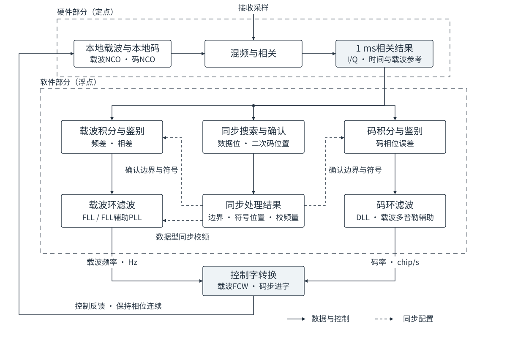

图1-1 跟踪处理主数据流与软硬件边界

载波环调整频率，码环结合码误差与载波辅助调整码率。同步结果用于积分对齐和符号擦除，数据型同步还提供一次校频量。FCW控制相位推进速度，常规更新保持NCO相位连续。

| 功能 | 主要职责 | 结果 |
|---|---|---|
| 积分与误差鉴别 | 按当前方法组合相关结果，计算频差、相差和码误差 | 带时间参考的误差测量 |
| 载波与码环滤波 | 根据误差调整本地信号，平滑噪声并跟随变化 | 载波频率、码率 |
| 同步处理 | 搜索数据位边界或二次码位置，使用新数据独立确认 | 同步边界、符号位置 |
| 质量估计与状态选择 | 根据载噪比、同步、动态及辅助条件选择处理方式 | 积分、鉴别方法、带宽和运行状态 |

### 1.3 通道运行流程

捕获强档使用强信号入口，中、弱档使用中弱信号入口。同步前，强入口的载波环与码环均每20 ms更新，中弱入口均每160 ms更新。满足同步开放条件后开始搜索，搜索与确认期间两条环路持续运行。

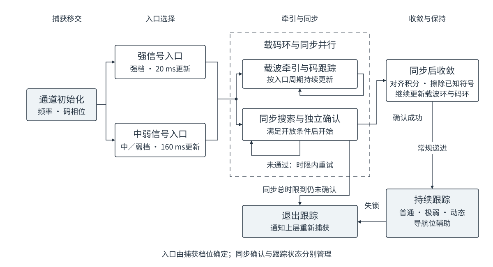

图1-2 捕获入口与常规跟踪阶段

同步确认后先收敛，再按功率、动态和辅助条件选择保持方式；状态与转换见第4章。

同步允许限时重试：B1C为60 s，其余20 s。超时未同步或持续跟踪中确认失锁时，退出并请求重捕。

| 接口 | 主要内容 |
|---|---|
| 捕获移交 | 信号与卫星编号、捕获档位、频率、码相位及参考时刻；G1频率频道、B1I电文格式 |
| 连续输入 | 1 ms复相关值、样点范围及实际载波参考 |
| 可选辅助输入 | 与当前PDI对应的已知导航数据符号 |
| 控制输出 | 载波频率，单位Hz；码率，单位chip/s；接口转换为硬件控制字 |
| 状态输出 | 同步边界、载噪比、跟踪状态及退出请求 |

## 2 积分与误差鉴别方法

积分积累相关结果，鉴别器将其转换为频差、相差或码误差；同步确定数据位边界或二次码位置。

### 2.1 相干积分与分块累加

相干积分分别累加I、Q，保留复数相位。得到一个相干块后，可以取功率或幅度，再累加多个块。

$$
P=I^2+Q^2,\qquad A=\sqrt{P}
$$

式中，I、Q为一个相干块的相关结果，P为功率，A为幅度。

| 处理方式 | 运算顺序 | 主要作用 |
|---|---|---|
| 相干积分 | 块内分别累加I、Q | 保留相位，提高相位一致信号的积累增益 |
| 功率累加 | 每块计算I²＋Q²，再将各块功率相加 | 不要求不同块的相位一致，用于频率或同步候选比较 |
| 幅度累加 | 每块计算√(I²＋Q²)，再将各块幅度相加 | 保留各抽头的幅度关系，用于分块码鉴别 |
| 鉴别结果平均 | 每次先计算误差，再对误差求平均 | 保持短间隔鉴别的频差范围，平滑测量噪声 |

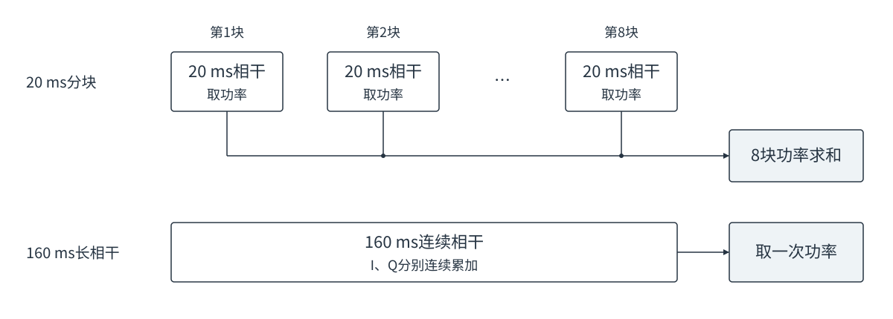

图2-1 20 ms分块累加与160 ms连续相干的区别

图中上路为8个20 ms相干块、跨块累加功率，下路为160 ms连续相干。相干积分要求块内符号一致、残余相位变化较小；分块可减轻跨符号抵消，但增益不同于同等时长的连续相干。

### 2.2 符号擦除与复平方

符号擦除将相关值乘以已知±1符号，消除180°翻转。普通软件积分在硬件混频后，对齐分量固定相位、擦除符号，再直接累加I/Q。

| 输入条件 | 积分组织方式 |
|---|---|
| 符号位置未知 | 缩短相干块以减小跨符号抵消，或用复平方消除每条输入的整体正负号 |
| 数据位边界已知，导航位正负未知 | 位内相干，跨位累加功率或幅度 |
| 二次码位置已知 | 擦除已知二次码后，跨主码周期相干 |
| 导航数据符号已知 | 擦除导航位；跨位相干时仍需满足载波相位一致性 |

复平方保留二倍载波相位，同时消除整体正负号。设复相关值z＝I＋jQ，j为虚数单位，则：

$$
z^2=(I^2-Q^2)+j\,2IQ
$$

z与−z的复平方相同。例如z＝1＋j时，复平方为2j，功率为2：前者保留二倍相位，后者不保留相位。复平方可消除输入间的整体反号，但会改变噪声特性，不能恢复单条相关内部已经发生的符号抵消。

### 2.3 载波鉴频

鉴频通过相邻相位变化或候选频率功率比较估计频差，输出单位Hz。

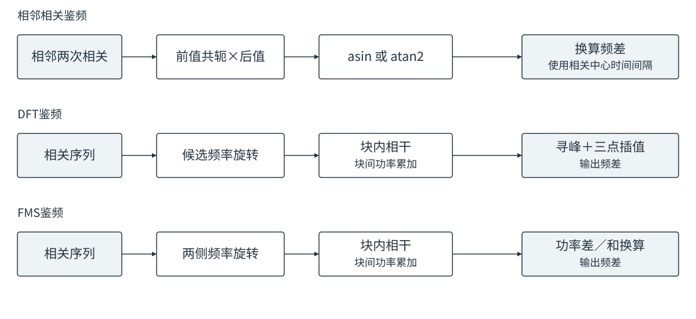

图2-2 相位变化、DFT和FMS鉴频的计算路径

#### 2.3.1 相邻相关鉴频

前后复相关为z₁、z₂，中心时间相隔T秒。共轭积给出相位增量：

$$
C=z_1^*z_2=D+jX
$$

星号表示复共轭，即Q取反。点积D＝I₁I₂＋Q₁Q₂，叉积X＝I₁Q₂−Q₁I₂；相位增量除以2πT得到频差。

| 方法 | 频差公式 | 原理与适用条件 |
|---|---|---|
| asin | $\hat f=\dfrac{\arcsin(X/\sqrt{D^2+X^2})}{2\pi T}$ | 用归一化叉积还原相位增量；适合相邻结果符号一致或翻转较少的输入，翻转会使本次鉴频方向反向 |
| 复平方asin | $\hat f=\dfrac{\arcsin(2DX/(D^2+X^2))}{4\pi T}$ | 两个输入先复平方，再按二倍相位换算；消除整体正负号，代价是频差范围缩小及噪声特性改变 |
| atan2 | $\hat f=\dfrac{\operatorname{atan2}(X,D)}{2\pi T}$ | 同时利用点积、叉积判断象限；适合符号一致或已擦除符号的输入，本身不消除未知符号翻转 |

三角函数输出为弧度。符号一致时，三者无折叠范围分别为±1/(4T)、±1/(8T)、±1/(2T)；T＝1 ms时为±250、±125、±500 Hz。端点附近易受噪声影响。

例如T＝20 ms、相位增加36°，频差为（36°／360°）／0.020＝5 Hz；复平方后相位增加72°，除去二倍关系仍为5 Hz。多次鉴频平均不改变由相邻时间间隔决定的范围。

#### 2.3.2 DFT与复平方DFT鉴频

DFT逐候选补偿相位旋转，接近真实频差时相干功率较大。zₙ为块内复相关，tₙ为相对参考时刻（s），f为候选频差：

$$
P(f)=\left|\sum_n z_n e^{-j2\pi f t_n}\right|^2
$$

多个相干块分别计算，再累加功率；块间可以整体反号，块内未知翻转仍会造成抵消。

复平方DFT先对输入复平方，再按二倍候选频率旋转：

$$
P_{\mathrm{sq}}(f)=\left|\sum_n z_n^2 e^{-j4\pi f t_n}\right|^2
$$

两式的f均为原始载波频差。例如真实频差10 Hz，平方后用20 Hz旋转，但候选仍标记10 Hz。符号未知时可用复平方DFT；符号可擦除时优先利用原始相关结果。

选择最大功率频点；内部峰用三点抛物线插值细化频差：

$$
\hat f=f_c+\frac{h}{2}\,\frac{P_R-P_L}{2P_C-P_L-P_R}
$$

$f_c$为峰值频率，h为间隔，$P_L$、$P_C$、$P_R$为左、中、右功率。右侧较大则向右修正，两侧相等则修正为零；边缘峰使用候选频率。插值不能纠正噪声或符号抵消造成的错误峰。

相干越长，频率响应越窄，候选间隔也需相应缩小。旋转必须在逐条输入累加之前完成，不能先累加整窗再旋转。

#### 2.3.3 FMS鉴频

FMS在本地频率两侧设置对称偏置，分别旋转、相干并累加功率，得到P₋、P₊。接近锁定时，正频差对应P₊较大，两侧相等对应零频差。

$$
d=\frac{P_+-P_-}{P_++P_-},\qquad \hat f\approx Kd
$$

d为归一化功率差，K为换算增益（Hz），取决于相干时长和两侧偏置；也可按频响作非线性换算。例如P₊＝120、P₋＝80，则d＝0.2、线性输出为0.2K Hz。改变积分长度时须同步核对换算关系。

FMS只计算两侧频点，适合频差收敛后的保持；DFT覆盖较宽频差。两者均可跨块累加功率。

### 2.4 载波鉴相

鉴相估计单个相干结果的载波相差，输出单位cycle（1 cycle＝360°）；鉴频则利用前后相位变化。

| 方法 | 相差公式 | 原理与适用条件 |
|---|---|---|
| atan2鉴相 | $e_\phi=\operatorname{atan2}(Q,I)/(2\pi)$ | 保留±半周的相位范围；适合符号已擦除、分量固定相位已对齐的相干结果 |
| Costas鉴相 | $e_\phi=\operatorname{atan2}(2IQ,I^2-Q^2)/(4\pi)$ | 将整体取反的输入视为同一相位，输出在±四分之一周内；适合正负未知、块内符号一致的数据 |

Costas也可由atan2相位折叠实现。I＝Q＝1时，两者均为0.125 cycle；输入变为−1−j时，atan2为−0.375 cycle，Costas仍为0.125 cycle。

Costas消除整块正负二义性，不能恢复块内符号抵消。多个未知符号块联合鉴相时，逐块复平方后累加，再取半相角。

### 2.5 码误差鉴别

码鉴别利用早晚抽头估计码差，输出单位chip。E、L为早晚抽头，VE、VL为外侧抽头，P为中心抽头；幅度用E、L等表示，复相关用z表示。

#### 2.5.1 E/L幅度鉴别

本地码接近主峰时，早、晚相关幅度之差反映偏移方向，幅度之和用于归一化。对理想三角相关主峰，单边抽头间距为a chip时：

$$
e=(1-a)\frac{L-E}{E+L}
$$

E＝L时输出零；按本方案方向定义，L＞E时为正码差。例如a＝1/3、E＝80、L＝100，e≈0.074 chip。该换算适用于三角主峰附近，实际斜率受前端带宽和抽头位置影响。

#### 2.5.2 五抽头双差鉴别

在早晚幅度差中加入外侧抽头差，利用更宽范围的相关峰形信息构造误差：

$$
e=G\,\frac{2(L-E)-(VL-VE)}{E+L}
$$

G将归一化差值换算为chip，需与抽头位置及峰形匹配。五抽头布局为VE、E、P、L、VL，本式使用四个侧抽头；有效范围由组合鉴别曲线决定。

#### 2.5.3 BOC双副本鉴别

ASPeCT组合BOC副本与不含副载波的PRN-only副本，利用两种相关形状的差异抑制副峰。

每种副本分别计算早晚差与中心抽头的点积：

$$
D=\operatorname{Re}\!\left[(z_E-z_L)z_P^*\right]
$$

点积消除早晚差与中心抽头共有的载波相位，两副本组合为：

$$
e=-\frac{D_b-\beta D_r}{G(P_b+\beta P_r)}
$$

b、r分别表示BOC与PRN-only副本，$P_b$、$P_r$为中心功率；β为组合比例，G为码差换算系数，两者须与信号及抽头配置匹配，有效范围由鉴别曲线决定。

分块鉴别先累计幅度，或累计ASPeCT点积与功率，再归一化；先鉴别再平均的噪声权重不同。

### 2.6 同步搜索与独立确认

同步按候选边界或二次码起点组织相干积分，比较累计功率；正确的符号对齐通常形成较高功率。

| 同步对象 | 候选内容 | 功率计算与结果含义 |
|---|---|---|
| 数据位边界 | 数据位的起始位置；残余频差较大时可增加频率候选 | 按候选边界位内相干、位间累加功率；存在已知覆盖码时同时擦除，结果确定边界而非导航位正负 |
| 二次码位置 | 已知二次码序列的循环起点 | 按候选擦除二次码后相干、跨块累加功率；结果确定后续可直接擦除的符号位置 |

数据位长期不翻转或残余频差较大时，候选功率可能难以区分。最大值须通过质量判决，并由新数据确认。

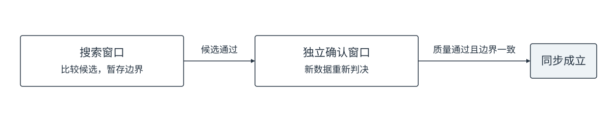

图2-3 搜索与确认使用两段不同的数据

| 判别依据 | 作用 |
|---|---|
| 峰值比 | 比较最佳候选与竞争候选或错位参考的功率，判断最佳位置是否足够突出 |
| 相干积累程度 | 比较按候选组织后的相干功率与短积分功率，判断增益是否符合正确符号对齐的特征 |
| 局部峰形 | 检查相邻候选的功率变化是否符合预期边界特征 |
| 独立确认 | 用新的数据重新判决，降低一次噪声峰造成误同步的概率 |

搜索通过后保存候选，新数据确认通过且边界相同才锁定。二次码同步后可擦码；数据位同步只确定边界，未知导航符号仍限制位内相干。

## 3 环路滤波与载码控制

载波环根据频差、相差调整本地载波频率；码环根据码误差调整本地码率。两条环路都保留历史积分，使控制量平滑变化。

### 3.1 环路结构

FLL与PLL共用频率和变化率积分，输出同一个载波频率。FLL负责修正频率偏离，PLL通过调节频率消除相位误差；PLL开放后，FLL以较小带宽继续辅助。

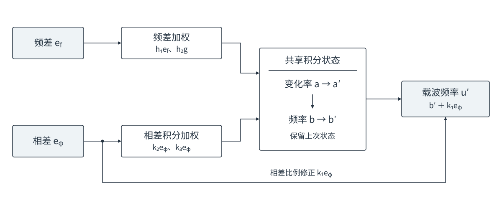

图3-1 FLL与PLL共同控制载波频率

| 工作方式 | 作用 |
|---|---|
| 纯FLL | 用于牵引及相位测量不够可靠的跟踪阶段，只使用频差反馈 |
| FLL辅助PLL | 相位反馈条件满足后，PLL精细控制相位，FLL辅助修正频差；当前辅助FLL带宽为0.25 Hz |

码环采用比例与积分两条支路：比例项响应当前码误差，积分项保留持续的码率修正。载波多普勒按射频与码率的比例转换为码率辅助，码环修正剩余误差。

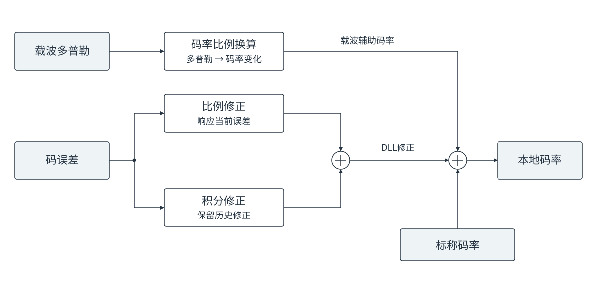

图3-2 码环修正与载波辅助共同生成码率

每份新测量只更新一次环路，没有新测量时保持已有输出。输出经接口转换为控制字，在下一PDI边界生效，NCO相位连续推进。

### 3.2 积分保持策略

环路积分累计的是误差修正，不是I/Q相干积分。

| 方式 | 更新方法 | 使用场景 |
|---|---|---|
| 普通积分 | 保留累计值，加入本次修正 | 强信号、普通弱信号及动态跟随 |
| 有限记忆积分 | 先衰减相对保持参考的偏差，再加入本次修正 | Sensitivity、极弱BitAiding |

例如真实变化率为0.10 Hz/s，一次噪声使估计升至0.12 Hz/s。暂不计后续修正，每320 ms保留95%的额外偏差：

| 扰动后的时间 | 普通积分 | 有限记忆积分 |
|---|---|---|
| 刚发生扰动 | 0.120 Hz/s | 0.120 Hz/s |
| 3.2 s后 | 0.120 Hz/s | 约0.112 Hz/s |
| 32 s后 | 0.120 Hz/s | 约0.10012 Hz/s |

有限记忆减轻噪声长期积累，但会拖慢真实动态跟随；普通强弱跟踪及动态状态保留普通积分。

| 作用位置 | 有限记忆的保持参考 |
|---|---|
| 载波变化率 | 进入时已收敛的平均变化率 |
| 码环积分修正 | 零，即载波辅助之外的额外码率修正逐渐衰减 |

环路仍接收新误差并更新，不冻结频率。换带宽或FLL／PLL方式时保留积分状态。

## 4 跟踪状态与转换机制

状态选择积分、鉴别和环路参数；切换时保留已有载码控制量。

### 4.1 状态职责

| 状态 | 主要职责 | 环路更新周期 | 选择依据 |
|---|---|---:|---|
| ShortFast | 强入口快速牵引 | 20 ms | 捕获强档 |
| ShortNormal | 短周期收敛 | 20 ms | ShortFast完成前级牵引 |
| ShortSlow | 强信号稳定跟踪，可开放PLL | 20 ms | 通常保持在28 dB-Hz及以上 |
| LongFast | 中弱入口牵引 | 160 ms | 捕获中、弱档 |
| LongNormal | 同步后长周期收敛 | 160 ms | LongFast完成同步后牵引 |
| LongSlow | 无电文辅助的弱信号跟踪 | 320 ms | 通常位于13.5～30 dB-Hz之间 |
| Sensitivity | 无电文辅助的极弱、低动态保持 | 320 ms | 低载噪比累计确认 |
| HighDynamic | 动态突变时快速跟随 | 20 ms | 连续出现明显同向频差 |
| MidDynamic | 动态收敛后的低噪声跟随 | 20 ms | HighDynamic降档后的过渡 |
| OutdoorBitAiding | 普通电文辅助跟踪 | 300 ms | 已同步、外部导航符号可用 |
| BitAiding | 极弱电文辅助保持 | 600 ms | 已知导航符号可用且功率较低 |

以下C为当前跟踪分量的NWPR估计（dB-Hz）；导频使用导频功率。表中范围是调度区间，不是硬性跟踪极限。

### 4.2 牵引与收敛

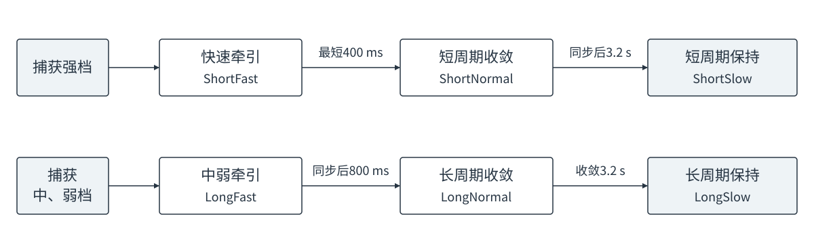

图4-1 强入口和中弱入口沿各自路径完成收敛

| 阶段 | 递进条件 |
|---|---|
| ShortFast → ShortNormal | 最短400 ms；数据型可在同步前递进，导频从同步确认后计时 |
| LongFast → LongNormal | 同步后800 ms，且已有可用码观察 |
| 两种Normal → 对应Slow | 同步后收敛3.2 s |

各阶段持续更新载码环；等待同步不抵扣收敛时间，中弱入口不因搜索失败改走强入口。

### 4.3 强弱保持切换

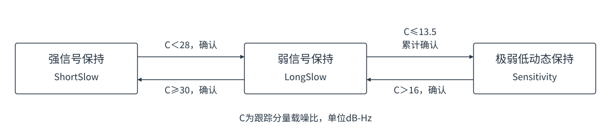

图4-2 不同的进入、退出门限形成重叠区

| 切换 | 主要条件 | 条件持续满足时的确认时间 |
|---|---|---:|
| ShortSlow → LongSlow | C＜28 | 80 ms |
| LongSlow → ShortSlow | C≥30 | 6.72 s |
| LongSlow → Sensitivity | C≤13.5 | 1.92 s |
| Sensitivity → LongSlow | C＞16 | 8.32 s |

28～30、13.5～16 dB-Hz形成滞回区。确认按环路节拍读取缓存NWPR：满足条件加一次，否则减一次，最低为零；不是独立报告计数或固定等待时间。

| Sensitivity切换 | 累计方式 |
|---|---|
| 已同步LongSlow进入 | 6次×320 ms＝1.92 s |
| 已同步HighDynamic／MidDynamic进入 | 96次×20 ms＝1.92 s |
| 恢复LongSlow | 26次×320 ms＝8.32 s |
| BitAiding辅助撤销 | 立即回Sensitivity |

例如计数3遇一次不满足条件，减为2，再满足4次才达到6。进入较快用于弱信号保护，恢复较慢用于抑制短暂回升；6／26次沿用芯片计数，并非已验证的最优时长。

八信号均不以频差拦截Sensitivity入口；低功率不保证频率已收敛。有限记忆的使用见3.2，保持能力见第8章。

### 4.4 动态跟踪与电文辅助

动态和电文辅助由各自条件触发，不是普通牵引路径上必须经过的阶段。

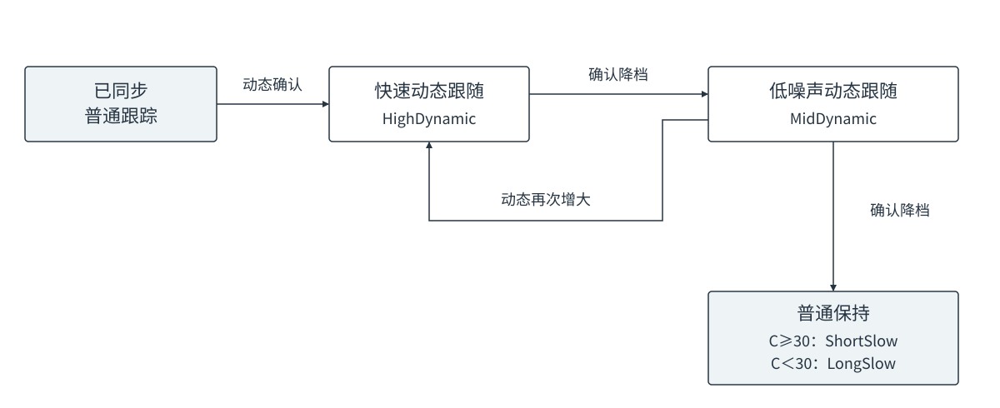

图4-3 动态快速接管，收敛后逐级恢复

分别平滑“有符号频差”和“频差绝对值”，每次保留7／8旧值、加入1／8新值；两者幅度越接近，频差方向越一致。

| 动态切换 | 条件 |
|---|---|
| 进入HighDynamic | 已同步，C＞16；频差绝对值均值＞4.6875 Hz，且频差均值绝对值＞前者80%，连续两份观察 |
| HighDynamic → MidDynamic | 频差均值绝对值＜绝对值均值20%，且平均变化率适应目标积分周期；每320 ms检查，连续4次 |
| MidDynamic → 普通保持 | 同样通过降档确认；C≥30回ShortSlow，否则回LongSlow |

接管源状态为ShortSlow、LongNormal、LongSlow、MidDynamic；PLL实际反馈且相差在±22.5°内时，不单凭辅助FLL偏差升档。两档动态FLL为4／2 Hz，低功率时也可转Sensitivity。

4.6875 Hz来自芯片尺度300÷64，软件直接使用Hz。它是残余频差、不是变化率；平滑与连续确认仍可能被同向噪声触发。

电文辅助只在同步确认后、外部已知导航符号可用时启用：

| 当前情况 | 下一状态 |
|---|---|
| LongSlow或Sensitivity获得辅助 | C＞13.5进入OutdoorBitAiding，否则进入BitAiding |
| OutdoorBitAiding功率下降至C≤13.5并确认 | BitAiding |
| BitAiding功率恢复到C＞16并确认 | OutdoorBitAiding |
| OutdoorBitAiding的原跟踪分量恢复到C≥30并确认 | ShortSlow |
| 普通辅助撤销／极弱辅助撤销 | 分别立即回LongSlow／Sensitivity |

辅助降档／恢复／回短环分别约2.1／8.4／6.9 s，由300／600 ms周期累计。回纯导频短环须使用独立导频C/N0，不用联合估计代替。

### 4.5 切换与退出规则

- 普通状态切换在完整载波观察结束后执行，下一完整块采用新方法；电文辅助撤销立即切换擦码方式。
- 只有同步后的ShortSlow允许开放PLL，仍需通过PLL进入确认；其余状态使用纯FLL。PLL质量回退先关闭相差反馈，不等于直接退出跟踪。
- 同步搜索、确认允许重试；总时限到仍未同步则停止通道。B1C为60 s，其余信号为20 s。
- 同步后确认失锁或收到上层重捕请求时，停止后续观察和控制输出，交由上层重新捕获，不在原通道内重走牵引。

## 5 各信号牵引与同步

各信号共用牵引、同步搜索、独立确认和同步后收敛流程，差别在符号处理、积分及候选构造。

### 5.1 共用处理流程

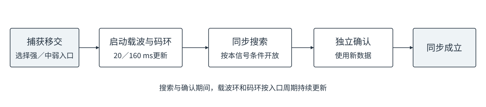

图5-1 同步搜索与确认期间，载波环和码环持续运行

捕获强档进入ShortFast，载波与码环均20 ms更新；捕获中、弱档进入LongFast，均160 ms更新。同步前只使用FLL，不形成PLL相差反馈。牵引阶段先修正频率，不把牵引残差积累为多普勒变化率。

### 5.2 同步前载波牵引

下表的“相干时长×块数”表示块内相干、块间累加功率；相邻asin方法则先鉴频，再平均频差。

| 信号 | 强入口：20 ms更新 | 中弱入口：160 ms更新 |
|---|---|---|
| L1CA | 相邻1 ms Prompt做asin，平均20个间隔 | 10 ms×16块，DFT＋插值 |
| G1 | 相邻1 ms Prompt做asin，平均20个间隔 | 5 ms×32块，DFT＋插值 |
| B1I D1／D2 | 1 ms Prompt复平方asin，平均20个间隔 | 同一方法，平均160个间隔 |
| L5、B2a、E5a | 1 ms导频Prompt复平方asin，平均20个间隔 | 每条1 ms Prompt先复平方，再在160 ms窗内做DFT＋插值 |
| E1 | 4 ms×5块，DFT＋插值 | 4 ms×40块，DFT＋插值 |
| B1C | 10 ms×2块，DFT＋插值 | 10 ms×16块，DFT＋插值 |

| DFT使用场景 | 原载波频率候选 | 鉴频输出 |
|---|---|---|
| L1CA、G1中弱入口；E1、B1C两种入口 | 11点，间隔12.5 Hz，范围±62.5 Hz | 寻峰插值后限于±25 Hz |
| L5、B2a、E5a中弱入口 | 11点，间隔2.5 Hz，范围±12.5 Hz | 平方后按二倍候选频率旋转，输出仍为原载波频差 |

L5类温启动频差为±12.5 Hz；载波DFT与二次码同步分开，后者不搜索频率。160 ms是复平方后的相干时长。E1、B1C先逐1 ms旋转，再形成4／10 ms主码块。

B1I D1通过复平方处理未知符号，NH起点由同步确定。相邻鉴频首次需21／161条PDI，保留末端点后仍每20／160 ms更新。

### 5.3 同步前码环牵引

| 信号 | 强入口：20 ms更新 | 中弱入口：160 ms更新 |
|---|---|---|
| L1CA | 每1 ms做E/L幅度鉴别，再平均 | 10 ms×16块，累加抽头幅度后做E/L鉴别 |
| G1 | 同上 | 5 ms×32块，累加抽头幅度后做E/L鉴别 |
| B1I D1／D2、L5、B2a、E5a | 同上 | 累加160条1 ms抽头幅度，再做E/L鉴别 |
| E1 | 每4 ms形成ASPeCT点积与功率，累计5块后鉴别 | 同一方法，累计40块 |
| B1C | 每10 ms形成ASPeCT点积与功率，累计2块后鉴别 | 同一方法，累计16块 |

E1、B1C使用BOC与PRN-only双副本，五抽头固定为−0.50、−0.25、0、0.25、0.50 chip。码环从首份完整观察开始纠偏，独立于同步搜索运行。

| 信号 | ShortFast：FLL／DLL带宽参数 | LongFast：FLL／DLL带宽参数 |
|---|---:|---:|
| L1CA、B1I、G1 | 4／2 Hz | 3.2／1 Hz |
| L5、B2a、E5a | 1／2 Hz | 1／1 Hz |
| E1、B1C | 4／1 Hz | 3.2／1 Hz |

L1CA、B1I、G1若在同步前进入ShortNormal，仍使用上述20 ms鉴别方法，FLL／DLL参数改为2／0.8 Hz。

### 5.4 同步搜索

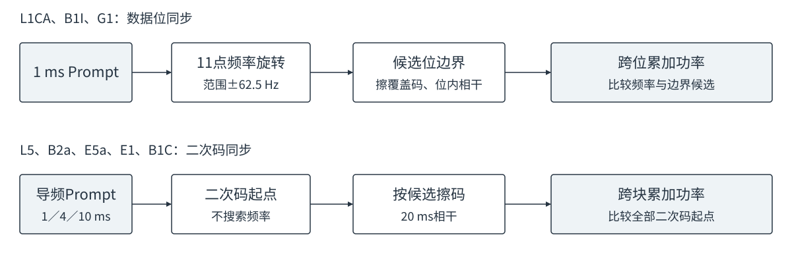

图5-2 数据位联合搜索频率与边界，导频只搜索二次码位置

| 信号 | 开放条件 | 搜索候选 | 搜索窗 → 独立确认窗 |
|---|---|---|---|
| L1CA、B1I D1、G1 | 首份载波观察完成后 | 11频率×20个位边界 | 1／2／4 s → 2／4 s |
| B1I D2 | 首份载波观察完成后 | 11频率×2个位边界 | 1／2／4 s → 2／4 s |
| L5 | 从完整PDI开始，与牵引并行 | 20个二次码起点 | 1 s → 1 s |
| B2a、E5a | 同上 | 100个二次码起点 | 1 s → 1 s |
| E1 | 完成初始码观察，且已有载波观察 | 25个二次码起点 | 1／2／4 s → 2／4 s |
| B1C | 同上 | 1800个二次码起点 | 18 s → 18 s |

E1、B1C的初始码观察累计至少400 ms：强入口400 ms、中弱入口480 ms，从下一个主码块开放同步。该时段内载波环和码环照常更新。

数据型使用11点×12.5 Hz、范围±62.5 Hz。按候选擦码、位内相干、跨位累加功率；L1CA/G1/B1I D1为20 ms，D2为2 ms，各窗另取19／1 ms边界余量。同步窗统一载波参考，与载波牵引各自计算频率候选。

导频按候选擦二次码后形成20 ms块：E1为5个4 ms主码，B1C为2个10 ms主码。1／2／4 s累计50／100／200块，B1C的18 s累计900块，并复用两主码和、差功率比较起点。

### 5.5 同步判决与独立确认

| 信号 | 每轮搜索、确认的判据 |
|---|---|
| L1CA、G1 | 最佳边界功率／错开半个位的参考功率≥1.18；相干质量指标≥370；峰两侧距边界1 ms的功率均高于同侧2 ms处 |
| B1I D1／D2 | 最佳边界功率／错开半个位的参考功率≥1.18；相干质量指标≥370 |
| L5、B2a、E5a、E1、B1C | 最佳二次码起点功率／次峰功率≥1.18 |

数据型质量指标为：位内相干功率与1 ms功率估计出的线性C/N0，乘以窗口所含500 ms段数。

搜索通过只保存候选，独立新数据确认同一边界后才锁定。数据型搜索先校频一次，确认用零附加频差；导频不提供校频量。

| 同步事件 | 数据型与E1 | L5、B2a、E5a及B1C |
|---|---|---|
| 搜索失败 | 清窗，取新2 s、4 s；达到4 s后继续新窗 | 滑动重试：L5类补20 ms，B1C补1 s |
| 搜索通过 | 独立确认窗取搜索窗两倍，最多4 s | L5类独立1 s，B1C独立18 s |
| 确认质量失败 | 2 s时保留候选、扩至4 s；4 s仍失败则清候选重搜 | 清候选重搜 |
| 质量通过但边界改变 | 保存新候选，再次独立确认 | 同左 |

例如E1搜索1 s失败、搜索2 s通过、确认4 s通过，共7 s；块内仍20 ms相干。重试期间载码环持续更新，总时限不续期，E1仍为20 s。

确认后按边界擦码并进入同步后收敛。L5、B2a、E5a的数据位边界由导频位置按10／5／20 ms取模得到，不另设同步确认。

## 6 同步后跟踪策略

同步后擦除已知覆盖码或二次码：未知数据只在位内相干，导频可跨主码周期相干。

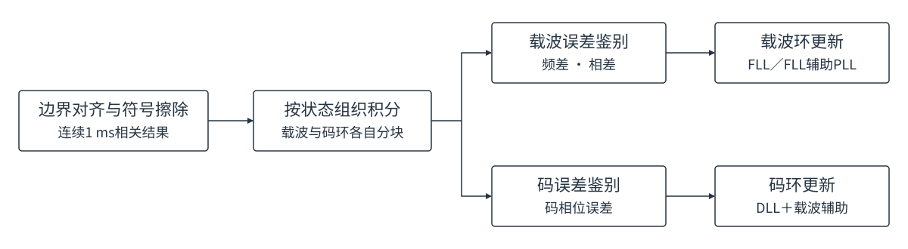

图6-1 同步确定符号与边界，状态决定积分和环路参数

### 6.1 数据型信号载波处理

L1CA、B1I D1、G1均按20 ms位内相干；B1I擦NH，G1擦Manchester符号。表中“20 ms×8”表示8块功率累加，导航数据位仍未知。

| 状态 | 相干与功率累加 | 鉴频方法 | 更新周期 |
|---|---|---|---:|
| ShortFast、ShortNormal、ShortSlow | 20 ms×1 | 11点DFT＋三点插值 | 20 ms |
| LongFast、LongNormal | 20 ms×8 | 同上 | 160 ms |
| LongSlow | 20 ms×16 | FMS，两侧±5 Hz | 320 ms |
| Sensitivity | 20 ms×16 | 同上 | 320 ms |
| HighDynamic、MidDynamic | 20 ms×1 | 11点DFT＋三点插值 | 20 ms |

DFT间隔10 Hz、范围±50 Hz，输出限于±25 Hz。FMS用两侧归一化功率差乘46.72 Hz，适合频差已收敛的保持。仅ShortSlow允许20 ms Costas相差反馈。

B1I D2先做2 ms位内相干，再复平方消除未知正负号，使用11点DFT＋插值：

| D2载波处理 | 平方后相干块 | 原载波候选间隔 |
|---|---:|---:|
| 短周期三态、LongFast／LongNormal、双动态 | 20 ms | 10 Hz |
| LongSlow、Sensitivity | 80 ms×4块功率，320 ms更新 | 3.125 Hz |

D2的ShortSlow鉴相将各2 ms结果复平方累加，再取半相角；码环仍用原始2 ms块。

### 6.2 导频信号载波处理

五种导频均擦二次码，LongSlow及Sensitivity方法统一；收敛阶段按信号选择：

| 状态 | L5、B2a、E5a | E1、B1C | 更新周期 |
|---|---|---|---:|
| ShortFast | 相邻20 ms块atan2 | 20 ms块，11点DFT＋插值 | 20 ms |
| ShortNormal、ShortSlow | 相邻20 ms块atan2 | 同左 | 20 ms |
| LongFast、LongNormal | 相邻20 ms块atan2，按160 ms平均 | 20 ms×8块，11点DFT＋插值 | 160 ms |
| LongSlow | 连续320 ms相干，11点DFT＋插值 | 同左 | 320 ms |
| Sensitivity | 连续320 ms相干，FMS | 同左 | 320 ms |
| HighDynamic、MidDynamic | 20 ms块，11点DFT＋插值 | 同左 | 20 ms |

L5类Fast、LongNormal的首20 ms块只建立前值；ShortNormal、ShortSlow首块或零共轭积时使用DFT。ShortSlow用20 ms atan2鉴相，PLL许可见第7章。

| 积分方式 | 频率比较范围 | 适用阶段 |
|---|---|---|
| 20 ms块DFT | 11点，间隔10 Hz，范围±50 Hz | 收敛及动态跟随 |
| 320 ms连续DFT | 11点，间隔1.5625 Hz，范围±7.8125 Hz | 普通弱信号保持 |
| 320 ms连续FMS | 两侧±1.5625 Hz，由功率比反解频差 | 极弱低动态保持 |

320 ms为连续相干，增益较高但频差容忍度更小；Normal先完成收敛，Sensitivity再按功率累计接管。低功率不保证频差已收敛，失败边界见第8章。

### 6.3 码环处理

码环更新周期与载波环一致，相干块长按下表选择。

| 状态 | L1CA、B1I D1、G1、L5、B2a、E5a | E1／B1C |
|---|---|---|
| 短周期三态、双动态 | 20 ms相干块 | 4／10 ms主码块，累计至20 ms |
| LongFast、LongNormal | 20 ms×8，累加幅度 | 4／10 ms块，累计至160 ms |
| LongSlow | 20 ms×16，累加幅度 | 4／10 ms块，累计至320 ms |
| Sensitivity：数据型 | L1CA、B1I D1、G1用20 ms×16 | — |
| Sensitivity：导频 | L5、B2a、E5a用160 ms×2 | E1、B1C用160 ms×2 |

| 信号与状态 | 码鉴别方法 |
|---|---|
| 六种非BOC：Fast、Normal、Sensitivity、辅助 | E/L幅度鉴别 |
| 六种非BOC：ShortSlow、LongSlow、双动态 | 方法配置时C＞13.5选双差幅度，否则E/L |
| E1、B1C所有状态 | ASPeCT；五抽头固定0.25 chip间距 |

B1I D2无辅助码环均用2 ms块，按状态周期累计幅度。

### 6.4 环路参数与相位反馈

纯FLL／DLL带宽参数如下（Hz）；ShortSlow通过PLL确认后改用FLL辅助PLL。

| 状态 | FLL | DLL |
|---|---:|---:|
| ShortFast | 4 | 2；E1、B1C为1 |
| ShortNormal | 2 | 0.8 |
| ShortSlow | 1 | 0.1 |
| LongFast | 3.2 | 1 |
| LongNormal | 1.6 | 0.5 |
| LongSlow | 0.7 | 0.1 |
| Sensitivity | 数据型0.4；导频0.7 | 数据型0.1；导频0.05 |
| HighDynamic／MidDynamic | 4／2 | 均为0.1 |

FLL辅助PLL共用环路状态；辅助FLL为0.25 Hz，PLL按当前分量C/N0选择带宽：

| C/N0区间，dB-Hz | ＜36 | 36～＜38 | 38～＜42 | ≥42 |
|---|---:|---:|---:|---:|
| PLL带宽，Hz | 2.4 | 4.8 | 7.2 | 9.6 |

Fast、Normal只校频，其余保持状态还更新变化率。LongSlow、普通辅助仅将写入变化率积分的频差限于±0.1 Hz，直接校频不受限。有限记忆见3.2；弱状态不反馈相差。

### 6.5 导航数据位辅助

辅助状态擦除已知导航符号后跨位相干。五种导频将数据与导频对齐固定相位、按标称幅度合并，供载波环和联合C/N0估计；码环仍用导频抽头。

| 状态 | 载波处理 | 码环处理 | 更新周期 | FLL／DLL |
|---|---|---|---:|---:|
| OutdoorBitAiding | 300 ms连续相干FMS | 100 ms×3 | 300 ms | 0.7／0.1 Hz |
| BitAiding | 300 ms×2，累加两侧功率后FMS | 300 ms×2 | 600 ms | 0.35／0.025 Hz |

两档FMS侧频点均为±1.6667 Hz；码环使用E/L或ASPeCT。辅助撤销立即回LongSlow／Sensitivity，清半窗、保留控制量。

## 7 载噪比估计与质量判决

载噪比负责状态与带宽选择，相差统计负责PLL回退，原始功率比负责失锁确认。

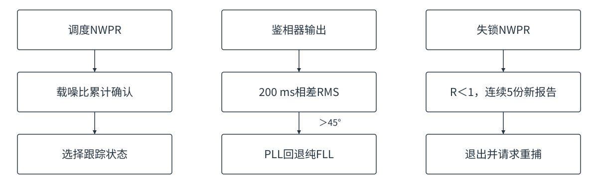

图7-1 功率换档、PLL回退和失锁确认分别处理

### 7.1 载噪比估计

| 阶段与用途 | 估计方法 | 相干块 | 报告与累计 |
|---|---|---|---|
| 同步前功率参考 | M2M4，统计1 ms Prompt的功率与功率平方 | 原始1 ms | 首报200 ms，随后每1 s |
| 同步后状态选择、PLL带宽 | NWPR，比较相干功率与逐毫秒功率和 | 20 ms；B1I D2为2 ms | 首报200 ms，随后每1 s；选择1～5 s历史 |
| 无辅助导频失锁检查 | 独立NWPR | 100 ms | 同样每1 s，最多5 s历史 |
| 电文辅助失锁检查 | 独立NWPR | 200 ms | 同样每1 s，最多20 s历史 |

数据型无辅助失锁复用位内NWPR。NWPR块内相干、块间平均功率比，5 s历史不是5 s相干；统计独立计时，普通状态切换不清历史。

| 当前1 s估计 | NWPR历史选择 |
|---|---|
| ≤18 dB-Hz | 使用长窗，随数据到达逐渐扩至5 s；辅助失锁支路可至20 s |
| ≥22 dB-Hz | 使用当前1 s |
| 18～22 dB-Hz | 保持原长、短窗选择 |

| 报告条件 | 输出处理 |
|---|---|
| 长窗≥20 dB-Hz，且比当前1 s高至少4 dB | 两者dB值平均，减轻功率下降时的滞后 |
| 原始功率比R＜1 | 报告10 dB-Hz |
| R＝1，或正常换算低于8 dB-Hz | 报告8 dB-Hz |

8／10为低信噪比报告规则，不代表真实功率。

普通跟踪使用实际分量C/N0；辅助状态使用联合估计，但恢复纯导频短环须检查独立导频估计。进出辅助清统计历史，两个辅助状态之间连续统计。

### 7.2 PLL进入与回退

| 环节 | 判据与动作 |
|---|---|
| 允许进入 | 已同步且处于ShortSlow；当前NWPR：G1＞30 dB-Hz，其余＞28 dB-Hz |
| 进入确认 | 每400 ms统计频差绝对值均值，＜10 Hz且功率条件满足，连续3批后开放相差反馈 |
| 相差反馈 | 按鉴相周期处理折返；反馈限于±67.5°，统计保留限幅前的相差 |
| 累计回退 | 200 ms相差RMS＞45°时，下一次控制回到纯FLL并重新确认 |
| 状态切换 | 离开ShortSlow后关闭PLL，保留环路已有控制状态 |

PLL进入最短1.2 s，不合格批次清零确认计数；开放后按累计相差回退。

### 7.3 失锁与退出

| 项目 | 规则 |
|---|---|
| 适用状态 | LongSlow、双动态、Sensitivity及两个辅助状态 |
| 失锁确认 | 连续5份新NWPR报告R＜1；R≥1清零 |
| 计数来源 | 原始功率比；缓存报告不重复计数，显示8／10不参与 |
| 确认失锁 | 停止观察与控制，向上层请求重捕 |

报告含重叠历史，5份不等于5个独立样本，也不保证5 s退出；辅助长窗检测更慢。

## 8 仿真验证与适用范围

牵引、同步、保持与精度分别评价；极限功率允许一定失败率，码精度单列。

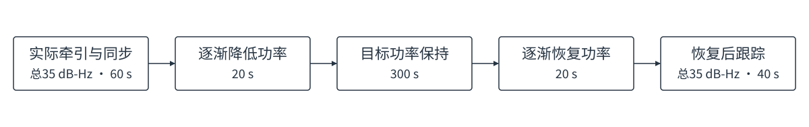

图8-1 先实际建立同步，再测试衰落、目标保持及功率恢复

### 8.1 测试输入与判据

| 场景 | 输入与评价 |
|---|---|
| 强弱入口牵引 | 八信号及B1I D2；非零频差、非零码差、多种子；BOC覆盖±0.35 chip，其余覆盖±0.50 chip；静态与±1 Hz/s |
| 无辅助低动态保持 | 总C/N0为10、12、15 dB-Hz；静态及±0.5 Hz/s，15 dB-Hz另覆盖±1 Hz/s；300 s目标平台并测试恢复 |
| 长时间保持 | 总C/N0为10、12 dB-Hz，整段1200 s，其中目标平台1060 s |
| 功率边界与双动态 | 强弱边界往返；双动态采用L1CA总25、其余总35 dB-Hz，覆盖正负5／20／166 Hz/s及平滑、突变、往返和恢复 |
| 导航位辅助 | 普通、极弱辅助，辅助加入和撤销，功率恢复；L1CA总3、G1总4 dB-Hz另测静态及±0.1／±0.2 Hz/s |
| B1I D2 | 无辅助总28、30、35 dB-Hz；2 ms电文，不沿用D1极弱功率要求 |

项目噪声口径：−160／−158／−155 dBm对应总10／12／15 dB-Hz。50%导频减3.01 dB，B1C的75%导频减1.25 dB；真值仅用于生成与评价。

保持判据：同步正确、完整平台及恢复、无退出，频差RMS≤5 Hz且绝对频差P95≤10 Hz；码差P95≤0.20 chip单列。结果是有限样本通过率，不是全输入保证。

### 8.2 载噪比累计入口对照

仅取消Sensitivity频差入口，其他参数不变：6,192组同输入对照（原基线c7a1504，采用版8645374）。

| 场景 | 用例数 | 原入口持续保持 | 载噪比累计入口持续保持 |
|---|---:|---:|---:|
| 300 s无辅助低动态，两批 | 768 | 712 | 702 |
| 1060 s无辅助目标平台 | 128 | 110 | 108 |
| −155 dBm既有低动态回归 | 384 | 384 | 384 |
| 功率边界往返 | 864 | 823 | 823 |
| 两批双动态 | 2560 | 2538 | 2538 |
| 普通辅助、极弱辅助及撤销 | 1088 | 998 | 998 |
| L1CA／G1严格辅助低动态 | 160 | 138 | 138 |
| 新增B1I D2目标场景 | 48 | 48 | 48 |
| 极弱加减速压力 | 192 | 48 | 48 |
| 合计 | 6192 | 5799 | 5787 |

新增13例极弱导频失败、恢复1例。采用收益是入口统一，非性能提升；极弱加减速单列为压力。详见[载噪比累计入口实验](实验记录-20260917-载噪比累计入口.md)。

### 8.3 分信号保持结果

每格32例，300 s静态／恒定斜率保持。E1为扩窗后的复验，其余七信号引用8645374结果；码精度见实验记录。

| 信号 | 总10 dB-Hz | 总12 dB-Hz | 总15 dB-Hz |
|---|---:|---:|---:|
| L1CA | 19/32 | 32/32 | 32/32 |
| B1I D1 | 24/32 | 32/32 | 32/32 |
| G1 | 28/32 | 32/32 | 32/32 |
| L5 | 25/32 | 31/32 | 32/32 |
| B2a | 26/32 | 32/32 | 32/32 |
| E5a | 22/32 | 27/32 | 32/32 |
| E1 | 27/32 | 31/32 | 32/32 |
| B1C | 28/32 | 30/32 | 30/32 |

L1CA总10 dB-Hz两批为12/16和7/16，存在种子波动；既有−155 dBm回归384/384另计。

### 8.4 E1同步扩窗验证

E1以8645374为基线：两批目标牵引1944例，总32／35 dB-Hz强入口、总27中弱入口，非零频差≤±62.5 Hz、码差≤±0.35 chip，静态及±1 Hz/s。

| 27 dB-Hz中弱入口 | 例数 | 正确同步：原→扩窗 | 完整稳定：原→扩窗 |
|---|---:|---:|---:|
| 全部码差 | 648 | 601 → 597 | 529 → 563 |
| ±0.25 chip以内的已测点 | 432 | 431 → 431 | 404 → 400 |
| ±0.35 chip边界 | 216 | 170 → 166 | 125 → 163 |

后两行为首行子集。稳定判据为正确同步、90 s无退出、末10 s频差RMS＜5 Hz及码差RMS＜0.20 chip。强入口稳定数不变，同步中位时间约慢1 s；收益主要是大码差同步后的保持。

隔离测试：纯噪声误锁1/512→0/512；固定残差误锁2/384→0/384，但正确同步285→258。零误锁不代表零风险。

E1后级保持702/736→701/736，双动态317/320及功率边界96/96不变；总10 dB-Hz保持30/32→27/32。其他七信号343例输出一致，详见[E1同步扩窗实验](实验记录-20260917-E1同步扩窗.md)。

### 8.5 证据边界

| 项目 | 当前证据与限制 |
|---|---|
| 历史牵引矩阵 | c7a1504稳定15,140/15,264、正确同步15,210/15,264；未按当前版本全量复跑，E1局部复验见8.4 |
| BOC移交范围 | 按±0.25 chip设计；±0.35为扩展压力，不承诺±0.50 chip直接牵引 |
| 验证层次 | 1 ms相关闭环模型；本轮无新增完整量化IQ、TCXO、多径、干扰或RTL证据 |
| 已知问题 | 极弱接管、辅助撤销及长测失败，BOC大码差失败，辅助失锁长尾；专用旁峰监视未实现 |

软件通过不替代硬件位级、时序及完整灵敏度资格。历史牵引和状态工作区见[状态职责实验](实验记录-20260916-状态职责与切换验证.md)，逐例失败见8.2、8.4所引实验记录。
