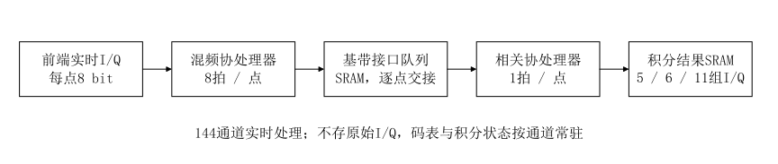
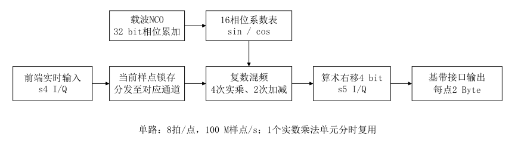
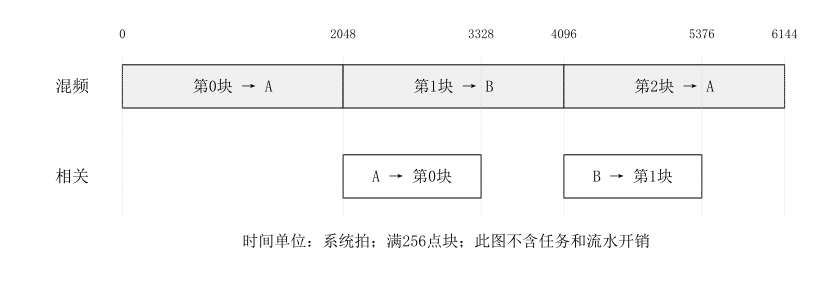
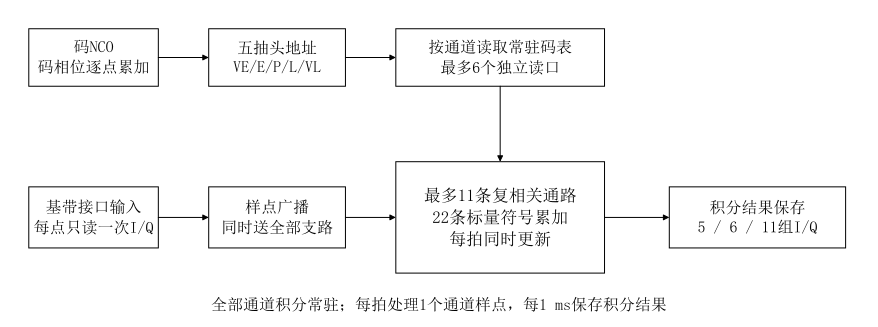
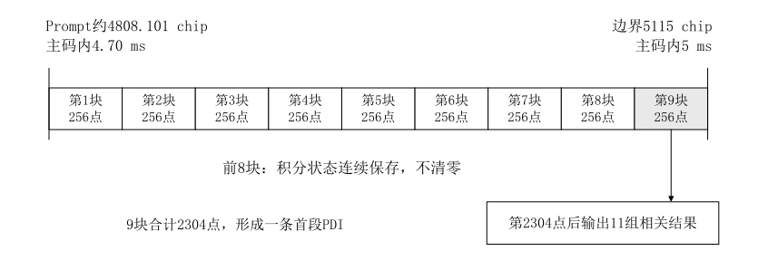

# 跟踪混频与相关协处理器处理流程与资源预算

跟踪硬件分为混频、相关两个协处理器。混频协处理器读取原始I/Q，按通道载波相位完成DDC，将基带I/Q写入共享SRAM；相关协处理器读取同一批基带样点，生成本地伪码，完成多支路相关及1 ms预检测积分。软件读取积分结果并更新通道参数。两级通过分块缓存交接数据，各协处理器内部配置多个并行计算单元。

目标配置为144通道：L1CA/B1I 48个、L5/B2a/E5a 48个、G1 12个、E1/B1C 36个。下文仍沿用原定点方案的资源池0、1、2、3编号，顺序分别对应这四类信号。每类通道数是该池内全部信号的合计，不是每种信号分别配置该数量。

第2～8章解释一个工作单元的数据处理和缓存接续；第9.6、9.7节核算144通道的并行需求及带宽；第11.4节给出对应的存储预算。原单路示例用于说明运算过程，不能当作144通道整机配置。

本文沿用《跟踪逻辑定点化设计方案》的数值格式和相关支路，按《样点并行PMF协处理器处理流程与资源预算》的结构，分别说明处理流程、存储容量、供数带宽和运算拍数。

## 1 架构与计算条件

原始样点按输入流保存。每个跟踪通道分别完成混频，得到该通道的基带样点。当前通道的数据、导频和各个码抽头共用这一份混频结果；不同通道通常使用不同的载波频率与相位，基带缓存不能相互代替。

### 1.1 硬件配置

| 模块 | 数量与计算条件 |
|---|---|
| 计算时钟 | 预算取800 MHz，即800000拍/ms |
| 混频协处理器 | 共1套，内部多路并行；每个混频工作单元按8拍/复样点核算 |
| 相关协处理器 | 共1套，内部多组并行；每组依次处理五抽头，按5拍/复样点核算 |
| 相关计算通路 | 每个工作组最多3条复数通路，同批并行处理不同分量或副本 |
| 原始I/Q缓存 | 每条独立输入流配置3块，每块暂按1 ms采样量分配 |
| 共享基带缓存 | 每块256个复样点，每点按16 bit存储；A/B为单路示例，144通道容量见第11.4节 |
| 主码源SRAM | 保存已配置通道的主码；相同码表可共享 |
| 工作主码RAM | 每个相关工作组2份，每份最多10230 bit |
| 通道状态SRAM | 每通道独立保存连续NCO相位、积分部分和及处理位置 |
| PDI结果SRAM | 按通道保存输出结果，容量预算以每通道两份结果为例 |

PDI（Pre-Detection Integration，预检测积分）在本文中指Prompt参考码相位覆盖一个标称1 ms码片段形成的复相关结果；PRN（Pseudo-Random Noise，伪随机噪声码）指本地主码；I&D（Integrate and Dump，积分并输出后清零）属于相关协处理器。

800 MHz和混频8拍沿用参考方案的预算口径；相关5拍、256点块和缓存深度是本方案提出的设计取值，均不是硬件实测结果。“8拍/点”和“5拍/点”表示持续处理间隔，固定流水延迟另外计算。旧定点文档的245.76 MHz用于其原有实现环境，不与本文800 MHz预算混用。

### 1.2 信号与资源池

| 资源池 | 信号 | ADC采样率，MHz | 标称码率，Mchip/s | 主码长度，chip | 每主码片段数 | 复相关数 | 积分格式 |
|---:|---|---:|---:|---:|---:|---:|---|
| 0 | GPS L1CA | 7.68 | 1.023 | 1023 | 1 | 5 | s18 I/Q |
| 0 | BDS B1I | 7.68 | 2.046 | 2046 | 1 | 5 | s18 I/Q |
| 1 | GPS L5 | 30.72 | 10.23 | 10230 | 1 | 6 | s20 I/Q |
| 1 | BDS B2a | 30.72 | 10.23 | 10230 | 1 | 6 | s20 I/Q |
| 1 | Galileo E5a | 30.72 | 10.23 | 10230 | 1 | 6 | s20 I/Q |
| 2 | GLONASS G1 | 10.24 | 0.511 | 511 | 1 | 5 | s18 I/Q |
| 3 | Galileo E1 | 7.68 | 1.023 | 4092 | 4 | 11 | s18 I/Q |
| 3 | BDS B1C | 7.68 | 1.023 | 10230 | 10 | 11 | s18 I/Q |

这里的资源池表示支路和位宽配置，四个资源池共用两个协处理器，不是复制四套混频和相关硬件。L1CA、B1I、G1采用同一五抽头处理流程；L5、B2a、E5a采用同一数据/导频处理流程；E1、B1C采用同一双副本处理流程。

| 资源池 | 信号集合 | 目标通道数 | 每1 ms输出复相关结果数 |
|---:|---|---:|---:|
| 0 | L1CA、B1I | 48 | 48×5＝240 |
| 1 | L5、B2a、E5a | 48 | 48×6＝288 |
| 2 | G1 | 12 | 12×5＝60 |
| 3 | E1、B1C | 36 | 36×11＝396 |
| 合计 | 八种信号 | **144** | **984** |

每1 ms合计形成144条PDI，其中包含984组I/Q复相关结果。

### 1.3 数据格式与预算单位

| 数据 | 运算格式 | 本文SRAM组织 |
|---|---|---|
| 原始I/Q | I、Q各s4 | 每复样点1 Byte，32 bit字容纳4点 |
| 混频结果 | I、Q各s5，活动范围−10～+10 | I、Q各放入1 Byte，每复样点2 Byte；32 bit字容纳2点 |
| 载波相位、步进 | u32圆环整数 | 通道状态独立保存 |
| 码相位、步进 | uQ14.36、uQ0.36 | 通道状态独立保存 |
| 抽头间距 | uQ1.10 | 读入后左移26 bit，与码相位对齐 |
| 1 ms相关结果 | 每个I/Q为s18或s20 | 按有效bit连续打包，再按32 bit字对齐 |
| 本地主码 | 1 bit/chip | 0表示+1，1表示−1 |
| DDC系数 | sin、cos各sQ1.4 | 16组，共160 bit |

sN表示N bit二补码整数；uQI.F表示I个整数bit和F个小数bit。混频结果在SRAM中的8 bit存储槽只用于寻址，s5到8 bit执行符号扩展，不改变数值，也不把运算精度改为s8。

1 KiB＝1024 Byte；1 MB＝1000000 Byte。公式中采样率使用复样点/s，带宽表使用MB/s。“一次相关”表示一个复样点对一条复相关支路的贡献，包含I、Q两个标量的符号选择和累加。

## 2 通道任务与数据分块

### 2.1 一次任务处理什么

一次跟踪任务针对一个通道，从该通道当前Prompt码相位开始，处理到下一个1 ms码片段边界。完整任务形成5、6或11组复相关结果；启动时不足1 ms的首段也按实际区间形成一次结果。

任务在执行时拆成最多256点的搬运块。每个搬运块先混频、后相关，直至任务结束。

| 层次 | 含义 | 到达末端时的操作 |
|---|---|---|
| 原始缓存块 | 一段固定数量的ADC样点 | 切换读取地址；不据此结束相关积分 |
| 基带搬运块 | 两个协处理器之间交接的最多256个样点 | 保存处理进度和部分和；不清零积分 |
| PDI任务 | 当前Prompt相位到下一个码片段边界的样点 | 输出全部相关结果，清零对应积分状态 |
| 完整主码 | E1含4个、B1C含10个码片段 | 连续码相位扣除完整主码周期 |

跟踪只计算当前码相位附近的抽头，不搜索一个主码的全部码相位。本方案不需要捕获中的“相干长度＋搜索码长−1”输入窗口，不在硬件中增加PMF或FFT。

### 2.2 最小任务参数

| 参数组 | 混频协处理器使用 | 相关协处理器使用 |
|---|---|---|
| 样点范围 | 输入流、源地址、本块有效点数 | 基带地址、相同的有效点数 |
| 通道状态 | 通道索引、载波相位和步进 | 通道索引、码相位和步进、未完成积分 |
| 固定配置 | 16相位系数 | 资源池、主码地址、码长、抽头间距 |
| 输出位置 | A或B基带缓存 | 通道状态区、PDI结果区 |

任务参数可以放入SRAM描述符，由软件或DMA队列送入。主机不参与逐样点处理；描述符只指向相应数据和状态，不能把同一通道的两个相邻任务反序提交。

### 2.3 任务终点与尾块

设当前Prompt码相位为$P$，下一码片段边界为$B$，当前码步进为$K$，三者均使用Q36原始整数。若本次PDI内$K$保持不变，则任务需要处理的样点数为：

$$
N=\left\lceil\frac{B-P}{K}\right\rceil
$$

式中，$N$是本任务的有效ADC样点数。该式供任务配置端确定读取长度，按正整数向上取整；相关协处理器内部仍使用逐样点加法、比较判断边界，不配置通用除法器。配置端可以按`(B-P+K-1)/K`执行一次整数计算，不能先把chip相位取整再计算。

每块的有效样点数取剩余任务长度、256点和当前原始缓存连续可读长度的最小值。遇到输入缓存末端，先结束当前搬运块，再从下一块继续；遇到PDI边界则结束整个任务。尾块未使用的存储槽不参与相关。

## 3 原始I/Q共享缓存

### 3.1 按输入流共享

同一条ADC输入流可以供多个通道重复读取，原始样点无需按卫星复制。共享的前提是输入流、采样时刻和前端配置完全相同。资源池编号不能代替输入流编号：例如同属资源池0的L1CA与B1I不一定来自同一RF前端。

一个输入块在所有引用它的通道读取完成后才能覆盖。接收新样点、处理当前数据、保留尚未读完的数据分别使用三块缓存；三块只提供有限缓冲，不能消除长期算力不足。

### 3.2 容量与带宽

标称每块保存1 ms数据，原始I/Q每点1 Byte：

$$
N_{raw}=f_s/1000,\qquad M_{raw}=3N_{raw}
$$

式中，$N_{raw}$是单块复样点数，$M_{raw}$是三块原始缓存容量，单位Byte。

| 独立输入流采样率 | 每块样点数／Byte | 三块容量，KiB | ADC写入带宽，MB/s |
|---:|---:|---:|---:|
| 7.68 MHz | 7680 | 22.5 | 7.68 |
| 10.24 MHz | 10240 | 30 | 10.24 |
| 30.72 MHz | 30720 | 90 | 30.72 |

三块缓存合计容量按实际独立输入流累加，而不按跟踪通道数累加。一个通道跨两个原始缓存块积分时，保留其积分状态即可，不复制接缝样点。

## 4 混频协处理器

本章描述一个混频工作单元。多个单元各自处理一个已分配任务，共用协处理器配置入口和共享SRAM访问网络；其数量由第9.6节的144通道工作量决定。

### 4.1 处理流程

1. 读入当前通道的载波相位、频率步进和任务范围。
2. 按原始样点先后顺序读取s4 I/Q，取载波相位高4 bit查sin/cos表。
3. 完成复数共轭混频，算术右移4 bit，得到s5 I/Q。
4. 将结果符号扩展到两个Byte，按样点顺序写入空闲A/B缓存。
5. 每消费一个样点，载波相位增加一次；当前块写完后提交缓存，保存下一样点的相位。

同一通道的所有相关支路只混频一次。数据与导频的固定复相位差保留在输出相关值中，不需要分别设置两套载波NCO。

### 4.2 数值运算

设输入为$x_I,x_Q$，表中系数整数为$C,S$，则：

$$
y_I=\left\lfloor\frac{x_IC+x_QS}{16}\right\rfloor,
\qquad
y_Q=\left\lfloor\frac{x_QC-x_IS}{16}\right\rfloor
$$

式中，$y_I,y_Q$是写入共享SRAM的混频数值；除以16对应去除系数的4个小数bit，使用算术右移。系数采用原定点方案的固定16相位表，单项乘积s8、乘加s9、输出s5。

处理完$L$个样点后，保存的载波相位为：

$$
p_c^{next}=(p_c^{start}+LK_c)\bmod2^{32}
$$

式中，$L$为本块有效点数，$K_c$为载波步进，$p_c^{start}$和$p_c^{next}$分别对应本块首样点和下一未处理样点。上式描述结果关系；串行执行时逐点累加，不额外设置$L K_c$乘法器。

例如$x_I=5,x_Q=-3,C=15,S=3$，得到$y_I=4,y_Q=-4$。SRAM中存为两个8 bit二补码值$(4,-4)$，相关器读出后数值仍为$(4,-4)$。

### 4.3 连续处理能力

| 项目 | 计算方法 | 预算 |
|---|---|---:|
| 混频吞吐量 | 800 MHz÷8 | 100 M复样点/s |
| 一个256点块运算拍数 | 256×8 | 2048拍 |
| 一个256点块运算时间 | 2048÷800 MHz | 2.56 μs |
| 原始样点最大读取量 | 100 M点/s×1 Byte | 100 MB/s |
| 基带最大写入量 | 100 M点/s×2 Byte | 200 MB/s |
| 实数乘法单元 | 每复样点4次，8拍内复用 | 1个 |
| 实数加减路径 | I、Q各1条 | 2条 |
| 载波NCO | 32 bit加法、自然回绕 | 1套工作状态 |
| 系数ROM有效容量 | 16×2×5 bit | 20 Byte |

每8拍处理一复样点时，可将4次实乘依次安排在前4个工作拍，再完成I/Q组合、缩位和写入。SRAM读取和系数预取需与这一节奏配合；具体寄存器级流水由实现确定，实际处理间隔必须按包括读写的完整通路测量。

## 5 两级之间的共享SRAM

本节先用单路A/B说明数据格式和交接规则。144通道使用相同格式的多块共享缓存，多个混频单元和相关工作组可同时拥有不同缓存块；总容量和并行端口需求见第9.7、11.4节。

### 5.1 A/B数据组织

共享基带A、B各保存256个复样点。每点占16 bit，32 bit字打包相邻两个样点：

| 32 bit字内位置 | 内容 |
|---|---|
| bit7:0 | 第$2k$点I，s5符号扩展到8 bit |
| bit15:8 | 第$2k$点Q，s5符号扩展到8 bit |
| bit23:16 | 第$2k+1$点I |
| bit31:24 | 第$2k+1$点Q |

式中，$k$为缓存内的32 bit字序号，从0开始。有效点数为奇数时，最后一个字只有前一个样点有效，后半字不得进入相关运算。

| 项目 | 计算方法 | 容量 |
|---|---|---:|
| 单份基带缓存 | 256×2 Byte | 512 Byte |
| 单份32 bit字数 | 512÷4 | 128字 |
| A/B合计 | 2×512 | **1024 Byte，1 KiB** |

A/B建议映射为两个可独立访问的SRAM bank。写A时读B、写B时读A；只给出一个总容量为1 KiB的单端口RAM，不能自动获得两级并行能力。

### 5.2 缓存交接

| 缓存状态 | 所有者与允许操作 |
|---|---|
| 空闲 | 混频协处理器可以申请写入 |
| 写入中 | 只有混频协处理器写，不允许相关器读取 |
| 完成 | 全部有效数据和任务参数已写好，等待相关器 |
| 读取中 | 相关协处理器独占，混频不能覆盖 |
| 读取完成 | 相关器不再引用该块，缓存归还空闲 |

软件只提交任务或读取结果，不应逐块复制基带样点。主机存在数据缓存时，描述符和完成标记的发布必须保证数据可见；该项由共享存储一致性或缓存维护实现。

### 5.3 两级重叠时序

图中先忽略固定流水尾部与任务开销。第0块混频用2048拍，完成后相关器读A；同时第1块混频写B。相关器用1280拍处理完第0块，在第1块混频结束前已归还A。

| 区间，拍 | 混频协处理器 | 相关协处理器 |
|---|---|---|
| 0～2048 | 第0块写A | 等待第0块 |
| 2048～3328 | 第1块写B | 第0块读A |
| 3328～4096 | 第1块继续写B | 等待第1块 |
| 4096～5376 | 第2块写A | 第1块读B |
| 5376～6144 | 第2块继续写A | 等待第2块 |

这说明在单路条件下混频是持续吞吐瓶颈，相关侧每个满块有768拍差额可覆盖部分工作开销。工作缓存按并行任务和在途数据分配，不直接按全部通道复制一份1 ms基带；增加并行工作单元时，缓存块数量、端口和队列必须相应扩展。

### 5.4 共享存储的访问能力

| 数据区 | 连续访问需求 | 32 bit端口请求率 |
|---|---|---:|
| 原始I/Q | 混频满速100 MB/s读取 | 25 M字/s，另计ADC写入 |
| 基带写入 | 混频满速200 MB/s | 50 M字/s |
| 基带读取 | 相关器自身满速320 MB/s | 80 M字/s |
| 基带流水平均 | 两级稳定后读、写各200 MB/s | 分bank各50 M字/s |

相关器对一个复样点读取一次后，在本地保持5拍供全部抽头复用。共享SRAM读取量不乘5、6或11；这些倍数只进入相关运算量。两个SRAM bank各只需一个读或写端口，但仲裁和互连必须允许它们同时服务不同协处理器。

## 6 相关协处理器与本地码

本章描述一个相关工作组。144通道配置在相关协处理器内部并行设置多组，每组有自己的码NCO、工作码和积分寄存器，组数见第9.6节。

### 6.1 模块组成

相关器工作区保存当前通道的码NCO、抽头距离、主码和各支路积分部分和。I/Q从共享SRAM读入后，一份数据同时提供给当前批次有效的复数计算通路。每条通路的I、Q分别做符号选择和累加。

### 6.2 五抽头分批

VE、E、P、L、VL分别为超早、早、即时、晚和超晚抽头。每批处理一个抽头；同一批的多条通路用于数据、导频或两种本地副本，不表示不同输入样点。

| 批次 | 池0、2：通路0 | 池1：通路0／通路1 | 池3：通路0／通路1／通路2 |
|---|---|---|---|
| VE | 单分量VE | 导频VE／空闲 | 导频调制VE／导频PRN-only VE／空闲 |
| E | 单分量E | 导频E／空闲 | 导频调制E／导频PRN-only E／空闲 |
| P | 单分量P | 导频P／数据P | 导频调制P／导频PRN-only P／数据调制P |
| L | 单分量L | 导频L／空闲 | 导频调制L／导频PRN-only L／空闲 |
| VL | 单分量VL | 导频VL／空闲 | 导频调制VL／导频PRN-only VL／空闲 |

同一输入点分别发生5、6、5或11次复相关贡献，但均使用5个抽头批次。通路身份在当前资源池内保持固定；不存在的支路不分配积分状态。

### 6.3 本地主码与BOC副本

码NCO以当前Prompt码相位生成五个抽头地址。E、VE取负偏移，L、VL取正偏移；跨过主码端点时加减一个完整码长。每个分量保存一份1 bit/chip主码，而不是按ADC采样率展开成样点码表。

| 工作主码RAM | 池0、2 | 池1 | 池3 |
|---|---|---|---|
| 第0份 | 唯一分量主码 | 导频主码 | 导频主码 |
| 第1份 | 不使用 | 数据主码 | 数据主码 |

每批从第0份RAM读取一个码片；P批次再从第1份RAM读取数据码片。因此两份RAM各一个同步读口即可。前提是它们是独立bank，或具有可同时访问两个地址的端口，不能把两个P读取请求挤入同一个单读口。

这两份工作RAM按分量划分，不是下一通道的A/B预装缓存。切换主码必须等前一通道相关读取结束；码表装载期间相关引擎等待，混频可按基带A/B空闲情况继续准备下一任务。

E1/B1C沿用窄带BOC(1,1)本地副本。取抽头相位的小数bit35，与PRN码位异或，得到调制符号；同一次PRN读取同时用于调制与PRN-only两条通路。BOC副本不增加ADC采样率，不存储两倍长度的BOC码表。完整宽带CBOC/QMBOC实现不包含在这一副本配置内。

### 6.4 连续5拍处理条件

以下时序以“某拍提交码RAM读取请求、下一拍末获得可供累加的码值”为约定。预处理先计算五抽头地址和当前样点的码边界标志；RAM请求同时带上抽头、BOC半码片符号和样点归属。

| 拍 | 主码RAM请求 | 执行相关累加 |
|---:|---|---|
| 0 | 样点$n$：VE | 前一流水数据或空闲 |
| 1 | 样点$n$：E | 样点$n$：VE |
| 2 | 样点$n$：P，含数据码 | 样点$n$：E |
| 3 | 样点$n$：L | 样点$n$：P，最多3条复通路 |
| 4 | 样点$n$：VL | 样点$n$：L |
| 5 | 样点$n+1$：VE | 样点$n$：VL |
| 6 | 样点$n+1$：E | 样点$n+1$：VE |

相邻样点从第0拍和第5拍开始，故持续间隔为5拍。样点$n$的VL尚未完成时，样点$n+1$可以开始地址预取，但它必须使用下一码相位；两个样点的I/Q和标签分别保存，不能共用会被覆盖的单寄存器。若实际RAM多一个读延迟，则相应增加首尾流水级，能否仍保持5拍启动间隔需实测验证。

最大11组复积分状态只有396 bit，当前活动通道采用小型寄存器阵列保存，不对共享SRAM逐次执行积分读改写。按通路组织独立状态，P批次的三次复累加可以同拍执行。5拍条件包含预取、流水和状态写回能力，不把一个普通单端口状态RAM当作三写口。

### 6.5 相关与积分计算

设本地码符号为$c=+1$或$-1$，则每个支路执行：

$$
A_I\leftarrow A_I+c y_I,\qquad A_Q\leftarrow A_Q+c y_Q
$$

式中，$A_I,A_Q$为该支路当前积分状态。$c y_I,c y_Q$通过原值/取负选择实现，不使用乘法器。正、负相关单项最大绝对值均为10。

例如基带值为$(4,-4)$，导频PRN为+1、当前BOC半码片为−1，则调制通路加入$(-4,+4)$，PRN-only通路加入$(+4,-4)$。两个结果分别累加，不能先把两条支路相加。

### 6.6 处理能力与资源

| 项目 | 计算依据 | 预算 |
|---|---|---:|
| 相关器样点吞吐 | 800 MHz÷5 | 160 M复样点/s |
| 256点连续工作量 | 256×5 | 1280拍，1.60 μs |
| 复数相关通路 | P批次最多3组 | 3条 |
| 标量符号选择与累加 | 每复通路I/Q两条 | 6条，最高按s21中间量实现 |
| 活动积分状态 | 最大11×2×18 | 396 bit有效状态 |
| 工作主码RAM有效容量 | 2×10230 bit | 2557.5 Byte |
| 工作主码按32 bit字分配 | 2×320字×4 Byte | **2560 Byte，2.5 KiB** |

本方案按“样点串行、抽头分批、分量/副本并行”核算。逻辑并行相关次数为每点的5、6或11次，不等于把输入SRAM的读取速度提高11倍。

## 7 PDI输出与跨块连续性

### 7.1 统一边界

每个1 ms码片段的定点宽度为$W_{seg}$，当前Prompt相位为$P$，先生成当前样点全部相关贡献，再用：

$$
P^{next}=P+K,\qquad end=(P^{next}\ge B)
$$

式中，$P^{next}$是下一样点码相位，$end$为当前样点结束本条PDI的标志。边界判断可提前计算并随流水传递，积分输出必须包含该样点的最后一次贡献。VE/E/L/VL的偏移相位只控制本地码，不各自产生积分边界。

普通片段结束后，连续相位保留$P^{next}$，边界增加$W_{seg}$。主码末段结束后，连续相位减去完整主码宽度，片段回到0，边界回到$W_{seg}$。不能把越界余量单独装成非主码末端的码相位。

### 7.2 输出和清零

每个抽头批次算出包含当前样点的新积分值。如果该样点为PDI末样点，将新值写入结果影子寄存器，同时把本支路工作积分置0。VL批次完成后，全部有效支路和结果说明均已齐全，才能对外发布一次完整结果。

这样可以在五个批次中逐项保存和清零，无需在VL结束后再插入五拍统一清零。结果SRAM的写入必须使用影子值，不能读取已经清零的活动积分寄存器。

### 7.3 B1C 4.7 ms移交示例

沿用已评审的B1C移交示例，Prompt位置约为4808.101 chip，即主码内4.70 ms；下一个边界为5115 chip，即5 ms。标称步进约0.133203125 chip/sample，本任务需要2304个样点。

| 项目 | 结果 |
|---|---|
| 本次首段 | 约4.70～5.00 ms |
| 输入样点 | 2304点 |
| 256点搬运块 | 9块 |
| 第1～8块结束 | 保存部分和，继续当前片段；不输出PDI、不清零 |
| 第9块最后一点 | Prompt相位越过5115 chip，输出11组结果 |
| 输出后连续相位 | 约5115.001 chip，保留小数超越量 |
| 下一任务 | 下一个边界为6138 chip，约5～6 ms |

E1使用完全相同的搬运和边界判断，只是主码包含4个片段，B1C包含10个片段。一个搬运块恰好等于某个边界的特例，不能据此把“处理256点”和“产生一条PDI”绑定。

### 7.4 积分位宽的使用范围

每个I/Q相关项的最大绝对值为10。若本次PDI包含$N$个样点，采用$w$ bit有符号积分的充分条件为：

$$
10N\le 2^{w-1}-1
$$

式中，$w$在池0、2、3取18，在池1取20。因此s18允许$N\le13107$，s20允许$N\le52428$。标称7680、10240和30720点均处于范围内。

实际$N$由码步进和起始相位决定；标称采样率对应的样点数用于吞吐预算，不能当作任意码步进下的最大积分长度。任务配置按实际$N$核对上述范围；不满足时拒绝该任务并报告长度配置错误，不执行静默截断。本方案保留原积分位宽，不新增逐样点饱和运算。

## 8 通道状态、码表与结果SRAM

### 8.1 状态保存

两级可能正在处理同一通道的不同搬运块，因此载波状态和码/积分状态分别归其所属协处理器更新：

| 状态区域 | 保存内容 | 更新位置 |
|---|---|---|
| 载波状态 | 下一未混频样点的相位、载波步进、混频进度 | 混频任务提交时 |
| 码与积分状态 | 下一未相关样点的码相位、边界、片段、各支路部分和 | 相关任务提交时 |
| 固定配置 | 码长、资源池、码表地址、抽头间距 | 启动或已安排的更新边界 |

载波进度允许暂时领先相关进度一个搬运块。两级不能各自把“整份通道状态”读出修改后全部回写，否则后一写入可能覆盖前一级的新状态。状态区使用分区写入或固定所有者，不需要逐样点传递载波相位数组。

容量预算按每通道64 Byte控制状态，加本池打包积分部分和，再向128 Byte分配边界取整。部分和有效位宽仍为s18/s20；128 Byte是通道状态存储预算，不是PDI输出格式。

### 8.2 码表容量

每份主码按32 bit字对齐，容量为$4\lceil N_{code}/32\rceil$ Byte：

式中，$N_{code}$为该分量完整主码的chip数。

| 信号 | 每通道主码份数 | 单份分配，Byte | 每通道源码表，Byte |
|---|---:|---:|---:|
| L1CA | 1 | 128 | 128 |
| B1I | 1 | 256 | 256 |
| L5、B2a、E5a | 2 | 1280 | 2560 |
| G1 | 1 | 64 | 64 |
| E1 | 2 | 512 | 1024 |
| B1C | 2 | 1280 | 2560 |

G1通道可共用一份公共主码；其他通道仅在PRN及分量码表相同时共享。切换卫星时，从源码表SRAM装载工作码RAM。一个通道的一条PDI尽量连续完成其多个搬运块，避免每256点重装码表。装载时间计入任务切换开销，不能隐藏在“5拍/点”中。

### 8.3 结果容量

| 资源池 | 复相关数 | 有效数据，bit | 按32 bit字对齐的数据，Byte | 加16 Byte结果说明 | 两份结果，Byte |
|---:|---:|---:|---:|---:|---:|
| 0 | 5 | 180 | 24 | 40 | 80 |
| 1 | 6 | 240 | 32 | 48 | 96 |
| 2 | 5 | 180 | 24 | 40 | 80 |
| 3 | 11 | 396 | 52 | 68 | 136 |

16 Byte结果说明用于记录通道、片段与实际积分范围等信息，属于本方案容量预留；寄存器和总线字段编码在接口设计时确定。每条复结果仍保持原s18/s20数值，尾字填充不对应新增相关支路。

两份结果区只能覆盖有限的软件读取延迟。若最坏读取延迟为$T_{read}$、最短PDI间隔为$T_{min}$，深度至少按$\lceil T_{read}/T_{min}\rceil+1$份核算；一份正在写入的结果不能算作可读完整结果。数据尚未读取时禁止覆盖。

## 9 计算量、带宽与通道预算

### 9.1 按每通道每1 ms核算

令$N_i$为池$i$一个通道标称1 ms样点数，$r_i$为复相关支路数：

$$
C_{mix,i}=8N_i,\qquad C_{corr,i}=5N_i,\qquad O_i=r_iN_i
$$

式中，$C_{mix,i}$、$C_{corr,i}$分别为两级运算拍数，$O_i$为复相关贡献次数。

| 池 | 每通道样点数 | 复相关贡献次数 | 混频拍数 | 混频时间，μs | 相关拍数 | 相关时间，μs |
|---:|---:|---:|---:|---:|---:|---:|
| 0 | 7680 | 38400 | 61440 | 76.8 | 38400 | 48 |
| 1 | 30720 | 184320 | 245760 | 307.2 | 153600 | 192 |
| 2 | 10240 | 51200 | 81920 | 102.4 | 51200 | 64 |
| 3 | 7680 | 84480 | 61440 | 76.8 | 38400 | 48 |

池3复相关次数超过池0一倍，但每个抽头批次使用两条或三条通路，因此按当前并行结构计算的样点拍数相同。E1和B1C均按每1 ms工作量计费，不分别等4 ms或10 ms再执行。

### 9.2 各资源池独占时的上界

| 资源池 | 单通道混频占用 | 单通道相关占用 | 混频理论最多通道 | 相关理论最多通道 | 混频占用不超过80%的示例上限 |
|---:|---:|---:|---:|---:|---:|
| 0 | 7.68% | 4.80% | 13 | 20 | 10 |
| 1 | 30.72% | 19.20% | 3 | 5 | 2 |
| 2 | 10.24% | 6.40% | 9 | 15 | 7 |
| 3 | 7.68% | 4.80% | 13 | 20 | 10 |

理论通道数按800000拍除以单通道工作量向下取整，未计等待和任务开销。各行表示该资源池独占两级硬件，不能把四行的通道数相加。80%只用于演示如何预留计算余量，不是已验证的通道承诺。

### 9.3 混合通道计算

设四个池活动通道数为$n_0,n_1,n_2,n_3$，每1 ms总处理样点为：

$$
N_{all}=7680(n_0+n_3)+30720n_1+10240n_2
$$

式中，$N_{all}$按通道重复计数，即同一ADC流被4个通道混频时贡献4份样点工作量。

两级占用分别为：

$$
U_{mix}=8N_{all}/800000,\qquad U_{corr}=5N_{all}/800000
$$

| 示例 | $(n_0,n_1,n_2,n_3)$ | 总通道 | 每ms样点 | 混频占用 | 相关占用 | 预算含义 |
|---|---|---:|---:|---:|---:|---|
| 低采样率组合 | (8,0,0,2) | 10 | 76800 | 76.80% | 48.00% | 算术预算留有余量 |
| 四池组合 | (3,1,1,1) | 6 | 71680 | 71.68% | 44.80% | 可作为首轮实现验证配置 |
| 接近满载 | (4,1,2,2) | 9 | 97280 | 97.28% | 60.80% | 混频只剩2.72%，不宜直接承诺实时 |
| 高采样率组合 | (0,4,0,0) | 4 | 122880 | 122.88% | 76.80% | 单混频协处理器不足 |

以四池组合为例，混频工作量573440拍，相关工作量358400拍。若要求混频总占用控制在80%，留给混频配置、访存停顿等额外开销的额度为640000−573440＝66560拍，即83.2 μs/ms。

### 9.4 原始与共享基带带宽

| 池 | 单通道原始读取，MB/s | 单通道基带写入，MB/s | 单通道基带读取，MB/s | PDI数据及16 Byte说明，MB/s |
|---:|---:|---:|---:|---:|
| 0 | 7.68 | 15.36 | 15.36 | 0.040 |
| 1 | 30.72 | 61.44 | 61.44 | 0.048 |
| 2 | 10.24 | 20.48 | 20.48 | 0.040 |
| 3 | 7.68 | 15.36 | 15.36 | 0.068 |

四池示例$(3,1,1,1)$的原始读取为71.68 MB/s，基带读和写各143.36 MB/s，两级基带总流量286.72 MB/s，PDI输出为0.276 MB/s。相比原始/基带搬运，PDI结果带宽很小；主要存储瓶颈在逐样点数据与工作码装载。

原始ADC写入只按输入流计一次，不能与按通道计的原始读取混淆。若全部SRAM都经过同一互连，必须汇总ADC写入、原始读取、基带读写、码表和结果访问量；分bank不会自动增加公共总线带宽。

### 9.5 首份结果延迟与持续处理

当输入已完整存在SRAM、两级固定开销为0、全部块均为256点且相关比混频快时，$J$个块形成第一份完整结果的理想时间为：

$$
T_{first}=\frac{2048J+1280}{800\times10^6}
$$

式中，$J$为该PDI任务的块数。该式包含最后一块相关尾部，并不等于简单把两级全任务时间相加。

| 任务 | 满256点块数 | 理想首份结果时间，μs |
|---|---:|---:|
| 标称L1CA完整PDI | 30 | 78.4 |
| 标称L5完整PDI | 120 | 308.8 |
| 标称G1完整PDI | 40 | 104.0 |
| B1C示例首段2304点 | 9 | 24.64 |

实际调度必须计入固定流水、切换、码表装载、输入可用时刻和下游暂停。若本任务输入尚未采集完，上表不能作为从ADC首样点算起的完成延迟。

可用以下递推式核算连续任务的实际完成时间：

$$
d_j=\max(d_{j-1},a_j,f_{j-2})+8L_j+h_{D,j}
$$

$$
f_j=\max(f_{j-1},d_j)+5L_j+h_{C,j}
$$

式中，$d_j$为第$j$块混频完成时刻，$f_j$为相关完成时刻，$a_j$为该块输入与控制配置均已可用的时刻，$L_j$为有效点数；$h_D,h_C$包括不能重叠的流水、装载和等待开销，全部以系统拍计。第$j$块复用第$j-2$块的缓存，必须等$f_{j-2}$后才能覆盖；前两个块按缓存初始空闲处理。

仅用$\max(\sum C_{mix},\sum C_{corr})$可判断长期吞吐下界，不能替代上述含依赖的完成时刻。

### 9.6 144通道的运算需求

将已确定的$(n_0,n_1,n_2,n_3)=(48,48,12,36)$代入：

$$
N_{all}=48\times7680+48\times30720+12\times10240+36\times7680
=2242560
$$

即每1 ms需处理2242560个通道复样点，每秒22.4256亿点。即使多个通道读取相同原始样点，各通道载波相位和本地码不同，仍需分别计入计算量。

| 资源池 | 通道数 | 每1 ms通道样点数 | 混频拍数 | 相关拍数 | 复相关贡献次数 |
|---:|---:|---:|---:|---:|---:|
| 0：L1CA/B1I | 48 | 368640 | 2949120 | 1843200 | 1843200 |
| 1：L5/B2a/E5a | 48 | 1474560 | 11796480 | 7372800 | 8847360 |
| 2：G1 | 12 | 122880 | 983040 | 614400 | 614400 |
| 3：E1/B1C | 36 | 276480 | 2211840 | 1382400 | 3041280 |
| 合计 | **144** | **2242560** | **17940480** | **11212800** | **14346240** |

单个混频工作单元需要22.4256 ms才能处理这1 ms工作量，单个相关工作组需要14.016 ms。增加缓存不能使该单路配置成为实时系统。

设并行混频工作单元数为$P_D$，相关工作组数为$P_C$，每毫秒可用拍数均为800000。在任务能均匀分配、完全无开销的条件下：

$$
P_D\ge\left\lceil\frac{17940480}{800000}\right\rceil=23,
\qquad
P_C\ge\left\lceil\frac{11212800}{800000}\right\rceil=15
$$

| 并行预算 | 混频工作单元 | 相关工作组 | 混频占用率 | 相关占用率 |
|---|---:|---:|---:|---:|
| 无开销算术下界 | 23 | 15 | 97.50% | 93.44% |
| 按计算占用不超过80%取整的示例 | 29 | 18 | 77.33% | 77.87% |

23和15是理论工作量下界，不能直接视为已通过的实时配置。29和18用于后续存储估算，预留量还需覆盖码表装载、访存、任务切换和负载不均。这些数值表示两个协处理器**内部**的并行工作单元数量，不是设置29个混频协处理器和18个相关协处理器。

也可以通过更深流水降低单元的样点接收间隔。例如混频做到1点/拍时，至少需要3路，按80%计算占用核算则取4路；相关侧需要对应提升。该优化会改变乘法器、码RAM读口和累加结构，不能沿用8拍混频的单乘法器资源数。本文先保留8拍/5拍工作单元作为一致的预算基准。

### 9.7 144通道的共享SRAM带宽

| 数据访问 | 每1 ms传输量，Byte | 平均带宽，GB/s |
|---|---:|---:|
| 原始I/Q按通道读取 | 2242560 | 2.24256 |
| 混频后基带写入 | 4485120 | 4.48512 |
| 相关器基带读取 | 4485120 | 4.48512 |
| 上述三项合计 | 11212800 | **11.21280** |

以上不包含ADC写入、码表装载、状态读写、描述符和PDI输出。基带共享SRAM需要平均4.48512 GB/s写入和4.48512 GB/s读取，不能只提供一条每拍32 bit的公共端口。

| 800 MHz下的端口示例 | 理论带宽 | 与所需带宽的关系 |
|---|---:|---|
| 独立32 bit原始读取端口 | 3.2 GB/s | 原始读取平均占70.08%，ADC写入和其他共享访问另计 |
| 独立64 bit基带写端口 | 6.4 GB/s | 基带写入平均占70.08% |
| 独立64 bit基带读端口 | 6.4 GB/s | 基带读取平均占70.08% |
| 统一128 bit公共总线 | 12.8 GB/s | 仅三项样点流量已占87.60%，还需承担其他流量及仲裁 |

32 bit字打包是数据布局，物理总线可以合并两个相邻字进行64 bit访问。64 bit读和64 bit写必须能独立或并行服务，不能把单个64 bit端口的6.4 GB/s同时算成读、写各6.4 GB/s。

144通道标称每1 ms分为8760个满256点搬运块。共享队列应由硬件按PDI任务自动拆块和分配缓存，避免要求软件每秒下发876万次搬运命令。PDI输出约144000条/s、984000组复相关/s；按第8.3节布局，带结果说明的写入量为7.152 MB/s。

## 10 控制更新与实时接续

### 10.1 参数作用于哪个样点

软件根据已完成PDI计算新载波步进、码步进和抽头距离，配置给该通道尚未开始混频的后续PDI任务。新参数对应明确的输入样点起点；混频、相关两级使用同一份配置快照，不能因为执行时间错开而一边采用新配置、一边采用旧配置。

已经混频的基带样点保持其原有载波参数，不能用新控制字修改历史样点含义。载波相位和码相位按实际处理样点递推；协处理器等待SRAM、让出执行单元或切换其他卫星时，不按800 MHz计算时钟推进NCO。

### 10.2 下一PDI控制的两种安排

| 安排 | 后续数据如何处理 | 代价 |
|---|---|---|
| 等待本通道新命令 | ADC继续写原始SRAM；暂不混频下一PDI，先处理其他通道；命令到达后回放下一段 | 增加数据处理延迟和缓存驻留时间，可保持按样点计的下一PDI更新语义 |
| 预先指定后续生效边界 | 已开始处理的下一PDI继续用旧参数，新命令作用于更后的PDI | 引入额外的闭环控制延迟，需要按真实延迟验证环路 |

首版建议采用“每通道按PDI任务串行、等待新命令后处理下一任务”。该安排与SRAM回放相配合：ADC输入连续，计算引擎在多个通道间轮转。是否能维持固定处理滞后，取决于软件最坏响应时间、通道负载和缓存保留时间，必须联合测量。

等待发生在计划控制更新点，并不要求软件每1 ms重算频率。未到环路更新时刻时，后续PDI任务可以继续复用当前步进和抽头配置；到达计划更新点后，再等待相应新参数，避免把1 ms相关输出周期误当作软件环路更新周期。

不能同时假定软件有计算时间，又让完整PDI产生的新命令在紧邻ADC边界无延迟生效。若为了吞吐改用预定后续边界，文档和软件必须共同记录这项延迟。

### 10.3 暂停、重试和输入缺失

基带缓存没有空闲空间时，只暂停新混频块；原始样点由环形SRAM继续保存。PDI结果空间不足时，不能覆盖旧结果，相关器暂停提交并阻止继续复用其在途缓存。

正常暂停不清零相位和部分和。只有输入实际丢失、任务被取消或明确重新启动通道时，才废弃未完成PDI。重试必须从已提交检查点继续，不能重复累加已经消费的样点；重启时使用新的起始相位和空积分状态。

## 11 资源汇总与实施取舍

### 11.1 单个工作单元的资源基准

下表是用于复制或改造的单路资源，不是144通道总资源。目标规模的并行需求按第9.6节确定。

| 资源 | 数量 | 说明 |
|---|---:|---|
| 混频工作单元 | 1 | 8拍/复样点预算 |
| 实数混频乘法单元 | 1 | 4次实乘分时复用 |
| 混频I/Q加减路径 | 2 | s9工作值 |
| 载波工作NCO | 1 | 通道切换时换工作状态 |
| 相关工作组 | 1 | 5拍/复样点预算 |
| 复相关通路 | 3 | I/Q合计6条符号累加路径 |
| 码工作NCO及五抽头地址模块 | 1套 | 含主码回绕、片段边界比较和请求预取 |
| 工作主码RAM | 2份 | 按分量独立读；合计2.5 KiB |
| 活动积分寄存器 | 按池启用 | 180、240、180、396 bit |
| 结果影子寄存器 | 至少一份最大结果 | 396 bit数据；控制与写回缓冲另计 |

800 MHz下的加法、SRAM访问和地址回绕时序需要综合验证；上述数量不换算为未经布局验证的门数或功耗。

### 11.2 六通道示例的存储预算

采用第9.3节四池组合：3个L1CA、1个L5、1个G1、1个B1C。为展示容量，暂按7.68、30.72、10.24、7.68 MHz四条独立输入流配置；若L1CA与B1C在实际前端共用同一输入流，可扣除一份原始三块缓存。

| 数据区 | 计算 | 容量，Byte |
|---|---|---:|
| 原始I/Q三块缓存 | 3×(7680＋30720＋10240＋7680) | 168960 |
| 全局基带A/B | 2×256×2 | 1024 |
| 通道源码表 | 3×128＋2560＋64＋2560 | 5568 |
| 工作主码RAM | 2×1280 | 2560 |
| 通道状态 | 6×128 | 768 |
| 每通道两份PDI结果 | 2×(3×40＋48＋40＋68) | 552 |
| DDC系数有效数据 | 16×2×5÷8 | 20 |
| 两级任务队列示例 | 每级8份、每份预留32 Byte | 512 |
| 已列容量合计 | 上述相加 | **179964 Byte，175.7461 KiB** |

本表包括共享SRAM和本地RAM的已列数据容量。宏单元容量取整、端口复制、活动寄存器、输入/输出小FIFO、仲裁和静态参数表另计。队列32 Byte是预算槽位，不代表接口bit布局已经冻结。

### 11.3 增加通道时优先扩展什么

当前条件下两级处理间隔为8拍和5拍，优先瓶颈是混频。需要超过第9章通道上界时，可缩短混频接收间隔，或在同一个混频协处理器内增加并行样点通路；这不必改变“混频、相关两个协处理器”的外部划分。

例如将混频提高到1点/4拍，其计算能力为200 M点/s，相关器的160 M点/s将成为下一瓶颈。此时需重新核算相关并行度及SRAM读写，而不是只增加A/B缓存容量。增加缓存可以吸收短时等待，但不增加持续计算能力。

### 11.4 144通道的状态、码表和缓存容量

144通道的积分状态有效bit数为：

$$
\begin{aligned}
M_{acc}={}&48\times5\times2\times18+48\times6\times2\times20\\
&+12\times5\times2\times18+36\times11\times2\times18\\
={}&36576\ \mathrm{bit}
\end{aligned}
$$

式中，$M_{acc}$只计算全部通道的积分数值，共4572 Byte。按每通道128 Byte保存完整通道状态时，共18432 Byte＝18 KiB；这18 KiB已经容纳部分和，汇总时不能再次把4572 Byte相加。

| 数据 | 144通道容量 | 说明 |
|---|---:|---|
| 通道状态 | 18432 Byte，18 KiB | 每通道128 Byte |
| 每通道两份PDI结果 | 14304 Byte，13.9688 KiB | 按40、48、40、68 Byte/条分别分配 |
| 通道主码源表 | 165952～227392 Byte | 池0在L1CA/B1I间、池3在E1/B1C间变化；G1共用64 Byte |

主码源表上界按池0全部使用B1I码长、池3全部使用B1C码长计算：

$$
M_{code,max}=48\times256+48\times2560+64+36\times2560
=227392\ \mathrm{Byte}
$$

式中，$M_{code,max}$是不同码表均独立保存时的容量上界；相同PRN、分量码表可以去重。下界165952 Byte对应池0全部为L1CA、池3全部为E1，其他分配相同。

以下整机容量示例采用29个混频工作单元、18个相关工作组，并分配64个共享基带块：

| 数据区 | 计算 | 容量，Byte |
|---|---|---:|
| 原始I/Q三块缓存 | 八信号各一条独立输入流，合计133.12 M点/s，每流保留3 ms | 399360 |
| 共享基带数据块 | 64块×256点×2 Byte | 32768 |
| 通道主码源表 | 四池按码长上界分配 | 227392 |
| 工作主码RAM | 18组×2份×1280 Byte | 46080 |
| 通道状态 | 144×128 Byte | 18432 |
| PDI结果 | 2×(48×40＋48×48＋12×40＋36×68) | 14304 |
| 各混频单元系数 | 29×20 Byte | 580 |
| 两级PDI任务队列示例 | 每级144份×32 Byte | 9216 |
| 基带块管理信息示例 | 64块×16 Byte | 1024 |
| 已列数据容量合计 | 上述相加 | **749156 Byte，731.5977 KiB** |

64个基带块共32 KiB，分别由混频写入、等待相关或相关读取的任务占有。按最多29块正在写入、18块正在读取计，还剩17块用于等待；块数是容量示例，不能证明任意突发和暂停条件下不阻塞。分配器必须依据空闲块启动任务，全部通道共用缓存，不给144通道分别保留整毫秒基带。

64个逻辑块不等于必须使用64个物理SRAM bank。实际bank数量和地址映射要满足第9.7节的并行读写需求；相关工作组也要按本通道的块序消费，并在切换码表前保存未完成状态。任务分配、码表驻留和SRAM仲裁需共同验证29/18示例的有效吞吐。

原始缓存容量取决于真实输入流数。若L1CA/E1/B1C确实共用一个7.68 MHz输入流、L5/B2a/E5a确实共用一个30.72 MHz输入流，另有B1I和G1输入，则三块原始缓存仍为168960 Byte，已列总量降至518756 Byte＝506.5977 KiB。只有前端提供同一时刻、同一配置的共同采样流时才能这样共享，不能只根据资源池合并原始数据。

上述存储合计不含宏单元容量取整、额外端口复制、活动寄存器和流水FIFO。800 MHz下的实际面积、功耗和可达频率须由具体实现给出。

## 12 验证要求与待确定参数

### 12.1 数值验证

| 验证对象 | 输入与检查内容 | 通过条件 |
|---|---|---|
| DDC | 全16相位、全部s4 I/Q组合，共4096组 | 与规定的乘加、算术右移整数结果逐点相同 |
| 四池相关 | 正负主码、数据/导频、BOC两副本 | 5、6、5、11组结果与逐样点参考逐bit相同 |
| 跨块积分 | 1、255、256、257点等不规则切块，跨原始SRAM边界 | 改变切块不改变结果或最终相位 |
| PDI边界 | 首段、恰好命中、跨界余量、E1/B1C主码回绕 | 当前边界样点只计一次，全部支路区间一致 |
| 混频领先 | DDC处理下一块、相关仍在上一块 | 通道载波状态和码状态互不覆盖 |
| 参数更新 | 正负频率、连续NCO换步进、抽头更新 | 两级在同一样点使用同一配置版本 |
| 多通道切换 | 同信号不同卫星、四池混合、同码表复用 | 相位、积分和主码不串通道 |
| 暂停恢复 | 任一SRAM或结果接口暂停后继续 | 不丢样点、不重复积分、不覆盖未消费结果 |

### 12.2 性能验证

1. 分别测量两个协处理器包括SRAM访问在内的连续处理间隔，验证8拍/点和5拍/点。
2. 测量每通道任务配置、工作码装载和流水尾部，把开销代入第9.5节递推式。
3. 按48、48、12、36通道同时输入，持续统计最老原始数据年龄、共享块等待、任务分配负载和每通道PDI完成延迟。
4. 加入软件实际最坏响应时间，验证每通道新命令能在计划样点生效，并验证长期不会耗尽原始三块缓存。
5. 比较协处理器与逐样点参考的原始PDI，在数值一致之后，再验证跟踪闭环的频率、码误差和同步行为。

本文随附核算脚本验证表格算术、DDC整数范围、切块等价性及简化A/B时序，不包含RTL综合、SRAM宏时序或整机实时能力的验证。

本次文档自检已覆盖4096组DDC输入、八种信号配置的连续处理与不规则切块对比、E1/B1C主码回绕、B1C首段2304点及A/B暂停等待。码表使用确定性二值测试向量，用于检查样点归属和数值连续性；这些检查不表示完成了真实信号的跟踪性能实验。核算结果保存于[预算核算.json](预算核算.json)。

### 12.3 接口评审需要确定的项目

| 项目 | 当前文档取值 | 硬件评审输入 |
|---|---|---|
| 运算时钟和混频间隔 | 800 MHz、8拍/点 | 实际目标时钟、综合可达间隔 |
| 相关并行度 | 最大3条复通路、5批/点 | 主码RAM读延迟和积分写回结构 |
| 活动通道数量 | 已确定为48、48、12、36，共144 | 进一步给出各池内部的具体信号配比 |
| 输入流共享关系 | 按真实ADC流分配 | 频段、中频及原始流拓扑 |
| SRAM互连 | 原始读取2.24256 GB/s，基带读写各4.48512 GB/s | 实际总线宽度、bank与仲裁、DMA和缓存一致性 |
| 内部并行规模 | 无开销下界23路混频、15组相关；预算示例29路、18组 | 单元流水结构、资源数和任务分配验证 |
| 软件响应与缓存深度 | 每通道下一任务等待命令 | 最坏响应时间和允许处理延迟 |

---

参考文档：

- [跟踪逻辑定点化设计方案](../09-逐模块定点化/18-跟踪逻辑定点化设计方案.md)：数据格式、四资源池、抽头与PDI边界。
- [样点并行PMF协处理器处理流程与资源预算](../../StarAcq/14-协处理器方案/样点并行PMF协处理器处理流程与资源预算.md)：预算组织方式和800 MHz、DDC 8拍计算口径。

图源及核算：[check_and_draw_tracking_coprocessor.py](tools/check_and_draw_tracking_coprocessor.py)。使用`--check-only`复算预算与整数检查；不加参数时同时更新本章SVG/PNG配图和机器可读核算结果。

| 版本 | 日期 | 修改内容 |
|---|---|---|
| V0.1 | 2026-09-13 | 建立混频与相关两级协处理器、全局基带A/B共享、四池相关、跨块积分和多通道预算 |
| V0.2 | 2026-09-13 | 固定48/48/12/36共144通道，补充并行单元、共享SRAM带宽及整机容量预算 |
